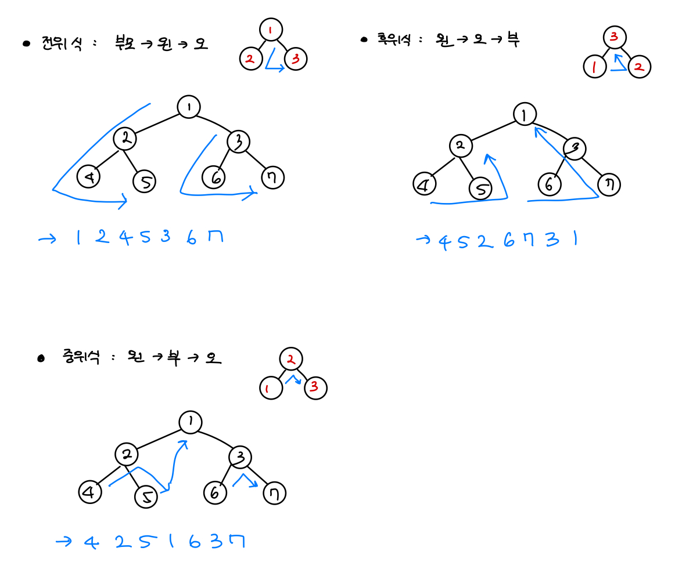
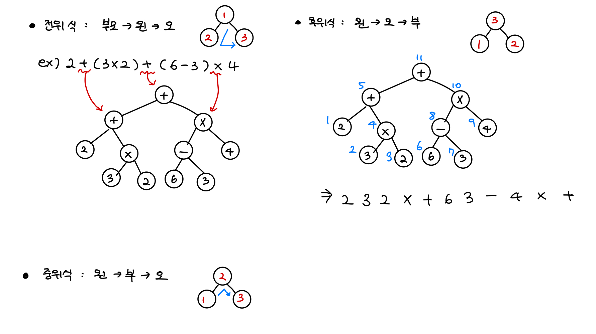
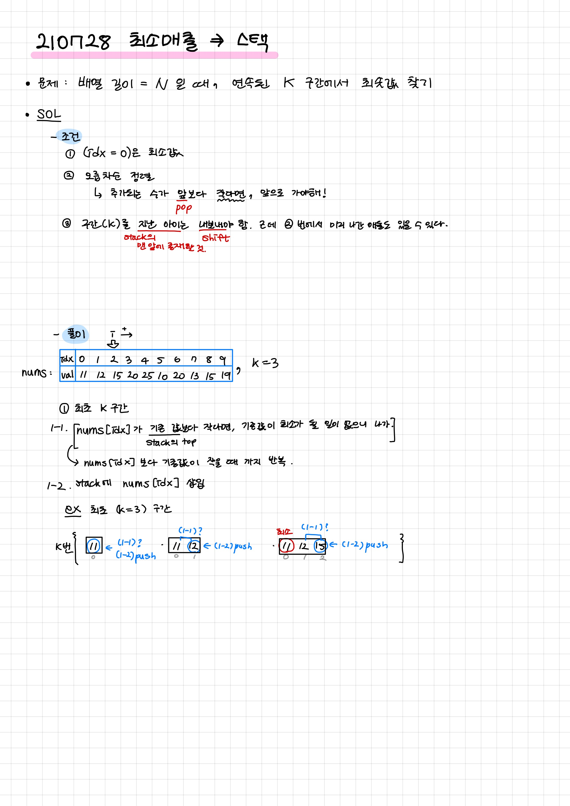

# 210728 스택, 큐, 데크 자료구조 / [재귀 함수](./recursive.js)

## 1. [올바른 괄호](./01.js)

## 2. [괄호문자 제거](./02.js)

## 3. [후위식 연산](./03.js)

### 전위/중위/후위 설명

### 후위식 문제 설명

## 4. [연속된 문자 지우기](./04.js)

## 5. [공주 구하기](./05.js)

## 6. [교육과정 설계](./06.js)

## 7. [최소 매출](./07.js)

## [test - 최소값 만들기(스택)](./test.js)
