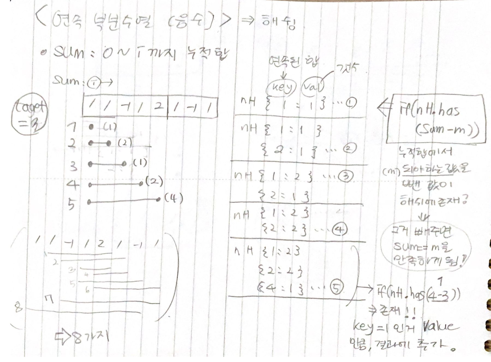
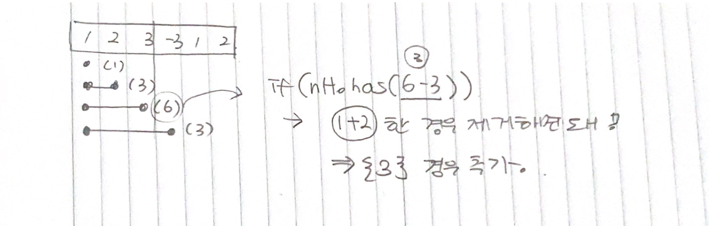

# 210729 슬라이딩윈도우, two pointer Algorithm

## 1. [최대 매출](./01.js)

## 2. [매출액의 종류](./02.js)

## 3. [연속 부분수열 1](./03.js)

## 4. [연속 부분수열 2(음수)](./04.js)

## 5. [연속 부분수열(부분집합)](./05.js)

## 6. [연속된 자연수의 합](./06.js)

## 7. [모든 아나그램 찾기(해쉬, 투포인터, 슬라이딩 윈도우)](./07.js)

## [test - 사과](test.js)
