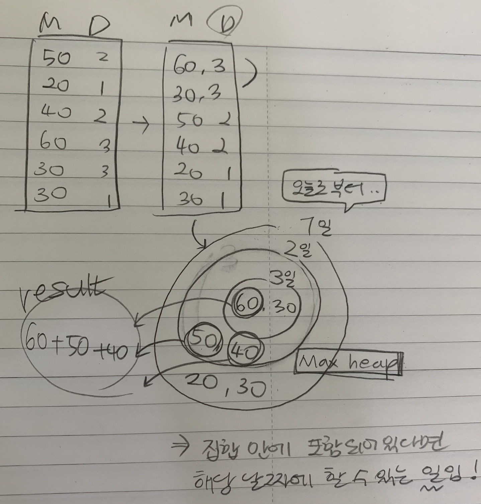
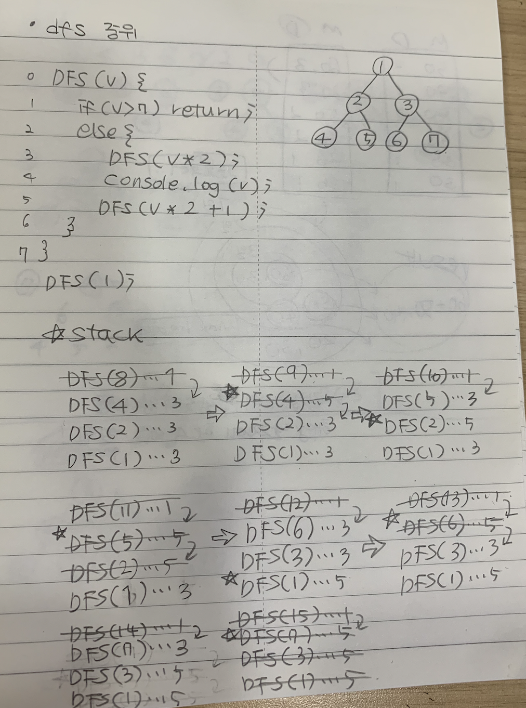

# 210730 그리디, [우선순위큐](maxHeap.js)

## 1. [동전 교환](./01.js)

## 2. [침몰하는 타이타닉](./02.js)

## 3. [회의실 배정](./03.js)

## 4. [마지막 남은 수](./04.js)

## 5. [수열의 높이 조정](./05.js)

## 6. [최대 수입 스케줄](./06.js)

### [최대힙 구현](./maxHeap.js)

## 7. [동전 교환: 풀지말고, 비교만.](./07.js)

## [DFS 중위](./dfs.js)

## [test](./test.js)
