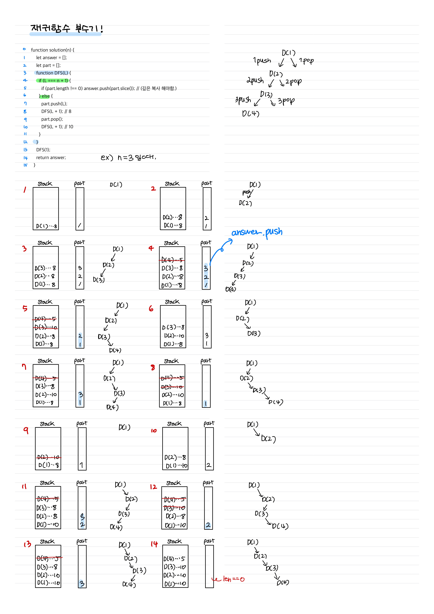
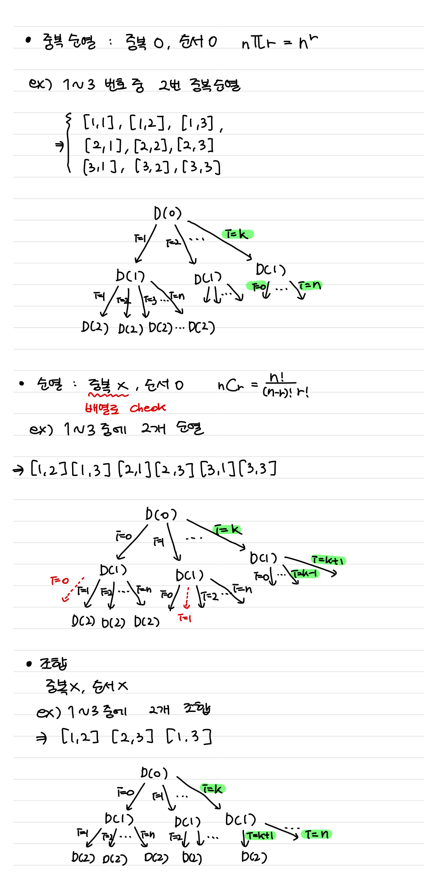
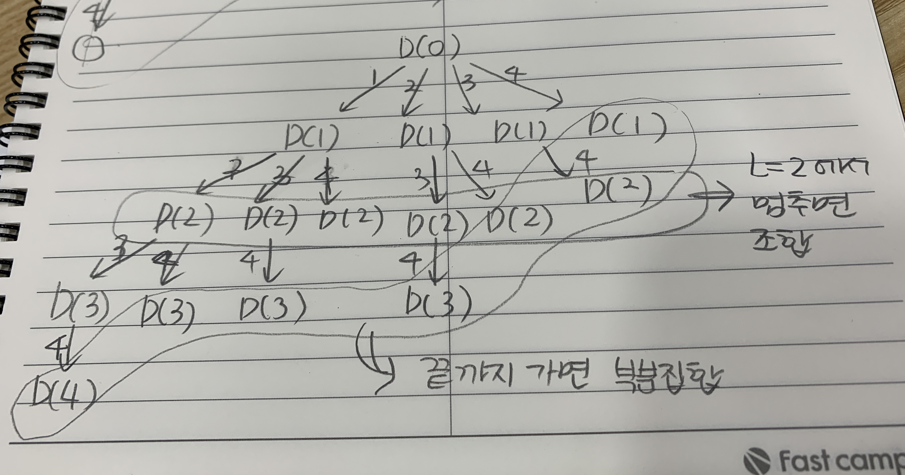
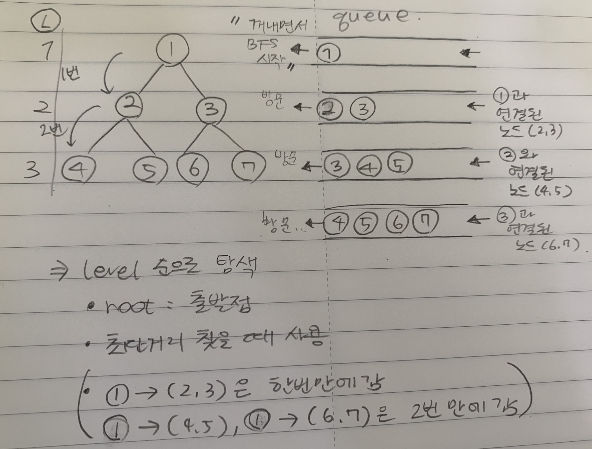
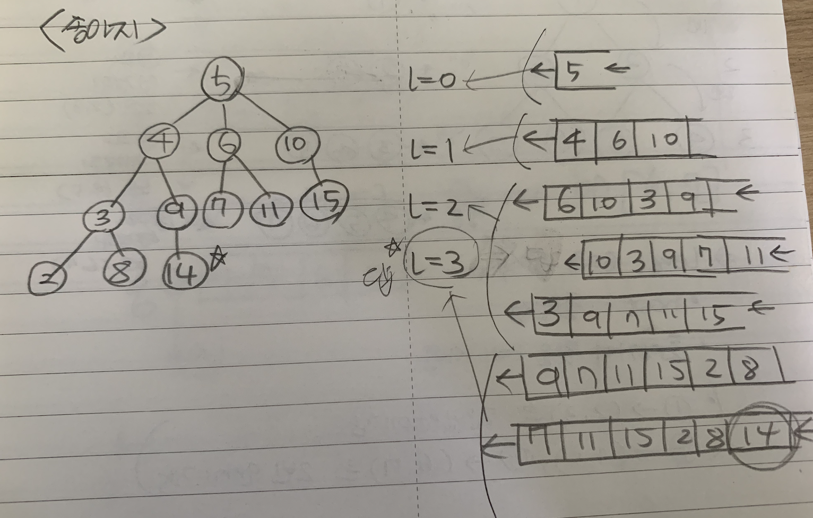

# 210802 재귀함수, DFS, BFS

## 1. [재귀함수를 이용한 이진수 출력](./01.js)

## -----DFS 완전 탐색-----

- 완전 탐색을 통해서, 부분집합을 구할 수 있다.
- 완전 탐색은 DFS 재귀를 2번 사용한다. (넣었을 때, 넣지 않았을 때)
- 부분집합은 몇개를 뽑아야 하는게 정해진 것이 아닌, M개의 숫자중에서 자유롭게 뽑거나 뽑지않는 것
- 순열,조합은 뽑아야 하는 갯수가 정해져있다.

## 2. [이진트리 순회(DFS)](./02.js)

## 3. [부분집합 구하기(DFS)](./03.js)

## 4. ❤️[합이 같은 부분집합(DFS)](./04.js)

## 5. [바둑이 승치(DFS)](./05.js)

## 6. [최대점수 구하기(DFS)](./06.js)

## ------순열과 조합은 매우 중요함!------

- 순열 조합은 뽑아야 하는 갯수가 정해져있다.
- N가지 숫자중에 R개를 뽑아야한다면, 재귀는 R번 반복해야한다. (for문 사용)
- 순열 : 중복 X 순서 O
- 중복순열 : 중복 O 순서 O
- 조합 : 중복 X 순서 X

## 7. ❤️[중복순열 구하기](./07.js)

## 8. [순열 구하기](./08.js)

## 9. [조합의 경우수(메모이제이션)](./09.js)

## 10. [수열 추측하기](./10.js)

## 11. [조합 구하기](./11.js)

## 12. [수들의 조합](./12.js)

## -----BFS-----

## 13. [이진트리 레벨탐색(BFS)](./13.js)

## 14. [송아지 찾기(BFS)](./14.js)

## 15. [미로의 최단거리 통로(BFS)](./15.js)
