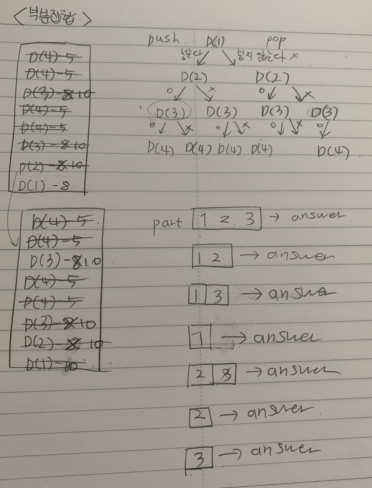
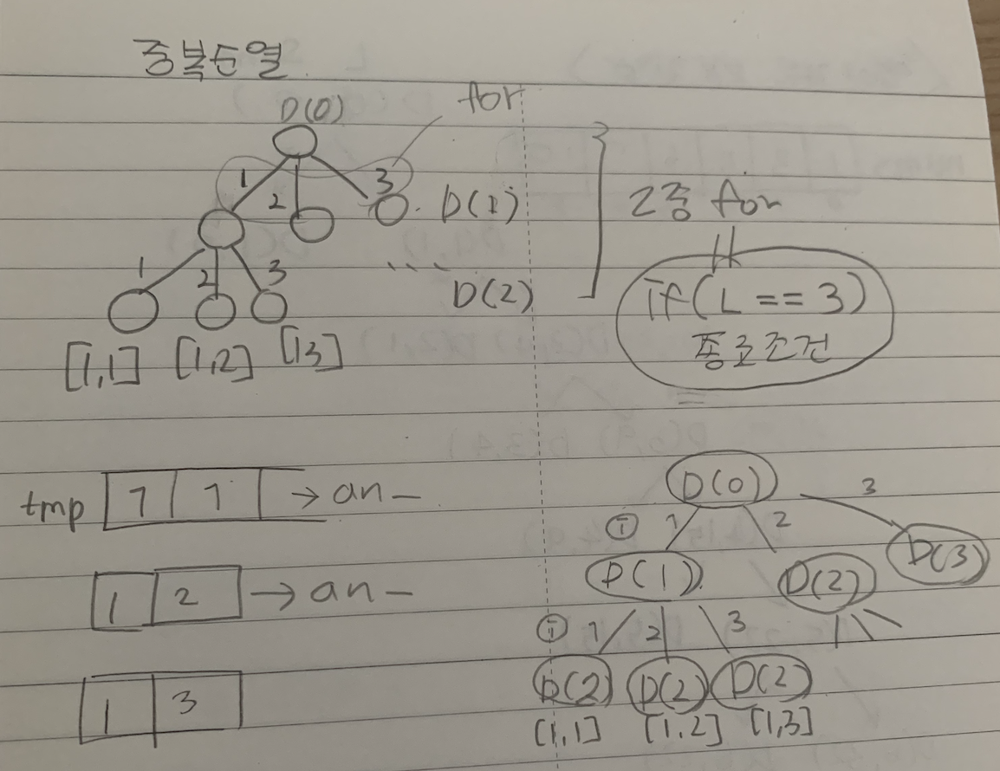
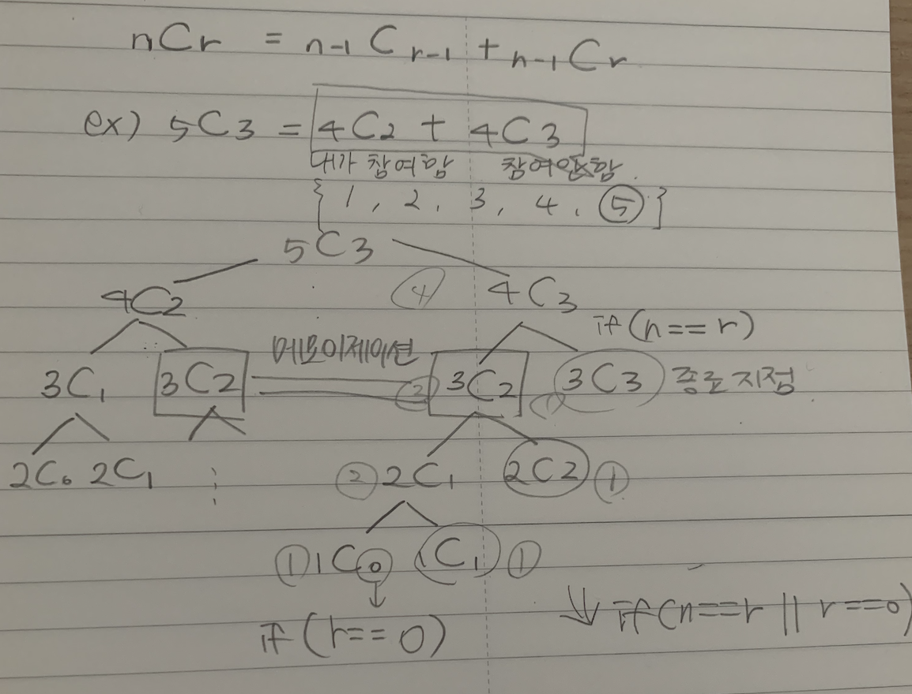
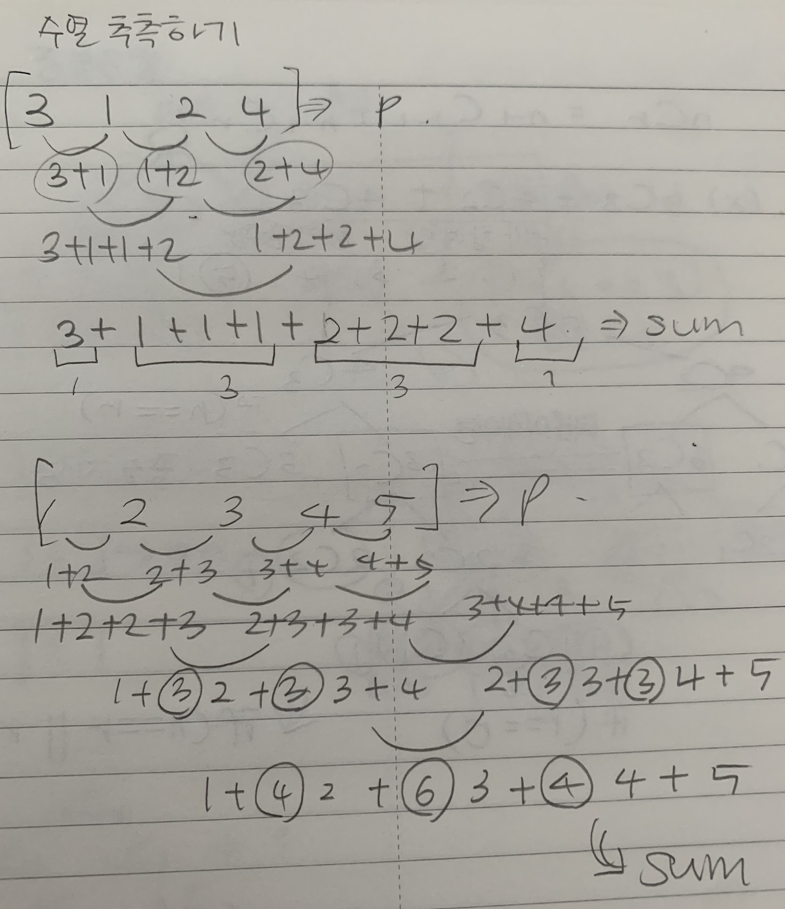

# 210802 재귀함수, DFS, BFS

## 1. [재귀함수를 이용한 이진수 출력](./01.js)

## 2. [이진트리 순회(DFS)](./02.js)

## 3. [부분집합 구하기(DFS)](./03.js)

## 4. ❤️[합이 같은 부분집합(DFS)](./04.js)

## 5. [바둑이 승치(DFS)](./05.js)

## 6. [최대점수 구하기(DFS)](./06.js)

## 7. ❤️[중복순열 구하기](./07.js)

## ------순열과 조합은 매우 중요함!------

## 8. [순열 구하기](./08.js)

## 9. [조합의 경우수(메모이제이션)](./09.js)

## 10. [수열 추측하기](./10.js)

## 11. [조합 구하기](./11.js)

## 12. [수들의 조합](./12.js)

## 13. [이진트리 레벨탐색(BFS)](./13.js)

## 14. [송아지 찾기(BFS)](./14.js)

## 15. [미로의 최단거리 통로(BFS)](./15.js)
