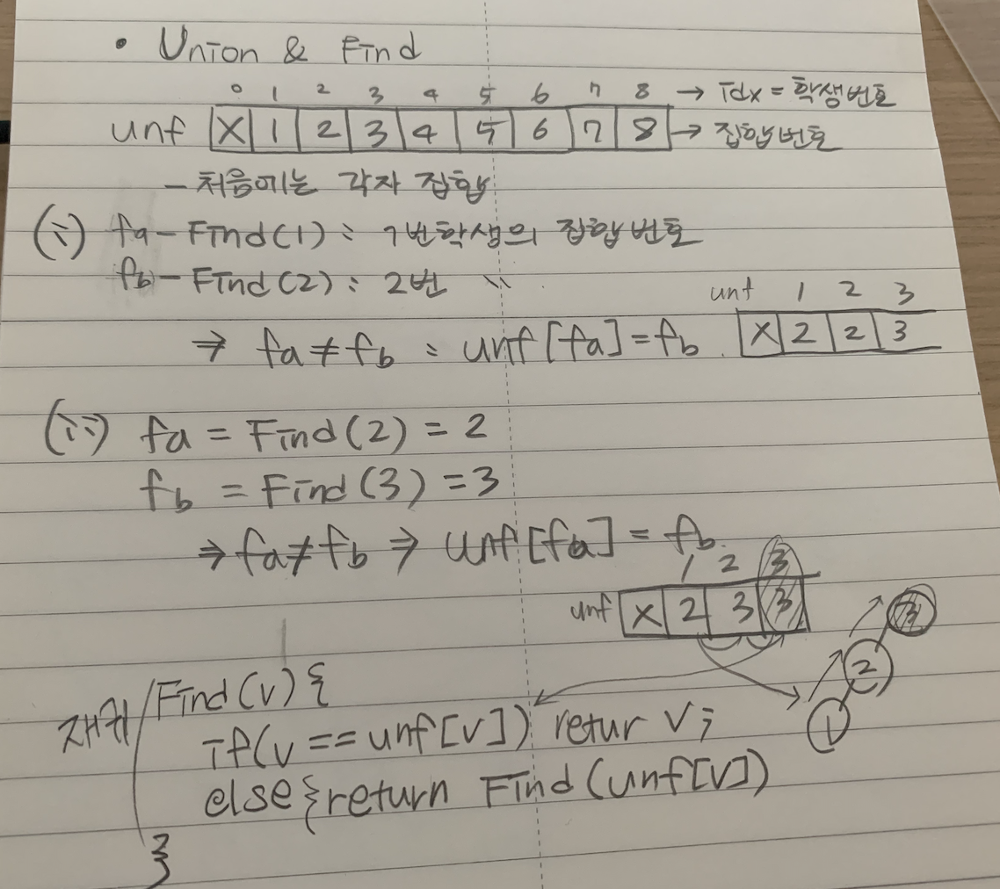
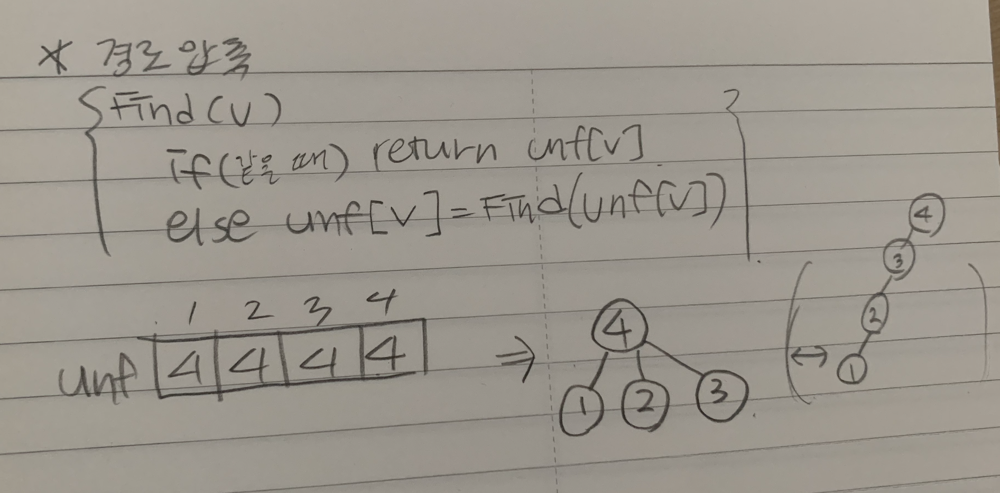
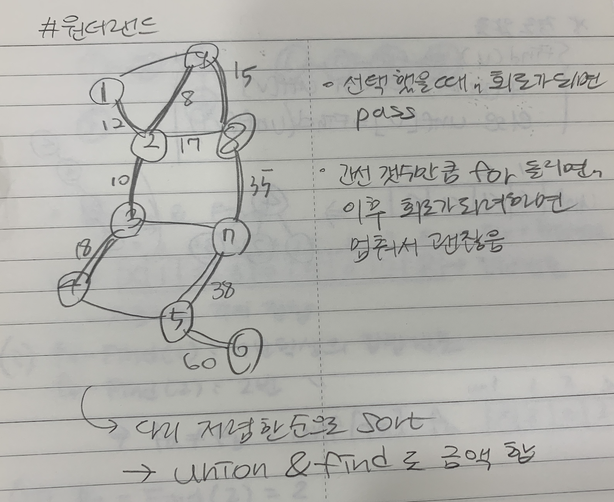
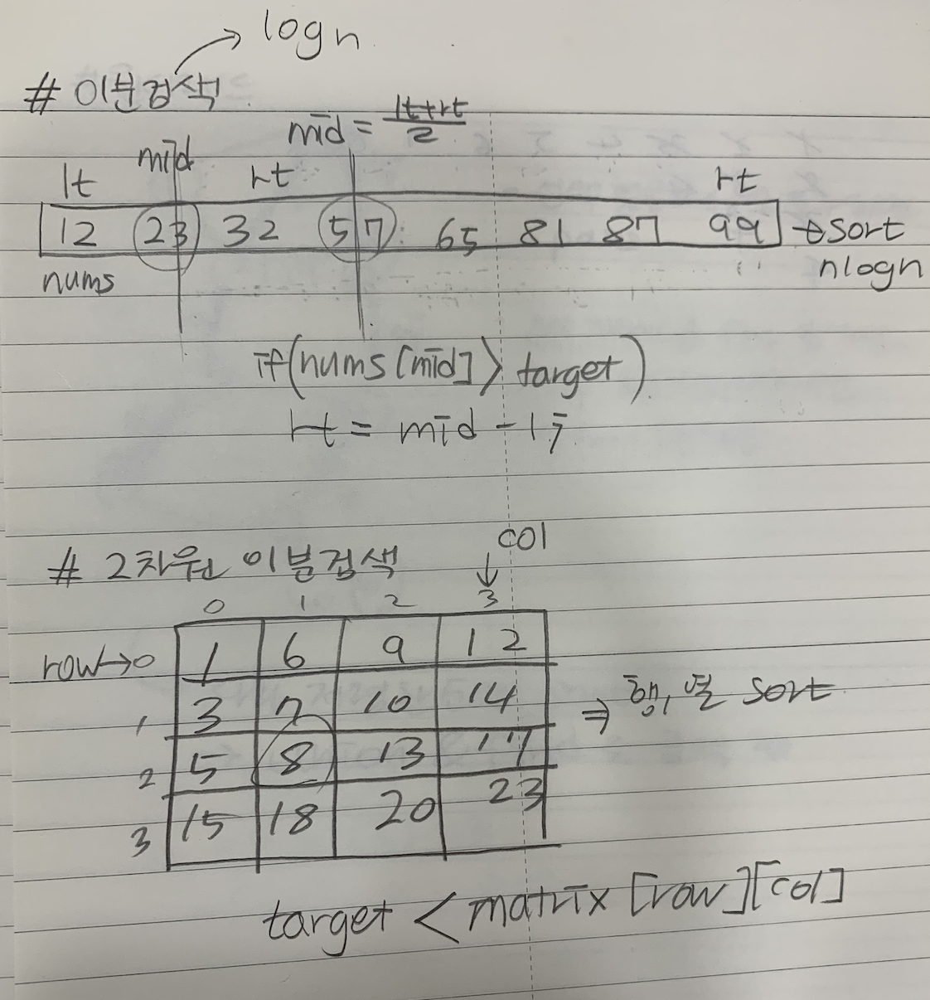
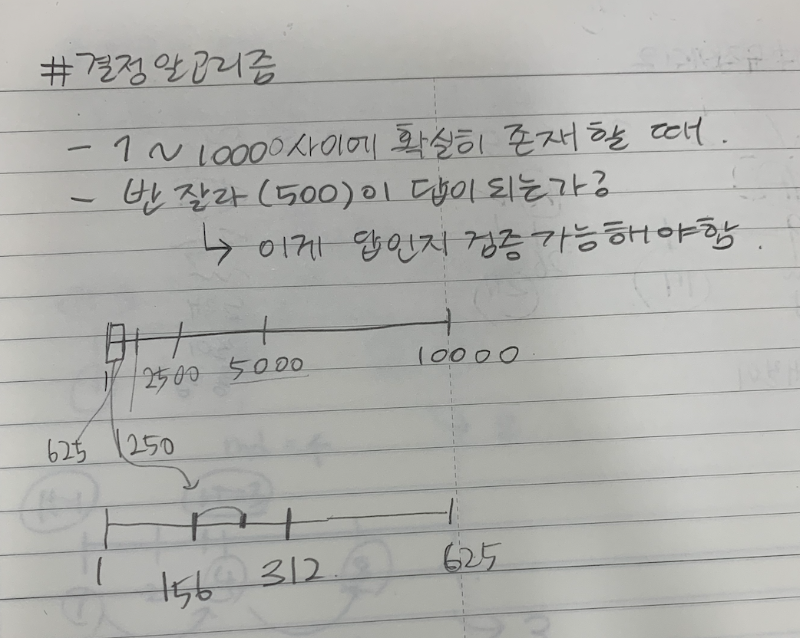
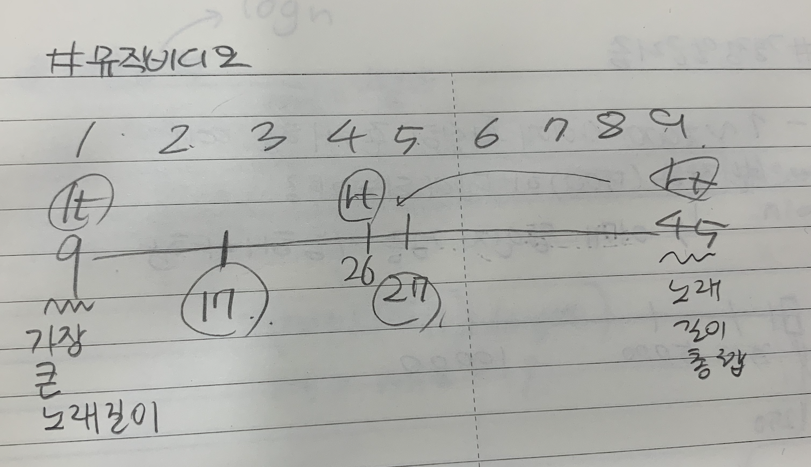
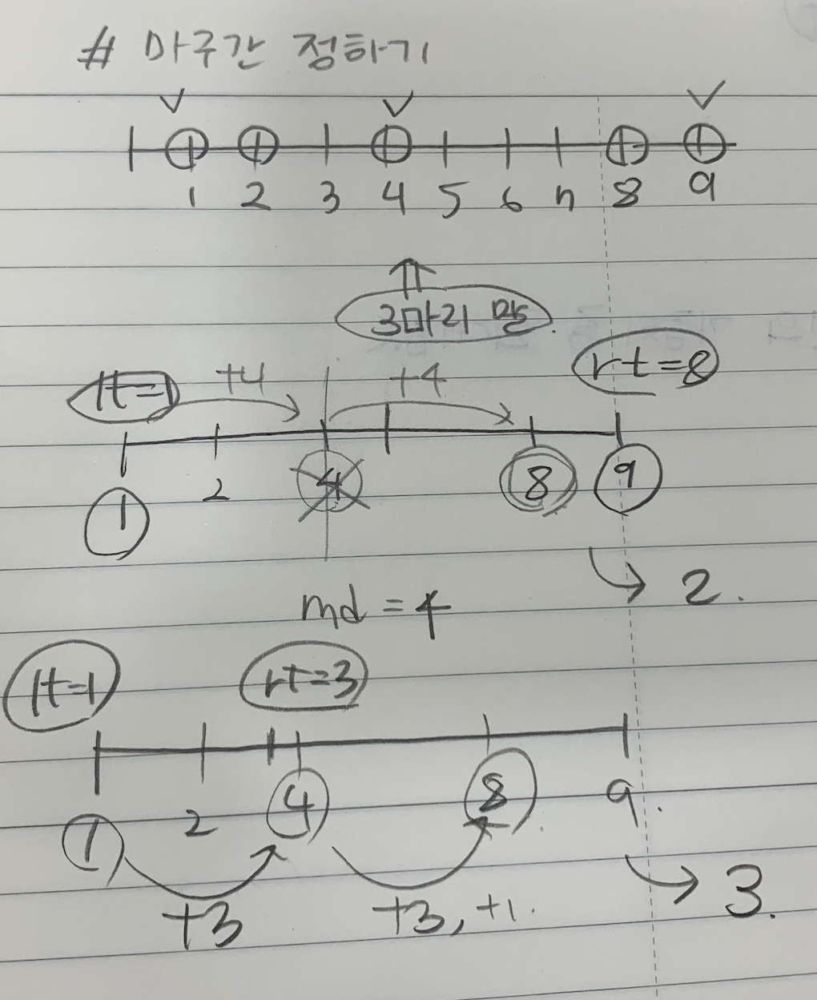
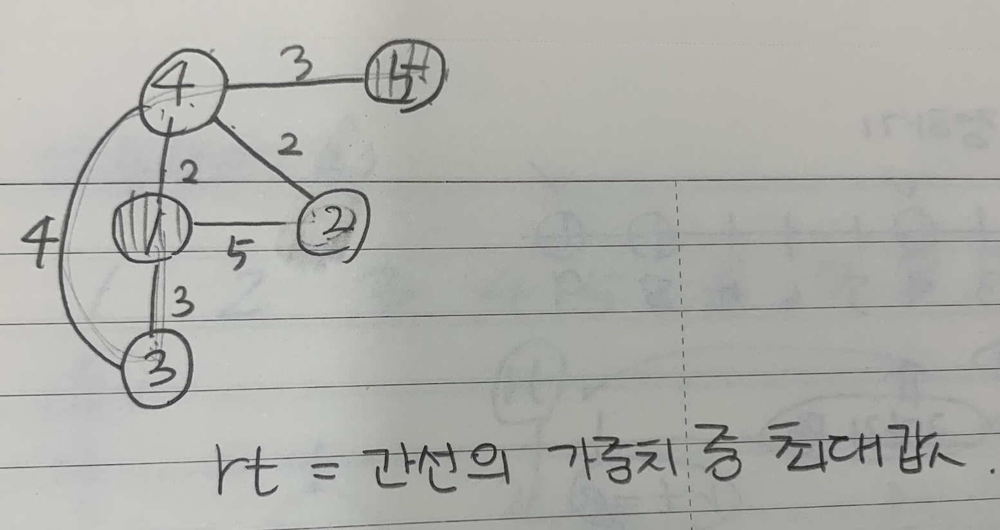

# 210804 트리, 이분검색(결정알고리즘)

## 1. [친구인가? (Disjoint-set: Union&Find)](./01.js)

## 2. [원더랜드(최소스패닝트리 : 크루스칼, Union&Find 활용)](./02.js)

## 3. [이분검색](./03.js)

## 4. [2차원 배열 이분검색](./04.js)

## 5. [랜선자르기(결정알고리즘)](./05.js)

## 6. [뮤직비디오(결정알고리즘)](./06.js)

## 7. [마구간 정하기(결정알고리즘)](./07.js)

## 8. [제품 이동](./08.js)

