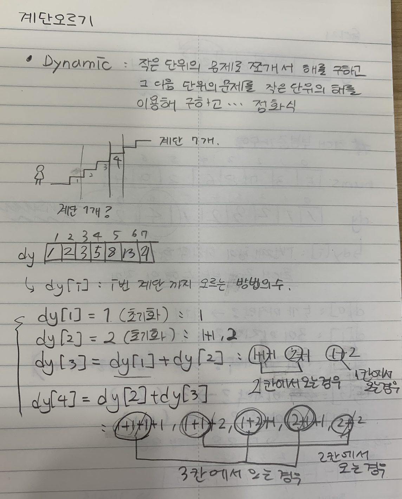
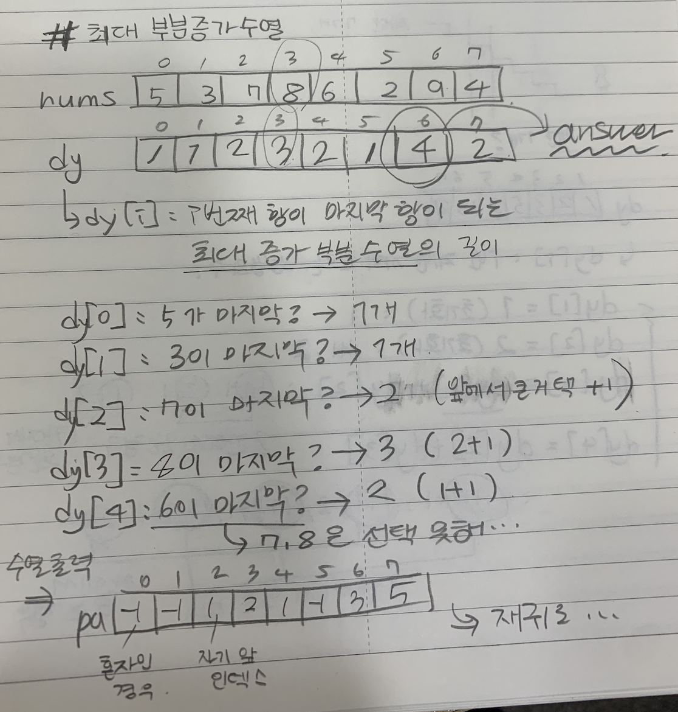
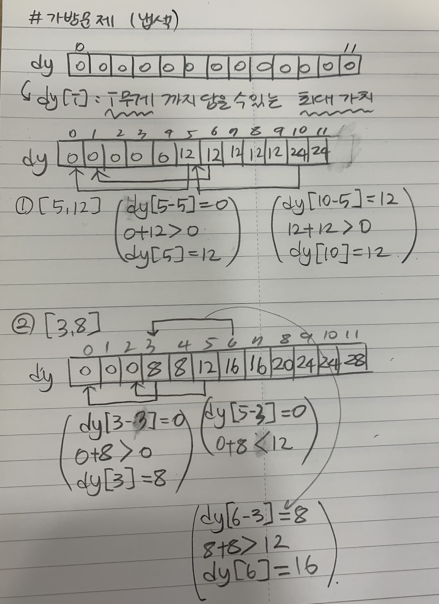
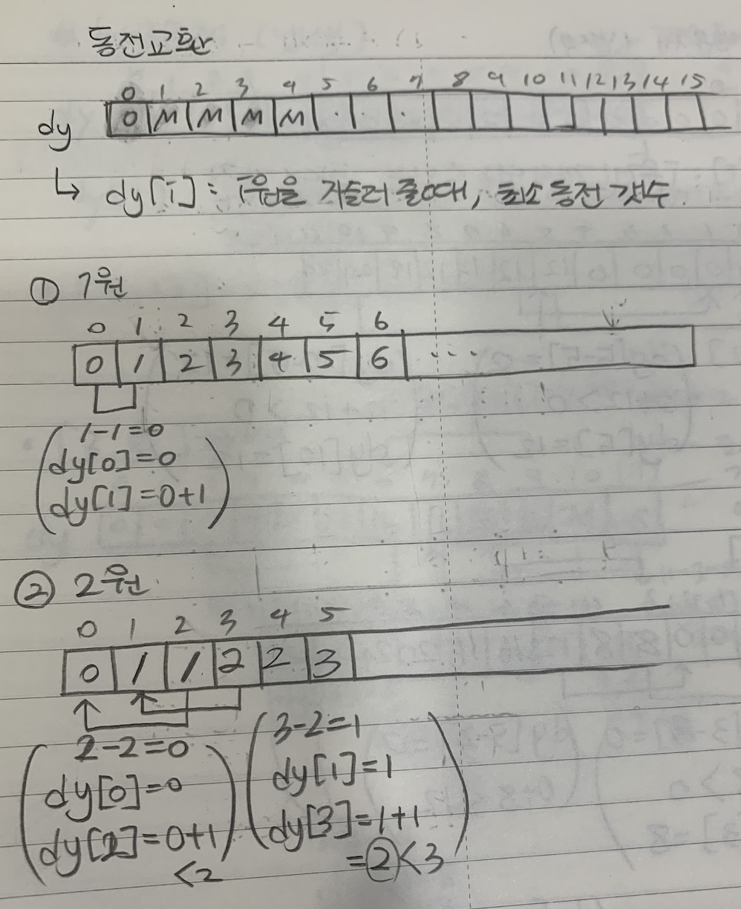
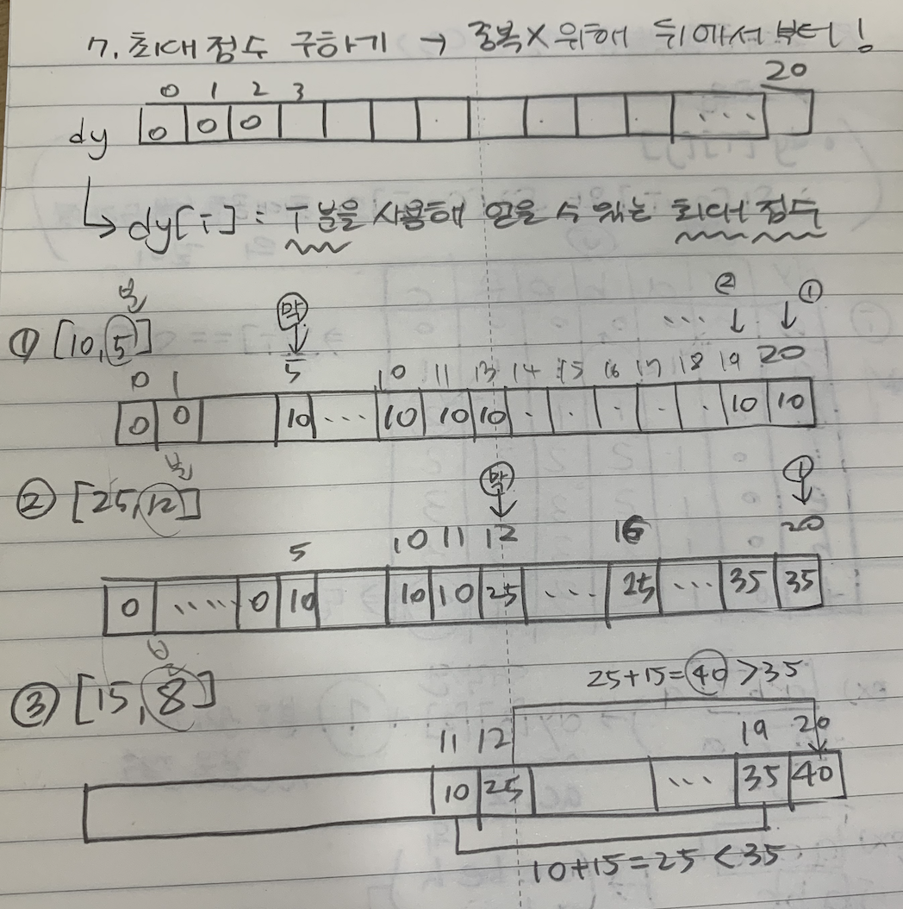
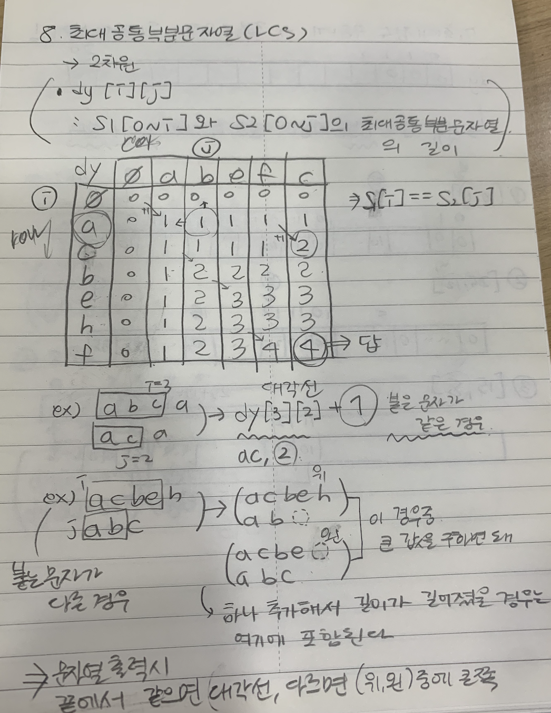

# 210805 동적 계획법: 다이나믹 프로그래밍

- dynamic : 큰 문제를 작은 단위의 문제로 쪼개서 해를 구하고, 그 다음 단위의 문제를 이전에 구한 해를 이용하여 해결하고, ... 점화식

## 1. [계단오르기](./01.js)

## 2. [돌다리 건너기](./02.js)

## 3. [최대 부분 증가수열](./03.js)

## 4. [효율적인 공부](./04.js)

## 5. [가방문제(냅색 알고리즘)](./05.js)

## 6. [동전교환(냅색 알고리즘)](./06.js)

## 7. [최대점수 구하기(냅색 알고리즘)](./07.js)

## 8. [최대공통부분문자열(LCS)](./08.js)

## [test - 마운틴 수열](./test.js)

## 9. [최소편집](./09.js)
