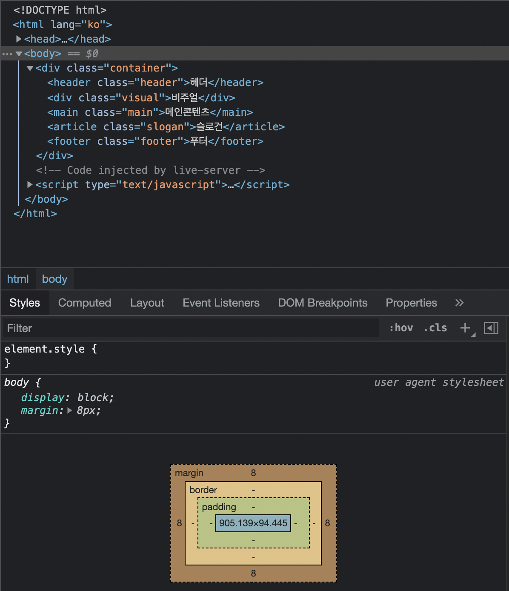
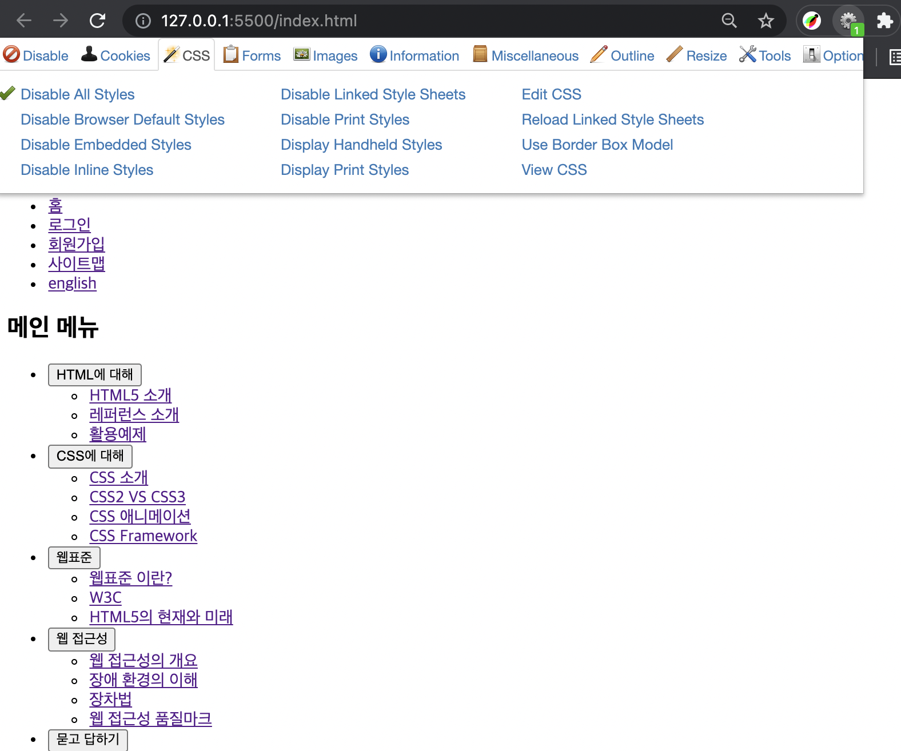
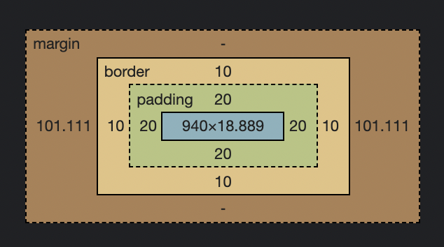

## 1. 레이아웃

- [main.html](../project/main.html)

- [main.css](../project/main.css)

### 1-1. 3단 레이아웃 & 4단 레이아웃

  

- 우리는 3단 레이아웃 + 5단 세부화

  `.contiainer>header.header+div.visual+main.main+article.slogan+footer.footer`

```html
<div class="contiainer">
  <header class="header"></header>
  <div class="visual"></div>
  <main class="main"></main>
  <article class="slogan"></article>
  <footer class="footer"></footer>
</div>
```

### 1-2. User agent stylesheet

- 설정하지 않았는데 마진이 들어가있넹?

  

## 2. header

- Web Developer

  

### 2-1. 로고

#### 이미지로 구성되어 있음

- 처음부터 img태그?
  상황에 따라 이미지를 바꾸기 어려움
  js로 할 수 있지만 성능이 안좋아...
  이미지를 바꾸지 않을 때는 좋음.

- 배경처리 : [Responsive Logos](http://www.responsivelogos.co.uk/)
  이미지 바꾸기 쉬움!
  반응형에 많이 사용됨.

#### img로 사용할거얌

- a 태그가 img 태그를 감싸고 있어야 함
- h1으로 감싸쟈!
- alt 대체 텍스트는 신경써서 작성하자...

  `h1.logo>a>img`

```html
<h1 class="logo">
  <a href="./index.html"></a>
</h1>
```

### 2-2. 링크모음

#### 홈, 로그인

- 홈, 로그인은 독립되었지만 링크모음임
- ul 클래스로 모아주고, li속 a로 링크 설정

  `ul>li*2>a`

```html
<ul class="member-service">
  <li><a>홈</a></li>
  <li><a>로그인</a></li>
</ul>
```

- 약어로 랩핑 : `option + cmd + G`

  ` ul>li*>a[href="#]`


- 수식 평가 : `control + shift + Y`

#### (참고) 네이밍

- PC(TC) : `MemberService`
- CC(camel case) : `meberService`
- KC(kebab case) : `member-service`
- SC : `member_service`

## 3. main

- `div.group.group$*3{group$}`

```html
<main class="main">
  <div class="group group1">group1</div>
  <div class="group group2">group2</div>
  <div class="group group3">group3</div>
</main>
```

### 3-1. 디자인을 위해서, html을 수정하지 말자!

- footer 만 제외하고, 나머지의 width를 결정하는 방법을 사용

```css
.container {
  background-color: gray;
}

/* footer을 전체영역에 걸쳐 표현하기 위해서 */
.header,
.visual,
.main,
.slogan {
  width: 940px;
}
```

### 3-2. 요소의 크기를 결정하는 것

- `margin: 0 auto;` 는 가운데 정렬하는 꼼수다.

  

```css
.header,
.visual,
.main,
.slogan {
  /* 요소의 크기를 결정하는 것은 width + padding + border + margin */
  width: 940px;
  padding: 20px;
  border: 10px solid black;
  /* auto: width + padding + border 을 제외한 나머지 영역을 margin으로 설정한다. */
  margin: 0 auto;
}
```

### 3-3. border-box;

- box-sizing

```css
*,
*::before,
*::after {
  /* 가상 요소 선택자 :: */
  box-sizing: border-box;
}
```

### 3-4. group

[flex-box tricks](https://css-tricks.com/snippets/css/a-guide-to-flexbox/)

- 인터넷 익스플로어에서 사용할 수 있게 해야함. => space-evenly 사용 못해
- flex-items의 order는 기본적으로 0값임.

```css
.main {
  background-color: aqua;
  height: 50vh;
  display: flex;
  /* justify-content: space-evenly;  => explore에서 동작하지 않음 */
  /* 아래와 같이 접근함 */
  padding: 30px;
  justify-content: space-between;
}
.group {
  /* flex-basis: 100%;
  flex-grow: 1;
  flex-shrink: 1; 
  flex: 1 1 100%; */
}
.group1 {
  background-color: red;
  /* flex-basis: 50%; 축소되는 값을 컨트롤 할 수 있음 */
  width: 250px; /* 전통적인 방식 */
  order: 1; /* 모든 flex-item의 order는 0번 */
}
.group2 {
  background-color: olive;
  width: 380px;
  /* 커스텀 레이아웃을 사용자가 자유롭게 설정할 때 ... order을 잘 사용해야함. */
  order: -1;
}
.group3 {
  background-color: violet;
  width: 190px;
}
```
