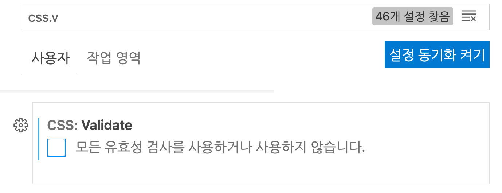

# Tailwind

- [Tailwind 사이트](https://tailwindcss.com/)

  - 이미 class로 스타일을 만들어 제공한다.
  - 사용한 것만 모아서 css로 빌드해준다.
  - 커스텀 가능 => 근데 어려워

## 환경 세팅

- shell

```shell
 % mkdir tailwind
 % cd tailwind
 % mkdir src src/css
 % touch src/index.html
 % touch src/css/tailwind.css
 % npm init -y
 % npm install -D tailwindcss@latest postcss@latest autoprefixer@latest
 % npx tailwindcss init -p // (-p : postcss까지)
```

- 확장 프로그램 설치





- tailwind.config.js

```js
module.exports = {
  // 인식할 수 있는 html 경로
  purge: ["src/**/*.html"],
  darkMode: "class", // or 'media' or 'class'
  theme: {
    // tailwind가 제공하는 글자색 배경색 ,.... 확장가능
    // 홈페이지에서 제공함
    // 배경: https://tailwindcss.com/docs/background-image#customizing
    // 글자색: https://tailwindcss.com/docs/gradient-color-stops
    extend: {},
  },
  variants: {
    extend: {},
  },
  plugins: [],
};
```

- tailwind.css

```css
@tailwind base;
@tailwind components;
@tailwind utilities;
```

- package.json

```json
{
  "scripts": {
    "start": "npm run watch",
    "tailwind": "tailwind -i src/css/tailwind.css -o src/css/style.css",
    "watch": "npm run tailwind -- --watch"
  },
  "devDependencies": {
    "autoprefixer": "^10.3.2",
    "postcss": "^8.3.6",
    "tailwindcss": "^2.2.7"
  }
}
```

## 연습

- html

```html
<!DOCTYPE html>
<html lang="ko">
  <head>
    <meta charset="UTF-8" />
    <meta http-equiv="X-UA-Compatible" content="IE=edge" />
    <meta name="viewport" content="width=device-width, initial-scale=1.0" />
    <title>tailwind CSS 실습</title>
    <link rel="stylesheet" href="./css/style.css" />
  </head>
  <!-- tailwind class를 추가하면 스타일링이 자동으로됨. -->
  <body class="text-lg bg-yellow-300">
    <p>Tailwind를 이용한 스타일링</p>
  </body>
</html>
```
