# WCAG 2.1 - 1.인식의 용이성 (Perceivable)

## 0. WCAG란

- Web Content Accessibiility Guidelines

  > 웹 콘텐츠를 장애인이 보다 더 접근 가능하게 만드는 방법을 정의한다.

      - 전맹, 저시력
      - 난청, 청각장애
      - 운동장애
      - 언어장애
      - 광과민성
      - 학습장애/ 인지장애

### 원칙

    - 인식의 용이성 (perceivable)
    - 운용의 용이성 (operable)
    - 이해의 용이성 (understandable)
    - 견고성 (robust)

### 지침

    - 13가지
    - 틀(framework)와 목표(objectives)

### 성공기준

    - A(최저), AA, AAA(최고)

### 충분/조언

    - 웹 콘텐츠 저작자들이 지침을 보다 더 잘 구현할 수 있도록
    - 일반적인 실패가 있는 경우, 그러한 것들도 문서화

 

---

## 1. 인식의 용의성

- 정보와 사용자 인터페이스 요소는 사용자가 인식할 수 있는 방법으로 제시되어야 한다.

 

## 1.1 대체 텍스트

- 큰 인쇄물, 점자, 음성, 기호 또는 간단한 언어와 같이 사용자가 필요로 하는 다른 형식으로 변경할 수 있도록 텍스트가 아닌 콘텐츠에 대한 대체 텍스트를 제공해야 한다

### 1.1.1 텍스트가 아닌 콘텐츠(A)

- 컨트롤, 입력

> 텍스트가 아닌 콘텐츠가 사용자의 입력을 허용하거나 컨트롤 한다면, 목적을 서술하는 이름(예: 컴포넌트 이름, 폼 입력 필드 이름 등)을 제공해야 합니다.

- 엽떡)input 아이디에서 label이 제공되지 않음. 비밀번호도 마찬가지

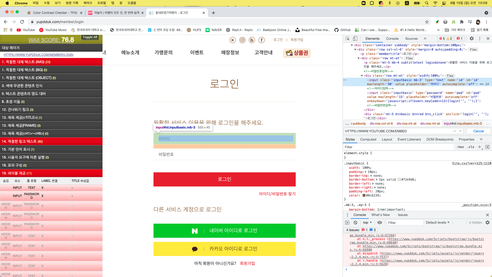

- 장식성, 포멧팅, 보이지 않는

> 텍스트가 아닌 콘텐츠가 순수한 장식 이거나, 시각적으로만 사용 되었거나, 사용자에게 보이지 않는다면 보조기술에서 이를 읽지 않고 무시하도록 처리해야 합니다.

- bad)네이버 아이디 로그인 텍스트와 네이버 이미지의 대체텍스트가 똑같음. 이미지 대체텍스트는 생략해야함.

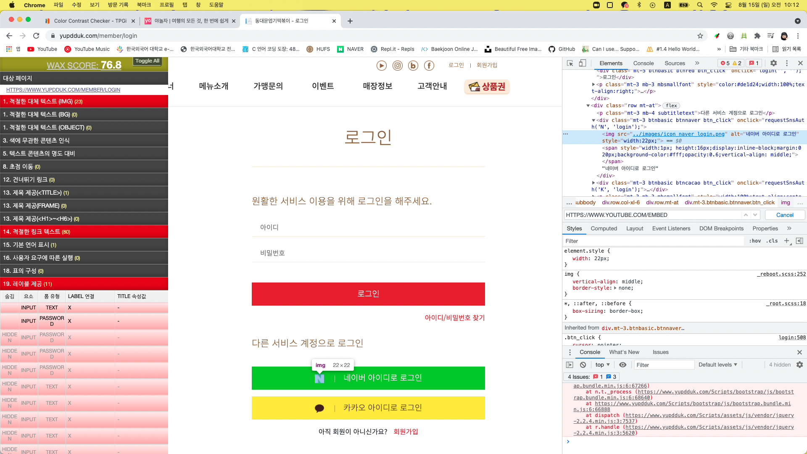

- good)aria-label을 사용하였음, 그리고 이미지 alt는 생략하였다.

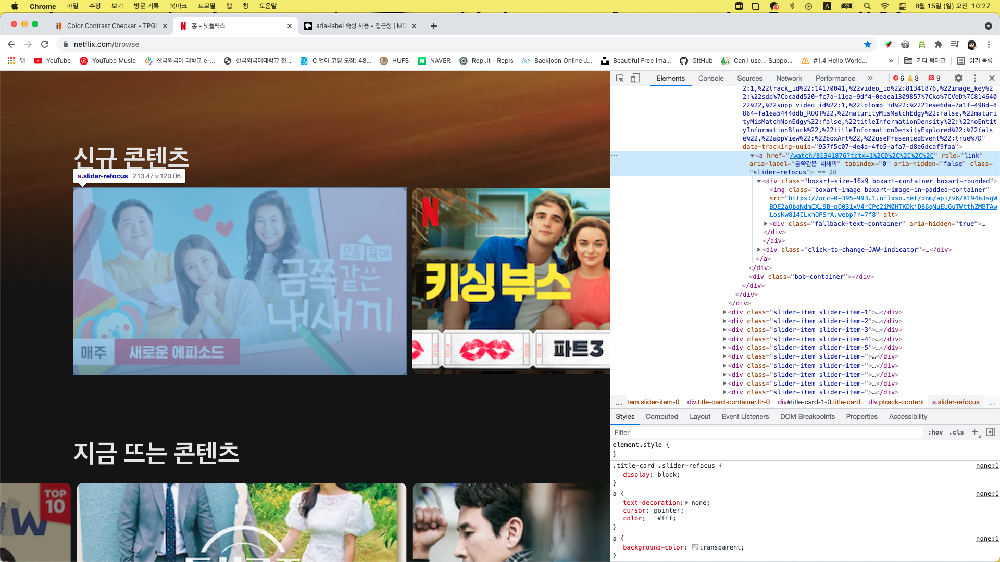

 

## 1.2 시간 기반 미디어

- 시간에 기반한 미디어(오디오, 비디오...)의 대체 수단을 제공해야 한다.

 

## 1.3 적응성

- 정보나 구조를 잃지 않고 다양한 방식(간단한 레이아웃)으로 표현할 수 있는 컨텐츠를 만들어야 한다.

### 1.3.6 목적 식별 (AAA)

- HTML 마크업 언어를 사용하여 구현된 콘텐츠에서 사용자 인터페이스(UI) 컴포넌트, 아이콘 및 영역(regions)의 목적을 프로그래밍 방식으로 결정할 수 있습니다.

- bad) 스크린리더(보이스오버)사용시 사용자정보에서, `&#xAC15;&#xD76C;`(강희) 을 직접 읽어줌

  > 사용자에게 이상하게 읽히지 않도록 적절한 대체 텍스트를 제공하지 못하였음.

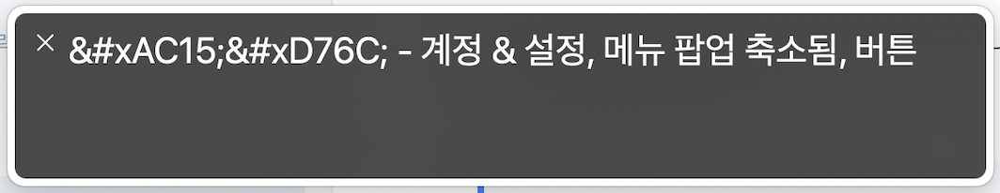

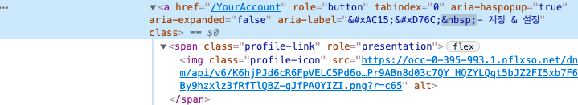

 

## 1.4 명로성

- 사용자가 콘텐츠를 보고 들을 수 있도록 명확하게 구분할 수 있어야 한다.

### 1.4.10 리플로우(AA)

콘텐츠는 정보나 기능의 손실없이 양 방향으로 스크롤하지 않도록 제공되어야 합니다. (CSS 픽셀 기준)

- 깃허브는 명로성 리프로우 항목에 맞추어, 400배 확대시 양방향 스크롤 되지 않는다.

<video src="./video/github.mov" width="400"><video>

- 네이버는 400배 확대시 양방향 스크롤이 된다.

<video src="./video/naver.mov" width="400"><video>

### 1.4.11 비 텍스트 명도대비 (AA)

- 링크 텍스트가 활성화 된 상태(:hover, :focus, :active 등)를 시각적으로 명확하게 구분할 수 있도록 만들어야 합니다. 기본 스타일을 그대로 사용하거나, 임의의 스타일을 설정해 시각적인 구분을 가능하게 만들어야 합니다.

- 대한항공은 활성화된 링크 텍스트를 명확하게 보여줌

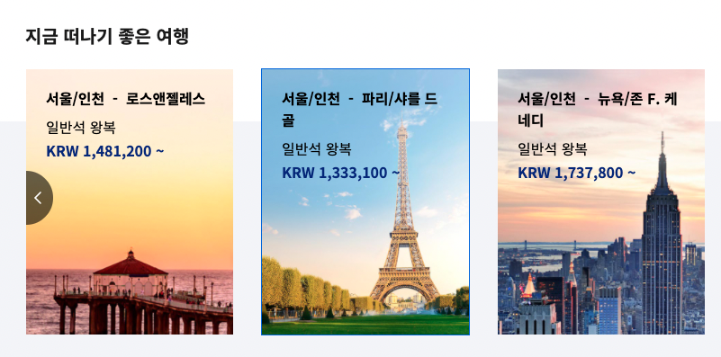

- 야놀자는 활성화된 링크 텍스트를 보여주지 않음

  

---

## 홈페이지 사례

1. [야놀자](https://www.yanolja.com/)

- bad)tab키로 접근하였는데, 아이콘이 포커싱되는 효과가 없음...

- bad)색상 대비가 너무 미미함

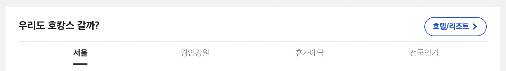

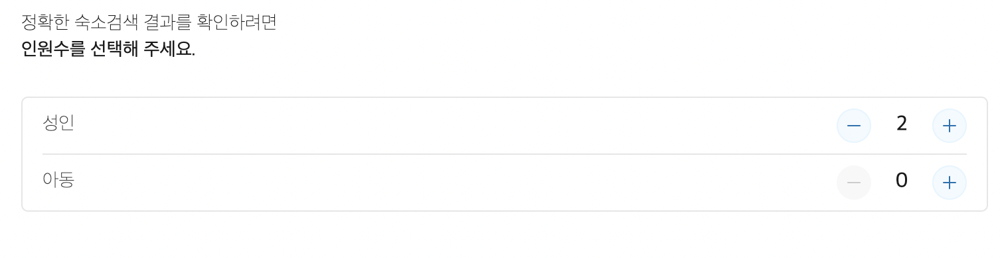

- bad)a link의 텍스트가 없음

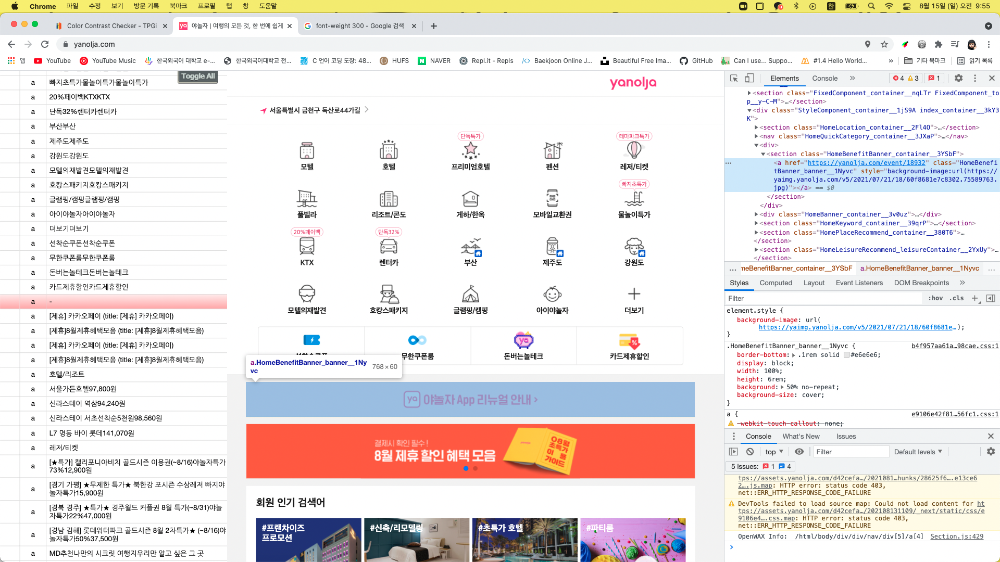

- bad)기본 언어가 표시되어있지 않음.

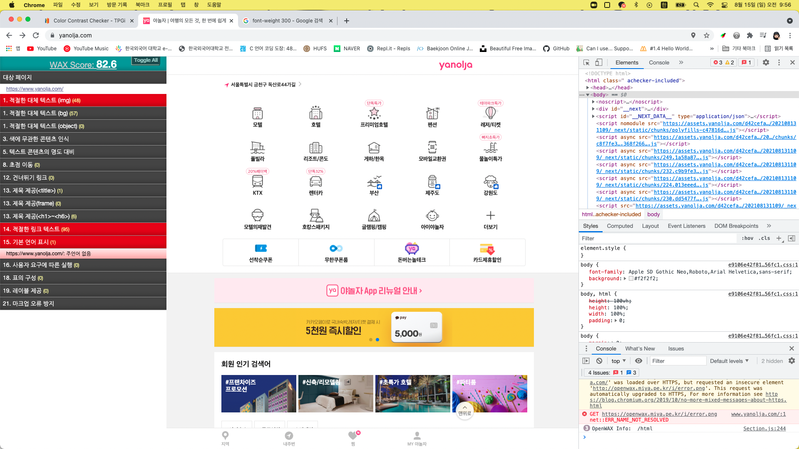

---

2. [엽떡](https://www.yupdduk.com/)

- bad)처음에 뜬 광고창 때문에 키보드로 접근이 불가능. 광고창 닫는 칸에 키보드 접근이 안된다.

- bad)`target="_blank"`로 여는데, opnener 이나 openreferr이 사용되지 않음

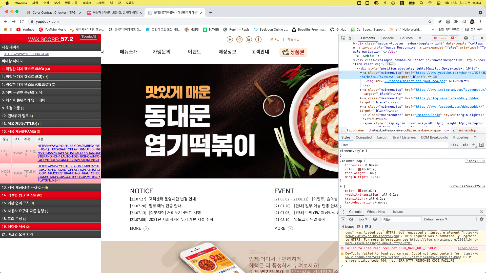

- bad)input 아이디에서 label이 제공되지 않음. 비밀번호도 마찬가지

- bad)네이버 아이디 로그인 텍스트와 네이버 이미지의 대체텍스트가 똑같음. 이미지 대체텍스트는 생략해야함.

- bad)색상 명암비가 확대시 3:1을 지키지 못한 2.7:1임.

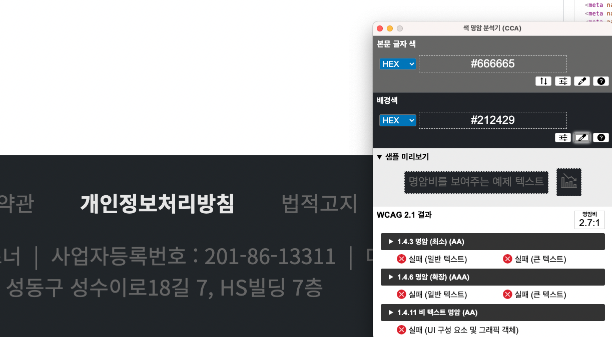

---

3. [넷플릭스](https://www.netflix.com/browse)

- good)aria-label을 사용하였음, 그리고 이미지 alt는 생략하였다.

- bad) 스크린리더(보이스오버)사용시 사용자정보에서, `&#xAC15;&#xD76C;`(강희) 을 직접 읽어줌

