# WebCafe

## HTML

## 1. 레이아웃

- [main.html](../project/webCafe/main.html)

- [main.css](../project/webCafe/css/main.css)

<br>
<br>

### 1-1. 3단 레이아웃 & 4단 레이아웃

  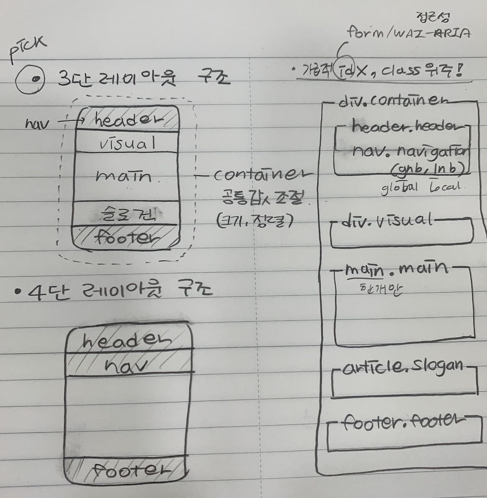

- 우리는 3단 레이아웃 + 5단 세부화

  `.contiainer>header.header+div.visual+main.main+article.slogan+footer.footer`

```html
<div class="contiainer">
  <header class="header"></header>
  <div class="visual"></div>
  <main class="main"></main>
  <article class="slogan"></article>
  <footer class="footer"></footer>
</div>
```

<br>

### 1-2. User agent stylesheet

- 설정하지 않았는데 마진이 들어가있넹?

  

<br>
<br>

## 2. header

- Web Developer

  

<br>

### 2-1. 로고

#### 이미지로 구성되어 있음

- 처음부터 img태그?
  상황에 따라 이미지를 바꾸기 어려움
  js로 할 수 있지만 성능이 안좋아...
  이미지를 바꾸지 않을 때는 좋음.

- 배경처리 : [Responsive Logos](http://www.responsivelogos.co.uk/)
  이미지 바꾸기 쉬움!
  반응형에 많이 사용됨.

<br>

#### 여기선 img로 사용할거얌

- a 태그가 img 태그를 감싸고 있어야 함
- h1으로 감싸쟈! (for outline algorithm...)
- alt 대체 텍스트는 신경써서 작성하자...

  `h1.logo>a>img`

```html
<h1 class="logo">
  <a href="./index.html">
    
  </a>
</h1>
```

<br>

### 2-2. 링크모음

#### 홈, 로그인

- 홈, 로그인은 독립되었지만 링크모음임
- ul 클래스로 모아주고, li속 a로 링크 설정

  `ul>li*2>a`

```html
<ul class="member-service">
  <li><a>홈</a></li>
  <li><a>로그인</a></li>
</ul>
```

- 약어로 랩핑 : `option + cmd + G`

  ` ul>li*>a[href="#]`

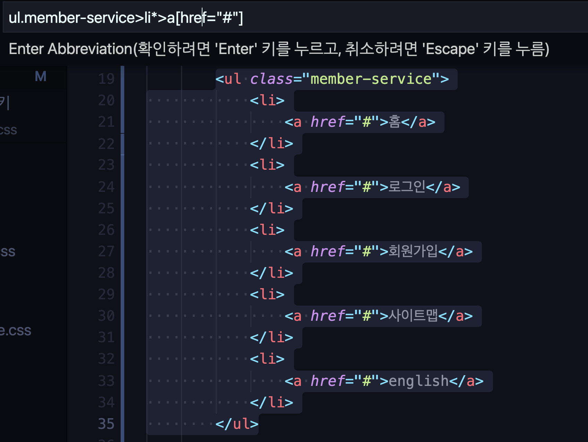

- 수식 평가 : `control + shift + Y`

<br>

## 2-3. nav

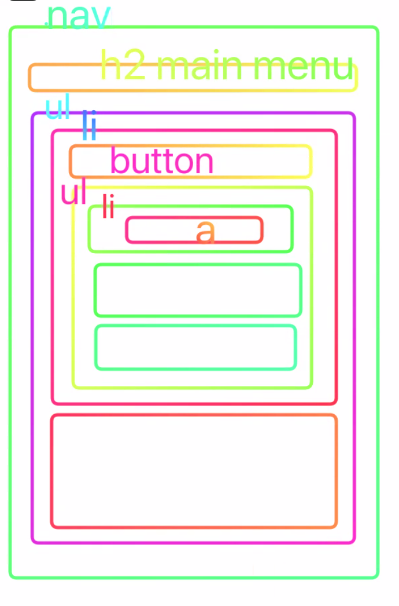

- `h2`는 접근성을 위한 숨김 컨텐츠

  - 전체적인 맥락을 파악하게함.
  - `<h2 class="a11y-hidden"></h2>`
  - accessibility-hidden

- html

```html
<nav class="navigation">
  <h2 class="a11y-hidden">메인 메뉴</h2>
  <ul class="menu">
    <li class="menu-item is-active">
      <button type="button" class="menu-button">HTML에 대해</button>
      <ul class="sub-menu menu-html">
        <li>
          <a href="#">HTML5 소개</a>
        </li>
        <li>
          <a href="#">레퍼런스 소개</a>
        </li>
        <li>
          <a href="#">활용예제</a>
        </li>
      </ul>
    </li>
    <li class="menu-item">...</li>
    <li class="menu-item">...</li>
    <li class="menu-item">...</li>
    <li class="menu-item">...</li>
    <li class="menu-item">...</li>
  </ul>
</nav>
```

- 결과

  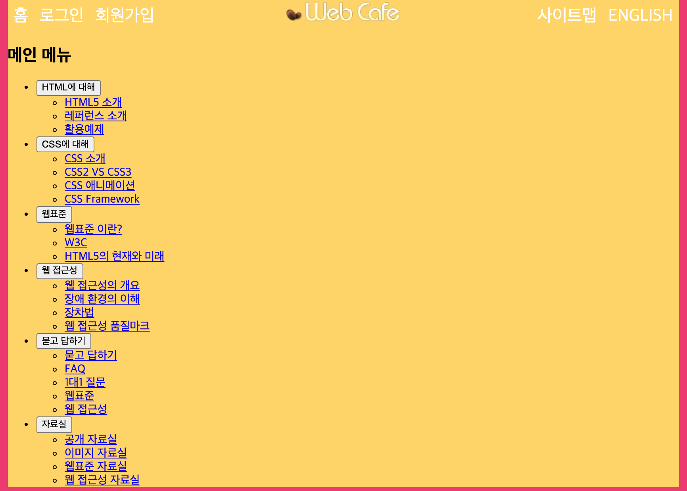

<br>

#### (참고) 네이밍

- PC(TC) : `MemberService`
- CC(camel case) : `meberService`
- KC(kebab case) : `member-service`
- SC : `member_service`

<br>
<br>

## 3. main

- `div.group.group$*3{group$}`

```html
<main class="main">
  <div class="group group1">group1</div>
  <div class="group group2">group2</div>
  <div class="group group3">group3</div>
</main>
```

<br>

---

## CSS

## 0. 유용한 사이트

- [toast UI](https://ui.toast.com/weekly-pick/ko_20210402)

- [color](https://coolors.co/)

- [컨테이닝 블록](https://developer.mozilla.org/ko/docs/Web/CSS/Containing_block)

- [접근성 기술](https://www.youtube.com/channel/UCTI6h7Vb05Td63qHQ3wjySQ)

- [그라디언트](https://www.colorzilla.com/gradient-editor/)

- [fontello - 아이콘](https://fontello.com/)

- [nuli](https://nuli.navercorp.com/)

- [HTML-CSS](https://github.com/dreamfulbud/TIL)

- [프로젝트 document 정리](https://shhn0509.gitbook.io/react/)

- [NHN 코딩컨벤션](https://nuli.navercorp.com/data/convention/NHN_Coding_Conventions_for_Markup_Languages.pdf)

- [한국형 웹 컨텐츠 접근성](<https://www.wah.or.kr:444/_Upload/pds/%ED%95%9C%EA%B5%AD%ED%98%95%EC%9B%B9%EC%BD%98%ED%85%90%EC%B8%A0%EC%A0%91%EA%B7%BC%EC%84%B1%EC%A7%80%EC%B9%A82.1(5).pdf>)

- [wai-aria 속성, 상태, 역할](https://velog.io/@kym123123/ARIA%EC%9D%98%EC%86%8D%EC%84%B1%EC%83%81%ED%83%9C%EC%97%AD%ED%95%A0%EB%B0%8F%EC%82%AC%EC%9A%A9-%EC%98%88%EC%8B%9C%EC%A3%BC%EC%9D%98%EC%82%AC%ED%95%AD)

- [웹 접근성 연구소 - 정보접근성 향상을 위한 W3C 국제표준 WAI-ARIA 사례집](https://www.wah.or.kr:444/board/boardView.asp?page=1&brd_sn=5&brd_idx=1019)

- [NIAWA](https://github.com/niawa/ARIA)

- [tab-interaction : 키보드 인터렉션](https://www.w3.org/TR/wai-aria-practices-1.1/#tabpanel)

- [gitbook skymimo](https://aoa.gitbook.io/skymimo/)

- [csslayout](https://csslayout.io/patterns/)

<br><br>

### 1-1. 디자인을 위해서, html을 수정하지 말자!

- footer 만 제외하고, 나머지의 width를 결정하는 방법을 사용

```css
.container {
  background-color: gray;
}

/* footer을 전체영역에 걸쳐 표현하기 위해서 */
.header,
.visual,
.main,
.slogan {
  width: 940px;
}
```

<br>

### 1-2. 요소의 크기를 결정하는 것

- `margin: 0 auto;` 는 가운데 정렬하는 꼼수다.

  

```css
.header,
.visual,
.main,
.slogan {
  /* 요소의 크기를 결정하는 것은 width + padding + border + margin */
  width: 940px;
  padding: 20px;
  border: 10px solid black;
  /* auto: width + padding + border 을 제외한 나머지 영역을 margin으로 설정한다. */
  margin: 0 auto;
}
```

<br>

### 1-3. border-box;

- `box-sizing: border-box`
  - 너비(`width`, `height`)에 안쪽 여백(`padding`)과 테두리선(`border`)를 포함하여 요소의 크기를 계산
- `box-sizing: content-box` : 기본값
  - 너비(`width`, `height`)만으로 요소의 크기를 계산

```css
*,
*::before,
*::after {
  /* 가상 요소 선택자 :: */
  box-sizing: border-box;
}
```

<br>

### 1-4. group

[flex-box tricks](https://css-tricks.com/snippets/css/a-guide-to-flexbox/)

- 인터넷 익스플로어에서 사용할 수 있게 해야함. => space-evenly 사용 못해
- `flex-items`의 `order`는 기본적으로 0값임.
- `flex: 증가너비(0) 감소너비(1) 기본너비(auto);`
- `order`이 작을수록 앞 순서로 옴.

```css
.main {
  background-color: aqua;
  height: 50vh;
  display: flex;
  /* justify-content: space-evenly;  => explore에서 동작하지 않음 */
  /* 아래와 같이 접근함 */
  padding: 30px;
  justify-content: space-between;
}
.group {
  /* flex-basis: 100%;
  flex-grow: 1;
  flex-shrink: 1; 
  flex: 1 1 100%; */
}
.group1 {
  background-color: red;
  /* flex-basis: 50%; 축소되는 값을 컨트롤 할 수 있음 */
  width: 250px; /* 전통적인 방식 */
  order: 1; /* 모든 flex-item의 order는 0번 */
}
.group2 {
  background-color: olive;
  width: 380px;
  /* 커스텀 레이아웃을 사용자가 자유롭게 설정할 때 ... order을 잘 사용해야함. */
  order: -1;
}
.group3 {
  background-color: violet;
  width: 190px;
}
```

<br><br>

---

## 2. Header CSS

- validate local


<br>

### 2-1. Flex 안쓰고 배치

- `margin-right: auto`를 회원가입에게 줌
  - 요소들이 채워지고 남은 공백이 회원가입의 오른쪽에 배치됨

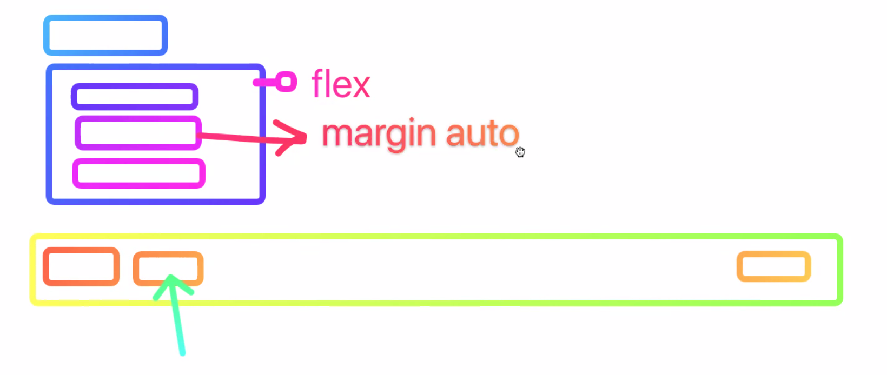

```css
.member-service {
  list-style: none;
  display: flex;
  padding-left: 0;
}
.member-service li {
  padding: 0.5em;
  text-transform: uppercase; /*대문자*/
}
.member-service a {
  text-decoration: none;
  color: #ffffff;
  font-size: 1.5em;
}
.member-service li:nth-child(3) {
  margin-right: auto; /* margin auto*/
}
```

<br>

- logo 배치 : `positon: absolute;`
  - header를 기준으로 위치가 이동됨.

```css
.header {
  background-color: blue;
  position: relative;
}
.logo {
  /* 헤더(컨테이너)를 기준으로 */
  position: absolute;
  left: 0;
  right: 0;
  text-align: center;
  margin: 0;
}
```

<br><br>

### 2-2. 다시 배치

### 2-2-1. [컨테이닝 블록 식별](https://developer.mozilla.org/ko/docs/Web/CSS/Containing_block)

컨테이닝 블록의 식별 과정은 position 속성에 따라 완전히 달라집니다.

1. position 속성이 static, relative, sticky 중 하나이면, 컨테이닝 블록은 가장 가까운 조상 블록 컨테이너(inline-block, block, list-item 등의 요소), 또는 가장 가까우면서 서식 맥락을 형성하는 조상 요소(table, flex, grid, 아니면 블록 컨테이너 자기 자신)의 콘텐츠 영역 경계를 따라 형성됩니다.

2. position 속성이 absolute인 경우, 컨테이닝 블록은 position 속성 값이 static이 아닌(fixed, absolute, relative, sticky) 가장 가까운 조상의 내부 여백 영역입니다.

3. position 속성이 fixed인 경우, 컨테이닝 블록은 뷰포트나 페이지 영역(페이지로 나뉘는 매체인 경우)입니다.

4. position 속성이 absolute나 fixed인 경우, 다음 조건 중 하나를 만족하는 가장 가까운 조상의 내부 여백 영역이 컨테이닝 블록이 될 수도 있습니다.

- transform이나 perspective (en-US) 속성이 none이 아님.
- will-change 속성이 transform이나 perspective임.
- filter 속성이 none이 아님. (Firefox에선 will-change가 filter일 때도 적용)
- contain 속성이 paint임.

<br>

### 2-2-1-2. transform이나 perspective (en-US) 속성이 none이 아님.


```html
<div class="box">
  <h1 class="logo">
    <a href="./index.html"></a>
  </h1>
</div>
```

```css
.box {
  background-color: red;
  /*float와 유사하게, logo가 붕 뜬상태임.*/
  height: 50px;
  transform: translateX(200px);
}
.logo {
  /* transform이 none이 아닌 box를 기준으로... */
  margin-top: 0;
  margin-bottom: 0;
  background-color: blue;
  /* position absolute일 때 */
  position: absolute;
  top: 45px;
  left: 65px;
}
```

<br>

### 2-2-2. logo의 `line-height`

```css
.logo {
  /* 헤더(컨테이너)를 기준으로 */
  margin-top: 0;
  margin-bottom: 0;
  background-color: blue;
  position: absolute;
  top: 45px;
  left: 65px;

  /* h2에 부여되어있는 font 스타일 때문에 여백이 생김.*/
  line-height: 0;
}
```

<br><br>

### 2-2-3. 폰트 - [스포카 산스](https://spoqa.github.io/spoqa-han-sans/)

- 폰트 연결

- CDN : 다른데에 있는겨 연결해서 쓰는거 ...

```css
@import url("./fonts.css");
body {
  margin: 0;
  font-family: "Spoqa Han Sans Neo", sans-serif;
  font-weight: 400;
}
a {
  text-decoration: none;
  /* 부모가 가진 폰트색, 검정 */
  color: inherit;
}
```

<br><br>

### 2-2-4. member-service

#### 2-2-4-1. 글자들 간의 공백 때문에 ....


- 다음과 같이 괴랄한 마크업을 옛날엔 사용했음

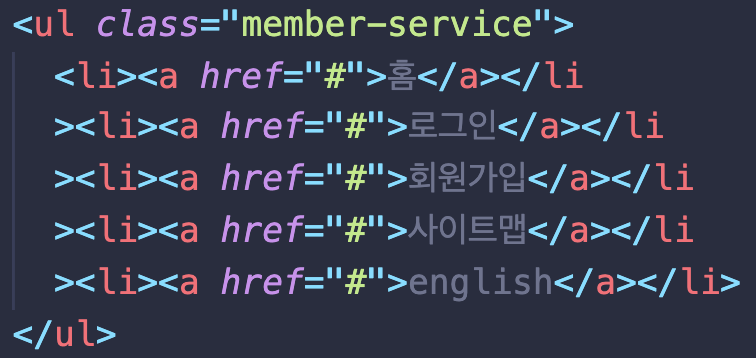

```css
/* 안내 링크 */
.member-service {
  background-color: yellowgreen;
  /* display: flex;
  justify-content: flex-end; */
  list-style: none;
  margin: 0;
  padding-left: 0;
}
.member-service li {
  /* 공백 문자 때문에 li간의 공백이 생김 => html마크업을 위와 같이 하는걸로 해결. */
  display: inline;
}
```

<br>

- 다른 대안 : `inline-block`으로, 부모의 `font-size`를 없애서...

```css
.member-service {
  background-color: yellowgreen;
  /* display: flex;
  justify-content: flex-end; */
  list-style: none;
  margin: 0;
  padding-left: 0;
  /* 공백 문자 없애기 위해 폰트 크기를 없앰 */
  font-size: 0;
  line-height: 0;
  text-align: right;
}
.member-service li {
  /* 공백 문자 때문에 li간의 공백이 생김 => inline-block + 부모 fontsize = 0 */
  display: inline-block;
  font-size: 0.875rem;
  line-height: 1.15;
}
```

#### 2-2-4-2. " : " 삽입

- css 상에서 삽입
  - 스크린리더를 사용하면 읽어짐

```css
/* 2번째 부터 몽땅! (css는 1번부터 시작) */
.member-service li:nth-child(n + 2)::before {
  content: ":";
}
```

<br>

- HTML 에서 삽입 : [YouTube 영상](https://www.youtube.com/playlist?list=PLtaz5vK7MbK3EAPhmB2gFnCU9qU72YMq3)
  - `aria-hidden = "true"`
  - 스크린리더에서 읽지 않음!
  - [aria 설명](https://developer.mozilla.org/ko/docs/Web/Accessibility/ARIA)

```html
<li>
  <a href="#">홈</a><span aria-hidden="true">:<span>
</li>
```

<br><br>

### 2-3. navigation

- [항공사의 ARIA적용](https://www.youtube.com/watch?v=qhuCggwxy9s&list=PLtaz5vK7MbK0wauPYD9VtgkwX2Bx_Ygo3)

- [화면을 보는 스크린리더 사용자](https://www.youtube.com/watch?v=kidbJ82Eukg&list=PLtaz5vK7MbK0wauPYD9VtgkwX2Bx_Ygo3&index=7)

<br>

#### 2-3-1. 숨김 컨텐츠 (a11y-hidden)

> 눈에는 안보이지만, 리더기는 접근할 수 있도록 해야함...
> 유틸리티 컨텐츠

- negative margin 공부하기

  > [negative margin 정리](./negative-margin.md)

```css
/* 숨김 컨텐츠 */
.a11y-hidden {
  background-color: red;
  /* 1. display: none */
  /* 접근성에서 치명적임 */
  /* 검색엔진이 접근하지 못함... */

  /* 2. position: absolute, top: -9999em */
  /* 사용성에 문제가 발생...*/
  /* 스크린리더가 읽으려고 top위로 탁 튀어버림...*/

  /* 3. width 1px, height 1px, overflow hidden */
  /* 가상 커서가 찾을 수 있도록...*/
  position: absolute;
  width: 1px;
  height: 1px;
  overflow: hidden;
  /* negative margin : 공부해보기! */
  margin: -1px;
  clip-path: polygon(0 0, 0 0, 0 0);

  /* clip 사용 */
  /* clip: rect(0 0 0 0);
  clip: rect(0, 0, 0, 0);
  clip-path: inset(50%); */
}
```

- clip-path 눈속임

  > [clip-path 웹페이지](https://bennettfeely.com/clippy/)

  - 적용 전

    

  - 적용 후 : 가시적으로 사라짐...

    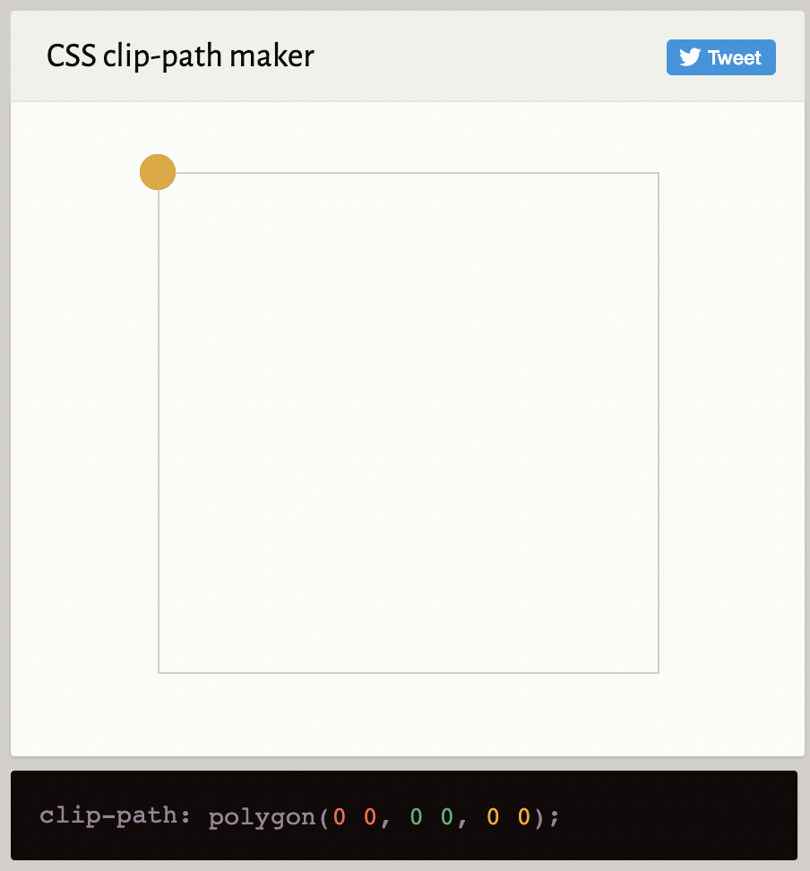

<br>

#### 2-3-1. 메인메뉴

- 레이아웃 잡음

```css
/* 메인 메뉴 */
.menu {
  background-color: orange;
  margin: 0;
  padding-left: 0;
  /*list-style-type*/
  list-style: none;
}
```

- 레이아웃 잡고나니 member-service의 englsh 글씨 레이아웃이 안맞는게 보임
  > 아래와 같이 수정

```css
/* 안내 링크 */
.member-service {
  ...
  /* engish 오른쪽을 땅기기 */
  /* 1. margin 사용 */
  /* margin-right: -10px; */

  /* 2. position 사용 */
  position: relative;
  right: -10px;
}
```

- 메인메뉴

```css
.navigation {
  /* 투명선 트릭. 바깥선이 겹치지 못하게... */
  padding-bottom: 50px;
  /* 로고 위치 이동 */
  padding: 5px 0 0 0;
}
.menu {
  background-color: orange;
  margin: 0;
  padding-left: 225px;
  /*list-style-type*/
  list-style: none;
  /* display: flow-root; => 높이 고정하면 안해도 돼 */
  height: 45px;
  /* border 말고 다른 방법으로 경계선 긋기
  상자 크기에 영향을 주지 않음... */
  box-shadow: 0 -2px 0 0 #000;
}
/* 익스플로어 6는 float방향과 같은 방향으로 margin을 넣으면
버그가 생김... 2배로 적용됨... 이때는 display: inline으로 하면됨 */
/* .menu .menu-item:first-child {
  margin-left: 225px;
} */
.menu-item {
  float: left;
  /* 높이 상속되어, button에서 써먹음 */
  /* height: 100%; */
}
.menu-button {
  /* border none보단 0이 좋다...*/
  border: 0;
  border-left: 2px solid rgba(255, 255, 255, 0.7);
  padding: 0 19px;
  line-height: 45px;
  font-weight: 700;
  font-size: 1.0625rem;
  background-color: transparent;
  color: white;
  /* 글씨 테두리, 오른쪽 하단 */
  text-shadow: 1px 1px 0 #000, -1px -1px 0 #000;
}
.sub-menu {
  position: absolute;
  display: none;
}
```

<br>

- 메인 메뉴 & 하단 링크 처리

```css
/* 메인 메뉴 */
.navigation {
  /* 투명선 트릭. 바깥선이 겹치지 못하게... */
  /* padding-bottom: 50px; */
  padding: 5px 0 45px 0;
}
.menu {
  /* 백그라운드 이미지가 렌더링 되지 않았을 때, organge색을 입히게 함... */
  background-image: linear-gradient(-45deg, red 0, orange);
  background-color: orange;

  margin: 0;
  padding-left: 225px;
  /*list-style-type*/
  list-style: none;
  /* display: flow-root; => 높이 고정하면 안해도 돼 */
  height: 45px;
  /* border 말고 다른 방법으로 경계선 긋기
  상자 크기에 영향을 주지 않음... */
  box-shadow: 0 -2px 0 0 #000;

  border-radius: 0 0 5px 5px;
}
/* 익스플로어 6는 float방향과 같은 방향으로 margin을 넣으면
버그가 생김... 2배로 적용됨... 이때는 display: inline으로 하면됨 */
/* .menu .menu-item:first-child {
  margin-left: 225px;
} */
.menu-item {
  float: left;
  /* 높이 상속되어, button에서 써먹음 */
  /* height: 100%; */
  position: relative;
}

.is-active .menu-button {
  color: #ff0;
}
/* 글씨 길이 만큼 밑줄을 생성 */
.menu-item.is-active .menu-button:after {
  content: "";
  display: block;
  height: 2px;
  background-color: #000;
}
.menu-button {
  /* border none보단 0이 좋다...*/
  border: 0;
  border-left: 2px solid rgba(255, 255, 255, 0.7);
  padding: 0 19px;
  line-height: 45px;
  font-weight: 700;
  font-size: 1.0625rem;
  background-color: transparent;
  color: white;
  /* 글씨 테두리, 오른쪽 하단 */
  text-shadow: 1px 1px 0 #000, -1px -1px 0 #000;
}
.sub-menu {
  position: absolute;
  display: none;
  top: 50px;
  /* inline 자식들이 여러줄로 되지 않고 한줄로 출력되게함. */
  white-space: nowrap;
  padding-left: 0;
}
.is-active .sub-menu {
  display: block;
  margin: 0;
  padding-left: 0;
  list-style: none;
}
.menu-html,
.menu-css,
.menu-standards {
  left: 0;
}
.menu-accessiblity,
.menu-qna,
.menu-archive {
  right: 0;
}
.sub-menu li {
  display: inline-block;
}
.sub-menu a {
  display: inline-block;
  padding: 8px 10px 8px 0;
  margin-right: 10px;
}
.sub-menu a:hover,
.sub-menu a:focus {
  color: #f00;
}
.sub-menu a::before {
  content: "\f192";
  font-family: "fontello";
  font-weight: normal;
  display: inline-block;
  text-decoration: inherit;
  width: 1em;
  margin-right: 0.2em;
  text-align: center;
  font-variant: normal;
  text-transform: none;
  line-height: 1em;
  margin-left: 0.2em;
}
.sub-menu a:hover::before,
.sub-menu a:focus::before {
  content: "\e800";
}
```

- 최종

  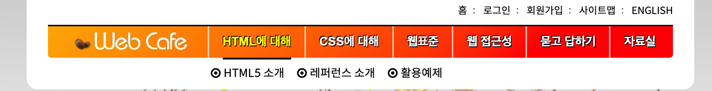

<br><br>

---

## 3. 비주얼영역 설정

### 배경에 이미지 레이아웃할 때...

- px과 %가 다르게 동작한다.

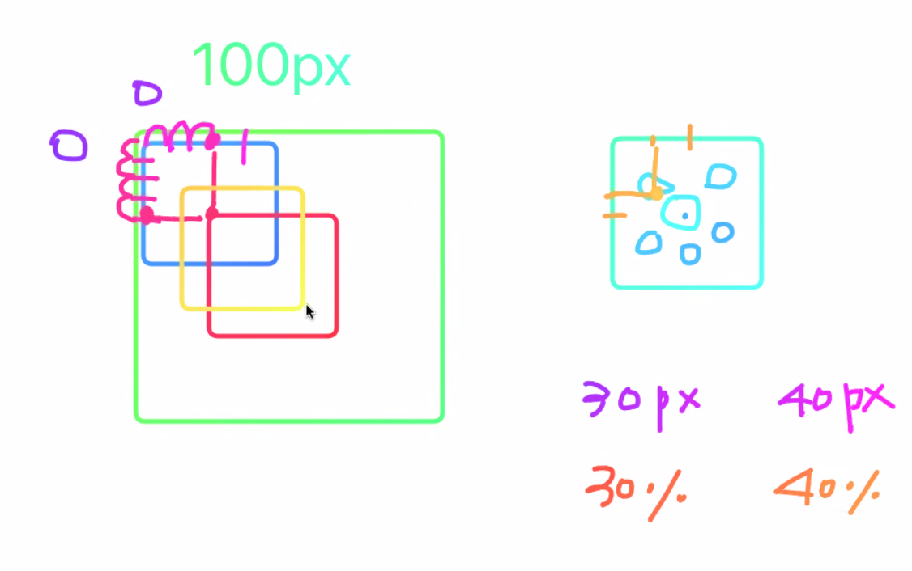

```css
body {
  margin: 0;
  font-family: "Spoqa Han Sans Neo", sans-serif;
  font-weight: 400;
  /* 배경 이미지 두 곳에서 나누어서 처리하면...*/
  /* background: linear-gradient(#ccc 0%, #eee 35%, #eee 50%, #fff 100%); */
}
.container {
  /* background: url(./images/bg_flower.png) no-repeat 50% 0 fixed; */

  /* 배경 이미지 한 곳에서 처리하면...*/
  /* 멀티백그라운드 할 때는 마지막 이미지에 콜백컬러를 설정해주어야 함...*/
  background: url(./images/bg_flower.png) no-repeat 50% 0, #999 linear-gradient(#ccc
          0%, #eee 35%, #eee 50%, #fff 100%);
}
```

```html
<div class="visual">
  <p class="visual-text">Web Standards &amp; Accessibility</p>
</div>
```

<br>

### 비주얼 배경에 이미지 애니메이션 삽입

- [파이어폭스 개코 reflow](https://www.youtube.com/watch?v=ZTnIxIA5KGw)

- [애니메이션 성능](https://www.slideshare.net/wsconf/css-animation-wsconfseoul2017-vol2?qid=00007390-0825-4176-81e2-0af696727fec&v=&b=&from_search=15)

```css
/* 비주얼 */
@keyframes moveEffect {
  /* 애니메이션 : 글씨 크기, 이동, 투명도 변화 */
  /* 애니메이션 시나리오 짜기...
    글씨 크기 : font-size 
    투명도: opacity, rgba(,0)
    이동: position absolute, padding margin => 성능 저하.
    transform translate => 이거 쓰자...
  */
  0% {
    font-size: 12px;
    color: rgba(0, 0, 0, 0);
    transform: translate(0, 0);
  }
  100% {
    font-size: 24px;
    color: rgba(0, 0, 0, 1);
    transform: translate(400px, 75px);
  }
}
.visual {
  height: 120px;
  position: relative;
}
/* 꽃 이미지 넣기 */
@keyframes fadeEffect {
  0% {
    opacity: 1;
  }
  100% {
    opacity: 0;
  }
}
.visual::before,
.visual::after {
  content: "";
  width: 100%;
  height: 100%;
  position: absolute;
  top: 0;
  left: 0;
  /* background-repeat: no-repeat; */
  animation: fadeEffect 2000ms infinite alternate;
}
.visual::before {
  background: url(./images/ani_flower_01.png), url(./images/ani_flower_02.png);
  background-position: 0 -10px, 670px 0;
  background-repeat: no-repeat;
}
.visual::after {
  background: url(./images/ani_flower_03.png), url(./images/ani_flower_04.png);
  background-position: 300px 0, 800px 0;
  background-repeat: no-repeat;
  animation-delay: 1000ms;
}
/* 글씨 */
.visual-text {
  display: inline-block;
  background-color: yellow;
  animation: moveEffect 1s;
  animation-fill-mode: forwards;
  margin: 0;
}
```

- 최종

  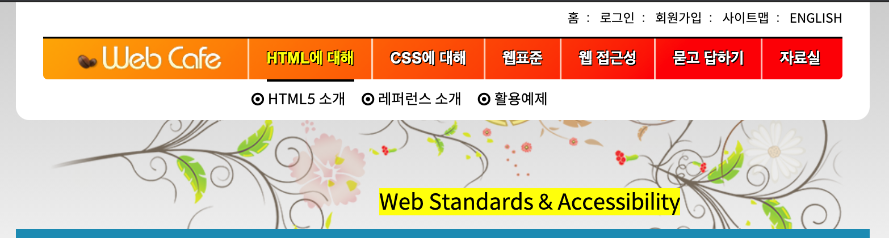

<br><br>

---

## 4. main

### 4-1. Float

- [Float 유튜브 영상](https://www.youtube.com/watch?v=xara4Z1b18I)

- float은 부모 컨테이너를 기준으로 붕 뜨어 배치된다.

- 따라서 부모 컨테이너 안에 자식들이 모두 붕 뜨게 되면 부모의 높이가 없어지고, 부모 컨테이너 이후에 오는 요소들이 겹치게 된다.

- float된 요소들을 부모 컨텐츠 안에 넣기 위해 부모의 높이를 고정하는 것은 좋지 않다.

<br>

#### 4-1-1. [BFS - (block format context](https://developer.mozilla.org/ko/docs/Web/Guide/CSS/Block_formatting_context)

- 요소들을 float하여 가로로 배치하고, 슬로건은 밑에 고정하기위해, 다음과 같이 `overflow: hidden` 하면, group1을 부모를 기준으로 움직였을 때, 짤리게 된다.!!

```css
.main {
  background-color: aqua;
  /* BFC - 이거 쓰지마...*/
  overflow: hidden;
  /* 넘치는 자식 요소를 제거*/
}
.group {
  height: 30vh;
  width: 200px;
}
.group1 {
  background-color: red;
  float: left;
  position: relative;
  /* main-overflow 때문에 짤려서 나옴.... */
  top: -20px;
  left: -20px;
  /* width: 250px;  */
}
```

- 결과 : 레이아웃 무너짐!

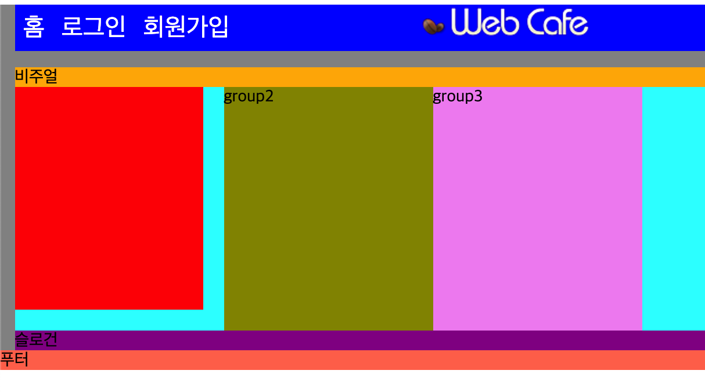

<br>
<br>

### 4-1-2. 마크업을 수정

- 마크업을 수정하는 것은 좋은 방법은 아님...

- HTML

```html
<main class="main">
  <div class="group group1">group1</div>
  <div class="group group2">group2</div>
  <div class="group group3">group3</div>
  <div class="clearfix"></div>
</main>
```

- CSS

```css
.clearfix {
  clear: both;
}
```

### 4-1-3. 가상요소 선택자를 사용

- CSS

```css
.main::after {
  content: "";
  display: block; /* 가상요소는 블락이 아니기 때문에, 블락으로 표현 */
  clear: both;
}
```

### 4-1-4. 부모에게 `flow-root` 적용

```css
.main {
  background-color: #118ab2;
  display: flow-root;
}
```

### 4-2. 요소간의 배치

```css
.main {
  background-color: #118ab2;
  display: flow-root;
  padding: 30px 15px;
  min-height: 450px;
}
.group {
  margin: 0 15px;
}
```


<br>
<br>

### 4-3. 로그인

#### 로그인 레이아웃

  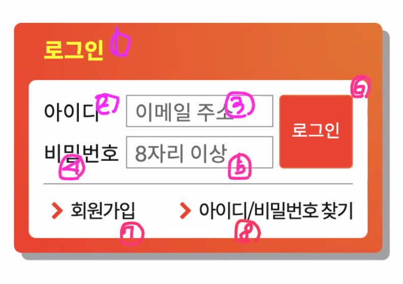

- 예전엔 테이블을 만들고, 다음과 같이 병합해 가면서 만들었다.

  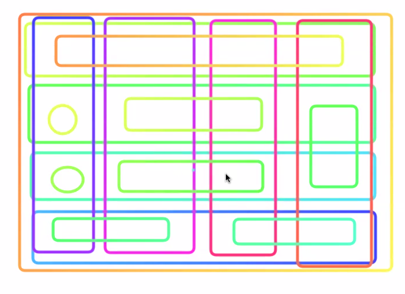

  이렇게 작성하면, tap으로 접근할 때, 아이디 => 로그인버튼 => 비밀번호 순으로 접근된다... 논리적이지 않음!

<br>

#### 로그인 마크업

- XHTML1.0에서 form에 fieledset이 필수, HTML4.01은 필수 아님

  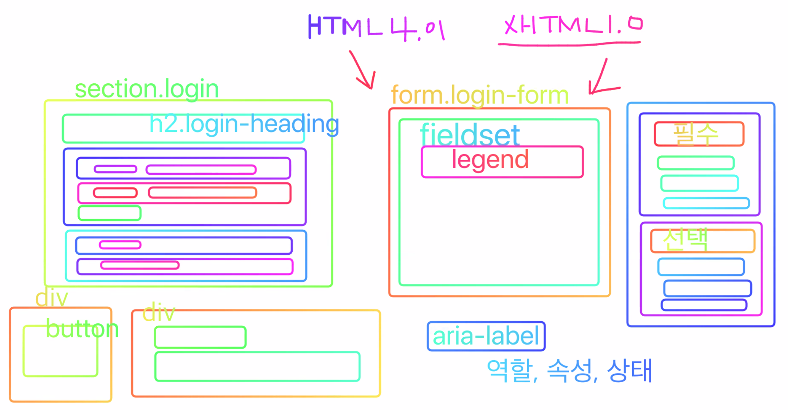

- div > label + input

- HTML

  ```html
  <section class="login">
    <h2 class="login-heading">로그인</h2>
    <form
      method="POST"
      action="https://formspree.io/seulbinim@gmail.com"
      class="login-form"
      id="form-id"
    >
      <fieldset>
        <legend class="a11y-hidden">회원 로그인 폼</legend>
        <div class="user-email">
          <label for="userEmail">아이디</label
          ><input
            type="email"
            id="userEmail"
            name="userEmail"
            required
            placeholder="아이디(이메일)"
          />
        </div>
        <div class="user-password">
          <label for="userPassword">비밀번호</label
          ><input
            type="password"
            id="userPassword"
            name="userPassword"
            required
            placeholder="8자리 이상"
          />
        </div>
        <button class="button-login" type="submit" form="form-id">
          로그인
        </button>
      </fieldset>
    </form>
    <ul class="sign">
      <li class="signup"><a href="#">회원가입</a></li>
      <li class="find"><a href="#">아이디/비밀번호 찾기</a></li>
    </ul>
  </section>
  ```

  - label은 반드시 사용해야함.

  - label 안에 img 삽입 가능

  - XHTML1.0 : required="required"

  - name: 서버로 데이터를 보낼 때 필요

  - form안에 button을 넣어줘야함

    > form 밖에서 button을 쓰고 싶다면? form의 id를 설정. button에 form의 id를 연결!

<br>

- CSS : 내가 작성

  ```css
  .group1 {
    /* background-color: #000; */
    float: left;
    width: 280px;
  }
  /* 로그인 폼 */
  .login {
    background-color: orange;
    border-radius: 10px;
    padding: 10px;
  }
  .login-heading {
    margin: 0;
    padding-left: 10px;
    padding-bottom: 10px;
    font-size: 18px;
    color: yellow;
  }
  .login fieldset {
    border: 0;
    padding: 0;
    padding: 15px;
    margin: 0;
    background-color: white;
    border-top-left-radius: 5px;
    border-top-right-radius: 5px;
    position: relative;
  }
  .login .user-email,
  .login .user-password {
    display: flex;
  }
  .login .user-email {
    margin-bottom: 10px;
  }
  .user-email > label,
  .user-password > label {
    display: block;
    width: 65px;
    /* float: left; */
  }
  .user-email input,
  .user-password input {
    /* background-color: yellow; */
    width: 45%;
    /* float: left; */
  }
  .button-login {
    position: absolute;
    display: block;
    width: 55px;
    height: 50px;
    top: 15px;
    right: 12px;
    background-color: orangered;
    border: 0;
    border-radius: 5px;
  }
  ```

<br><br>

- 강사님 작성

  - 강사님의 레이아웃

    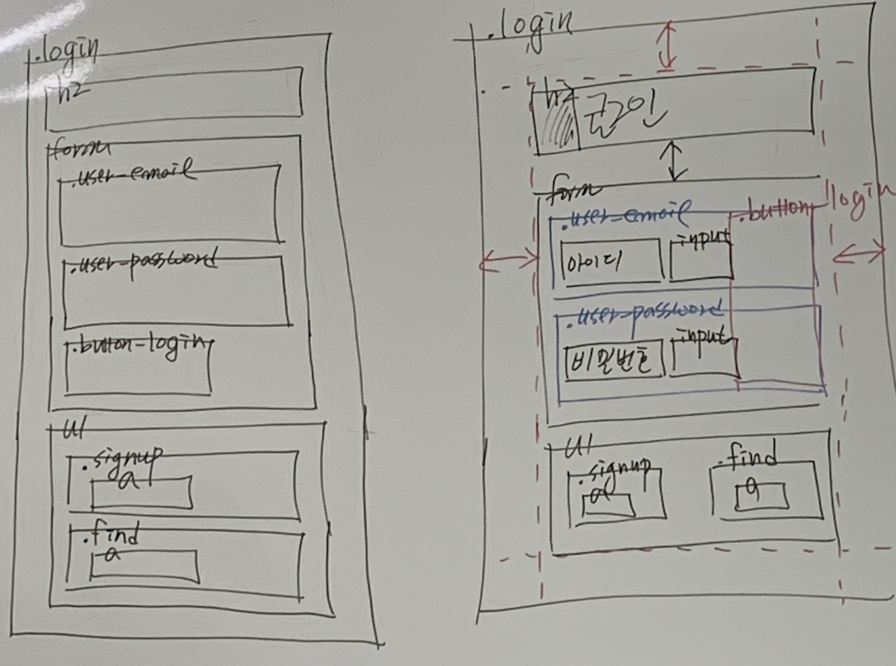

  ```css
  /* 로그인 폼 */
  .login {
    background: radial-gradient(circle at right top, #e8882e, #e85b2c);
    border-radius: 5px;
    box-shadow: 5px 5px 0 0 #ccc;
    padding: 10px;
  }
  .login-heading {
    margin: 0 0 10px 10px;
    font-size: 1rem;
    color: yellow;
  }
  .login fieldset {
    padding: 0 0 10px 0;
    border: 0;
    /* 로그인 버튼의 부모 */
    position: relative;
    border-bottom: 1px solid #ccc;
  }
  .login-form {
    background-color: white;
    padding: 10px 10px 0 10px;
    border-radius: 5px 5px 0 0;
  }
  /* 일괄적으로 마진을 처리함 */
  .user-email ~ div {
    margin-top: 5px;
  }
  .login-form label {
    font-size: 0.8125rem;
    /* 가로폭을 주기위해 인라인 블록으로 설정 */
    display: inline-block;
    width: 4em;
  }
  .login-form input {
    width: 100px;
    height: 22px;
    border: 1px solid #ccc;
    padding-left: 0.5em;
  }
  .button-login {
    position: absolute;
    top: 0;
    right: 0;
    border: 1px solid #e8882e;
    border-radius: 5px;
    color: white;
    height: 50px;
    width: 50px;
    background-color: rgb(255, 77, 0);
  }
  .sign {
    margin: 0;
    padding-left: 0;
    padding: 10px 10px 10px 10px;
    list-style-type: none;
    background-color: white;
    border-radius: 0 0 5px 5px;
    font-size: 0.8125rem;
    display: flow-root;
  }
  .sign::after {
    content: "";
    display: block;
    clear: both;
  }
  .sign a::before {
    content: "\e803";
    font-family: "fontello";
    font-weight: normal;
    display: inline-block;
    text-decoration: inherit;
    width: 1em;
    margin-right: 0.2em;
    text-align: center;
    font-variant: normal;
    text-transform: none;
    line-height: 1em;
    margin-left: 0.2em;
    color: rgb(255, 77, 0);
  }
  .signup {
    float: left;
  }
  .find {
    float: right;
  }
  ```

  - `currentColor` : 현재 글자 색깔을 가져다가 쓸 수 있음

<br><br>

### 4-4. 유효성 검사

- group1 컨텐츠 레이아웃

  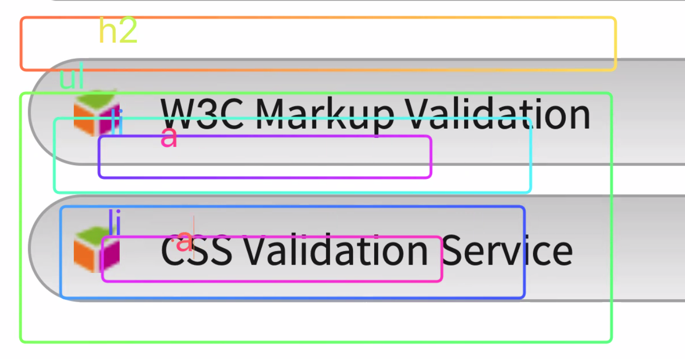

  - 이전에 사용하던 암묵적인 아웃라인... h2로 제목, ul로 묶기!

  - 이렇게 해도 됨

- group1 컨텐츠 HTML

  ```html
  <h2 class="a11y-hidden">유효성 검사 배너</h2>
  <ul class="validation-list">
    <li>
      <a
        href="https://validator.w3.org/"
        target="_blank"
        title="마크업 유효성 검사 사이트로 이동"
        rel="noopener noreferrer"
        >W3C Markup Validation</a
      >
    </li>
    <li>
      <a
        href="https://jigsaw.w3.org/css-validator/"
        target="_blank"
        title="CSS 유효성 검사 사이트로 이동"
        rel="noopener noreferrer"
        >CSS Validation Service</a
      >
    </li>
  </ul>
  ```

  - a태그의 title은 hover하면 보충 설명이 나타남. (이는 공통속성임...id, class, lang)

  - `target="_blank"` : 새로운 탭 열림

  - 새창 열 때 보완 : [noopener, noreferrer MDN](https://developer.mozilla.org/en-US/docs/Web/HTML/Link_types/noopener)

    > noopener : `target="_blank"` 로 새로운 탭을 열 때, 새로 열린 페이지에서 window.opener이 존재하지 않게하여, window.opener객체로 접근해 악의적으로 정보를 빼가는 일이 없게한다.

    > noreferrer : `target="_blank"` 로 새로운 탭을 열 때, 새로 열린 페이지에서 window.opener 객체를 조작하지 못하게 한다.

    > [noopener, noreferrer](https://webruden.tistory.com/262)

<br>

- group1 컨텐츠 css

  ```css
  /* 유효성 검사 배너 */
  .validation-list {
    list-style-type: none;
    padding-left: 0;
    margin: 25px 0 0 0;
  }
  /* 글씨 이외의 공간에 커서를 올려도 이동할 수 있게 함! */
  .validation-list a {
    display: block;
    background: url(images/validation_icon.png) no-repeat 20px 50%, linear-gradient(
        to bottom,
        #ccc,
        #eee
      );
    /* 마진 병합 */
    margin-top: 10px;
    border: 1px solid #aaa;
    border-radius: 20px;
    padding: 10px 10px 10px 45px;
  }
  .validation-list a:hover,
  .validation-list a:focus {
    color: #f00;
  }
  ```

  - flex 박스에서 마진은 겹치지 않음...

  - 한쪽 방향으로 마진을 주는걸 연습해야해 (마진 병합도 생각해보자)

  - [NHN 코딩컨벤션](https://nuli.navercorp.com/data/convention/NHN_Coding_Conventions_for_Markup_Languages.pdf)

<br>
<br>

### 4-4. 웹 관련 용어

- 웹 관련 용어 레이아웃

  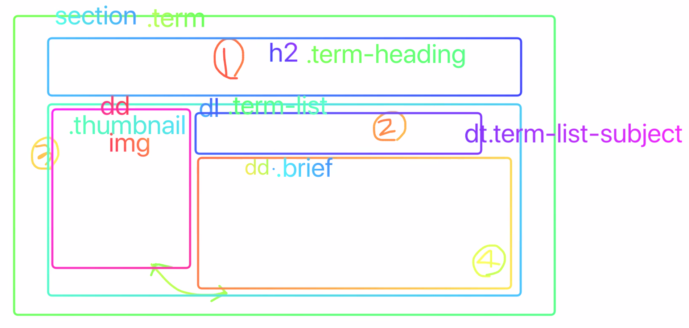

  - img: 배경으로 처리하지 말고, dd로 처리하면 나중에 유동적으로 수정할 수 있다...

    > 대체 텍스트가 있으면, SEO(검색)관점에서 좋음!

  - dl: 너무 많이 사용하면 문제가 될 수 있음. 오용 주의!!

  - dl: HTML5.2에서 dl의 자식으로 div 사용가능해졌음! 하지만 dl 안에 dt와 dd가 들어가있어야함!

    > 아래 이미지는 잘못된 예시.. dd을 div안에 넣어주어야함.

    > 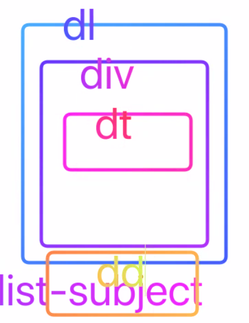

    > [HTML5.2 변경점 링크](https://mulder21c.github.io/2017/12/26/understanding-html-52-changes/)

<br>

- HTML

```html
<section class="term">
  <h2 class="term-heading">웹 관련 용어</h2>
  <dl class="term-list">
    <dt class="term-list-subject"><a href="#">웹 표준이란?</a></dt>
    <dd class="term-list-thumbnail">
      
    </dd>
    <dd class="term-list-brief">
      W3C 단체에서 규정한 웹 기술 사양에 대한 규칙을 말하며 표준 규격은...
    </dd>
  </dl>
</section>
```

- CSS

```css
/* 웹 관련 용어 */
.term {
  background: #ccc linear-gradient(to bottom, #ccc, #eee);
  border: 1px solid #aaa;
  margin-top: 20px;
  padding: 10px 15px;
  border-radius: 5px;
}
.term-heading {
  margin: 0;
  font-size: 1rem;
}
.term-list {
  /* cross browsing 안됨 ..*/
  /* display: flow-root; */
  margin: 10px 0 0 0;
}
/* cross browsing 할 때, : 하나 써야해 ... */
.term-list > div::after {
  content: "";
  display: block;
  clear: both;
}
.term-list dd {
  margin-left: 0;
}
.term-list-subject {
  /* 이미지와 제목과 그리드가 맞지 않은 이유...
    줄 간격이 있었기 때문.
  */
  /* line-height: 1; */

  /* 또는 위로 이동. */
  margin-top: -2px;
  color: #296897;
  margin-bottom: 5px;
}
.term-list-subject,
.term-list-brief {
  /* float할 때 width가 지정되지 않았으면, 부모크기를 상속받음 ...*/
  float: right;
  width: 145px;
  line-height: 1.2;
  font-size: 14px;
}
.term-list-thumbnail {
  float: left;
}
.term-list-thumbnail img {
  /* inline 요소는 상당히 까다로움... 
  base라인에 맞춰지지 않아도 됨.
  line-height: 0%;
  vertical-align: top;
  */
  background-color: blue;
}

/* div가 없다면? first-child last-child로 ... */
.even .term-list-subject,
.even .term-list-brief {
  float: left;
}
.even .term-list-thumbnail {
  float: right;
}
.odd ~ .even,
.odd ~ .odd {
  margin-top: 10px;
}
```

<br>

---

### 단편적인 지식

#### [한국형 웹 컨텐츠 접근성](<https://www.wah.or.kr:444/_Upload/pds/%ED%95%9C%EA%B5%AD%ED%98%95%EC%9B%B9%EC%BD%98%ED%85%90%EC%B8%A0%EC%A0%91%EA%B7%BC%EC%84%B1%EC%A7%80%EC%B9%A82.1(5).pdf>)

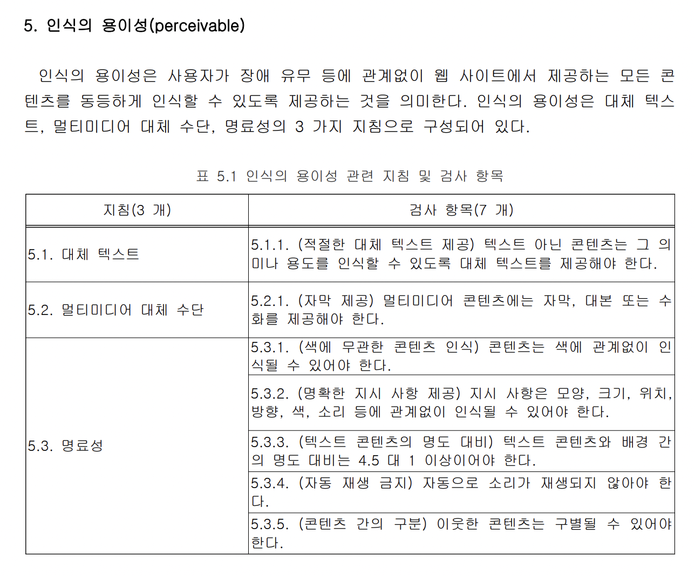

<br>

#### Zoom

- 웹엑스에 비해서 접근성이 상당히 좋다.
- 다양한 스크린 리더 사용자들도 소리를 통해 보조적인 정보 제공을 받을 수 있다.
- 개발단계에서 접근성을 깊게 고민해야한다.
- 클론 코딩을 할 때에도, 그대로 똑같이 만들지 말고, 접근성을 고려해서 추가할 부분을 추가해보자.

#### [skyscanner](https://www.skyscanner.co.kr/?)

- UI, UX, 접근성 관점에서 차별을 두자.

---

### 4-5. 건너뛰기 링크

- HTML 레이아웃

  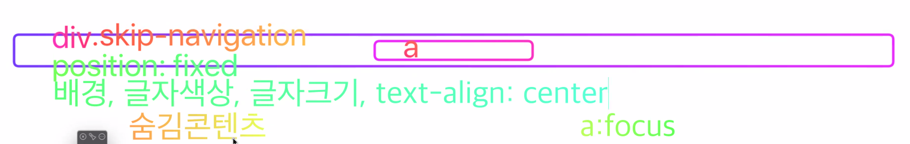

```html
<div class="skip-navigation">
  <a href="#userEmail">본문 바로가기</a>
</div>
```

- CSS

  > z-index, outline-offset, text-align, z-index

```css
/* 건너뛰기 링크 */
.skip-navigation {
  position: fixed;
  /* 왼쪽 오른쪽 정렬하면 전체에 걸쳐서 나옴. */
  left: 0;
  right: 0;
  width: 100%;
  background-color: #000;
  text-align: center;
  /* z-index가 낮아서 설정 ... */
  z-index: 10;
}
.skip-navigation a {
  font-size: 0.875rem;
  color: white;
  /* 숨김 처리 */
  position: absolute;
  width: 1px;
  height: 1px;
  overflow: hidden;
  margin: -1px;
  clip-path: polygon(0 0, 0 0, 0 0);
  padding: 10px 0;
}
.skip-navigation a:focus {
  position: static;
  padding: 15px;
  width: auto;
  height: auto;
  clip: initial;
  clip-path: initial;
  height: auto;
  margin: initial;
  display: inline-block;
  outline-offset: -5px;
}
```

<br>

### 4-6. 자료검색

> flex에서 form 버그가 발생함!! 확인해보기...

- 자료검색 레이아웃

  [web forms 정보](https://www.miketaylr.com/pres/html5/forms2.html)

  [html5 shiv polyfill](https://webdir.tistory.com/81)

  [placehorder CSS tricks](https://css-tricks.com/almanac/selectors/p/placeholder/)

```html
<h2 class="a11y-hidden">검색</h2>
<form
  action="#"
  class="search-form"
  method="POST"
  action="https://formspree.io/seulbinim@gmail.com"
  aria-label="검색"
>
  <fieldset>
    <legend class="a11y-hidden">검색 폼</legend>
    <label for="search"
      ><span class="icon-search" aria-hidden="true"></span>자료검색</label
    ><input
      type="search"
      id="search"
      name="search"
      required
      placeholder="검색어를 입력하세요."
    />
    <button class="button-search" type="submit">검색</button>
  </fieldset>
</form>
```

- aria-labelledby가 aria-label 보다 더 쎄다!! 두개 같이 나오면 aria-labelledby가 살아남음.

#### form안에서 h2를 쓸 수 없다면..?

> 스크린 리더와 엔진이 접근할 수 있게 `aria-label="검색"` 을 사용한다!

- CSS

```css
/* 자료 검색 */
.search-form {
  background: #ccc linear-gradient(#ccc, #eee);
  padding: 15px 25px 10px 15px;
  border: 1px solid #aaa;
  border-bottom-color: #fff;
  border-radius: 15px 15px 0 0;
}
.search-form * {
  /* 글씨와 입력창의 높낮이 맞춤 */
  vertical-align: middle;

  /* 14px */
  font-size: 0.875rem;
}
.search-form fieldset {
  /*화면에 없는것 처럼 설정*/
  border: 0;
  margin: 0;
  padding: 0;
}
.search-form labe {
  line-height: 1;
}
.search-form input {
  appearance: none;
  -webkit-appearance: none;
  border: 1px solid #aaa;
  height: 22px;
  border-radius: 2px;
  padding: 1px 1px 1px 5px;
  margin: 0 10px;
  width: 202px;
}
.button-search {
  border: 0;
  padding: 0 10px;
  background: #000;
  color: #fff;
  height: 22px;
  font-size: 0.75rem;
  border-radius: 2px;
}
/* 브라우저마다 폼 모양이 다름... 초기화 하기위해서?! */
.search-form input::-ms-clear {
  display: none;
}
```

- `appearence: none`, `-webkit-appearance: none;`

- native tag? (?? 찾아보기)

  > a태그가 h를 가진경우, button을 가진 form요소...

  > tabindex = "0" 으로 포커싱을 가져옴

### 4-7. 공지사항-자료실

- 공지사항-자료실 마크업 순서

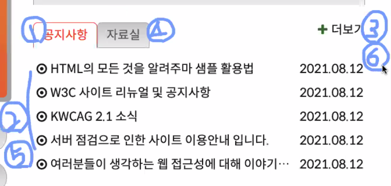

- 공지사항-자료실 구조

  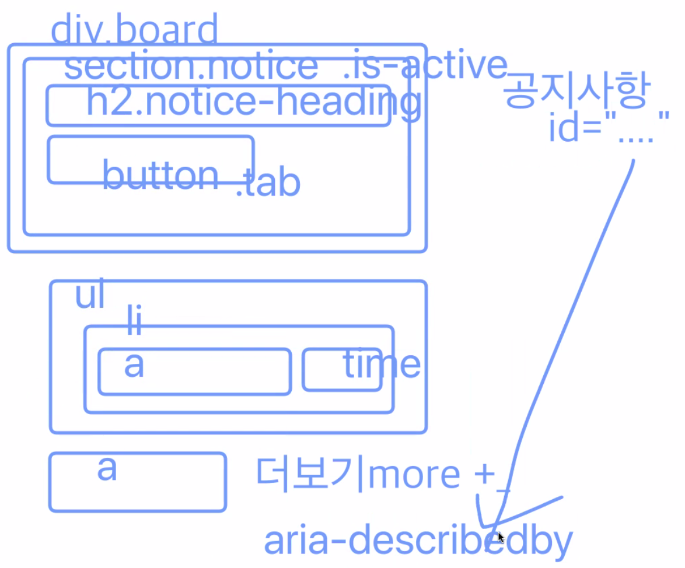

  > tabindex="0" 해주어도, javascript로 클릭이벤트를 따로 설정해줘야함 ...

  > h2 : 헤딩 + button => 이미 기능이 있는 태그에 버튼을 role로 주는건 좋지않음...

  > 부모에게 이벤틀 주어서, 자식에게 위임되는 방식을 많이 사용함. 따라서 부모 section이 is-active속성을 가져서, 자식에게 위임하도록...

  > is-active는 동적인 상태 클래스

  > 날짜 정보는 time 태그. => datetime="YYYY-MM-DDTHH:MM:SS" : 기계가 인식할 수 있는 날짜형식

  > 더보기는 링크 a로... aria-describedby = "id값"

- HTML

  > aria-labelledby="pdsHeading" 으로 링크에 연결되어있는 것이 무언인지 나타냄...

- [aria-label과 aria-labelledby 정리](./aria-label.md)

```html
<div class="board">
  <section class="notice">
    <h2 class="a11y-hidden" id="noticeHeading">공지사항</h2>
    <button type="button" class="tab">공지사항</button>
    <ul class="notice-list">
      <li>
        <a href="#">HTML의 모든것을 알려주마 샘플 활용법</a>
        <time datetime="2021-08-16T15:45:30">2021.08.16</time>
      </li>
    </ul>
    <a class="more" href="#" aria-labelledby="noticeHeading"
      ><span class="icon icon-plus" aria-hidden="true"></span>더보기</a
    >
  </section>
  <section class="notice">
    <h2 class="a11y-hidden" id="pdsHeading">자료실</h2>
    <button type="button" class="tab">자료실</button>
    <ul class="notice-list">
      <li>
        <a href="#">HTML의 모든것을 알려주마 샘플 활용법</a>
        <time datetime="2021-09-30T15:45:30">2021.09.30</time>
      </li>
    </ul>
    <a class="more" href="#" aria-labelledby="pdsHeading"
      ><span class="icon icon-plus" aria-hidden="true"></span>더보기</a
    >
  </section>
</div>
```

- CSS

```css
/* 공지사항-자료실 */
.board {
  margin-top: 20px;
  position: relative;
  height: 200px;
}
.board ul,
.board .more {
  display: none;
}
.is-active ul,
.is-active .more {
  /* 어떤 상황이든 is-active이면 강제적으로 보여줄거야. */
  /* 평소에 난발하는건 좋지 않음 ... */
  display: block !important;
}
.board .tab {
  position: absolute;
  top: 0;
  background: #ccc linear-gradient(to bottom, #ccc, #eee);
  color: #666;
  border: 1px solid #aaa;
  padding: 5px 10px;
  border-radius: 5px 5px 0 0;
  font-size: 0.875rem;
}
.is-active .tab {
  background: #fff !important;
  color: #e85b2c !important;
  border-color: #e85b2c #e85b2c #fff #e85b2c;
}
.notice .tab {
  left: 0;
}
.pds .tab {
  left: 69px;
}
.board ul {
  padding: 35px 0 0 0;
  list-style: none;
  margin: 0;
}
.board li {
  display: flex;
  margin-top: 10px;
  /* 14px */
  font-size: 0.875rem;
}
.board ul a {
  flex-grow: 1;
  /* 줄바꿈 방지 */
  text-overflow: ellipsis;
  white-space: nowrap;
  overflow: hidden;
}
.board time {
}
.board .more {
  position: absolute;
  top: -8px;
  right: -8px;
  /* 링크에 포커스할 때 잘 됨. 사용자 관점 */
  padding: 8px;
}
.more .icon-plus {
  color: hsla(110, 70%, 30%, 1);
}
```

- text-overflow

  > 줄바꿈 방지! 말 줄임표를 사용해아할 때...

  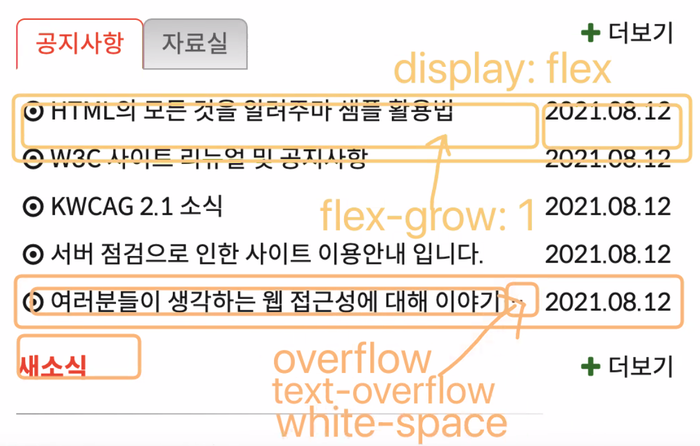

  ```css
  .board ul a {
    ...
    text-overflow: ellipsis;
    white-space: nowrap;
    overflow: hidden;
  }
  ```

- [웹 접근성 연구소 - 정보접근성 향상을 위한 W3C 국제표준 WAI-ARIA 사례집](<https://www.wah.or.kr:444/_Upload/pds2/WAI-ARIA%20%EC%82%AC%EB%A1%80%EC%A7%91(%EC%98%A8%EB%9D%BC%EC%9D%B8%ED%8C%90).pdf>)

- [NIAWA](https://github.com/niawa/ARIA)

  > 접근성과 사용성 높은 탭 UI를 위해 WAI-ARIA 속성들을 사용하여 구현한 코드는 아래와 같다...

   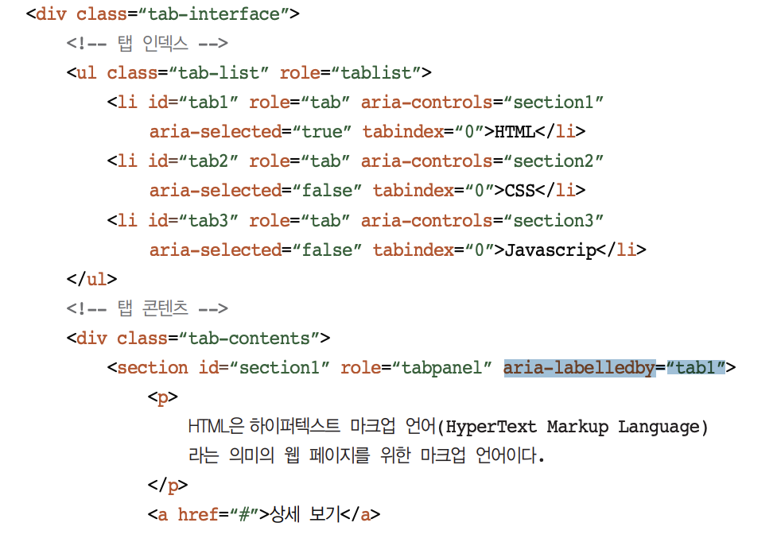

- [tab-interaction : 키보드 인터렉션](https://www.w3.org/TR/wai-aria-practices-1.1/#tabpanel)

---

### title속성 말고! label 사용하는게 좋다.

> title은 너무 오래된 가이드라인 기준...

### Acodian pannel, Acodian header

> 사용자가 선택하면 펼쳐지는 UI, 기존것은 닫혀야함...

- aria-expanded
- aria-controls
- aria-disabled

### [gitbook skymimo](https://aoa.gitbook.io/skymimo/)

---

### 4-8. 새소식

#### 새소식 구조

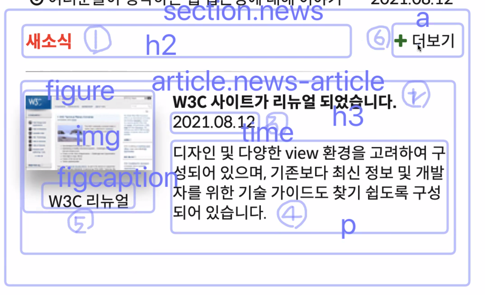

- 가급적 전체적 레벨에 맞는 헤딩을 부여해라. h1~h6 순서...
- figure: 안에 img, caption을 포함

#### HTML

```html
<section class="news">
  <h2 class="news-heading" id="news">새소식</h2>
  <a href="" class="news-link">
    <article class="news-article">
      <h3 class="news-article-subject">
        W3C 사이트가 리뉴얼 되었습니다.
        <time class="news-article-date" datetime="2021-08-17">2021-08-17</time>
      </h3>
      <p class="news-article-brief">
        디자인 및 다양한 view 환경을 고려하여 구성되어 있으며, 기존보다 최신
        정보 및 개발자를 위한 기술 가이드도 찾기 쉽도록 구성되어 있습니다.
      </p>
      <figure class="news-article-thumbnail">
        
        <figcaption id="thumbnail-caption">W3C 리뉴얼</figcaption>
      </figure>
    </article>
  </a>
  <a href="#" class="more" aria-labelledby="news"
    ><span class="icon icon-plus"></span>더보기</a
  >
</section>
```

- a : html5에서 배경이 transparent라서, 안에 여러 block을 포함할 수 있음.
  > 문법도 간편하고, 접근도 잘 되지만, 사용자 입장에서는 사용이 불편할 수 있음.

#### CSS

```css
/* 새소식 */
.news {
  margin-top: 20px;
  position: relative;
}
.news::before {
  content: "";
  display: block;
  position: absolute;
  top: 35px;
  left: 0;
  width: 100%;
  height: 1px;
  background: linear-gradient(to right, #aaa, #fff);
}
.news-heading {
  margin: 0 0 35px;
  font-weight: 700;
  font-size: 0.9375rem;
  color: #e85b2c;
}
.news-article {
  font-size: 0.875rem;
  background: violet;
  padding-left: 130px;
  position: relative;
}
.news-article-subject {
  margin: 0 0 3px;
  font-weight: 700;

  /* 부모 폰트 크기를 상속받는다고 명시해주면 
  적용될 수 있움..*/
  font-size: inherit;
}
.news-article-date {
}
.news-article-thumbnail {
  margin: 0;
  position: absolute;
  background: lime;
  text-align: center;
  top: 1px;
  left: 0;
}
.news-article-thumbnail img {
  box-shadow: 0 15px 10px 5px rgba(0, 0, 0, 0.3);
}
.news-article-thumbnail figcaption {
  margin-top: 15px;
}
.news-article-brief {
  margin: 10px 0 0 0;
  line-height: 1.5;
}
.news .more {
  position: absolute;
  top: -8px;
  right: -8px;
  padding: 8px;
}
```

- flex로도 구현해보기!
- [이듬 브런치 - 1px보다 얇은 선](https://brunch.co.kr/@euid)
- [csslayout](https://csslayout.io/patterns/)

- news 레이아웃을 flex로 꾸며보기


> 좀 까다롭네;;... height도 줘야함..

<br><br>

### 4-9. 신규이벤트

#### 신규이벤트 구조

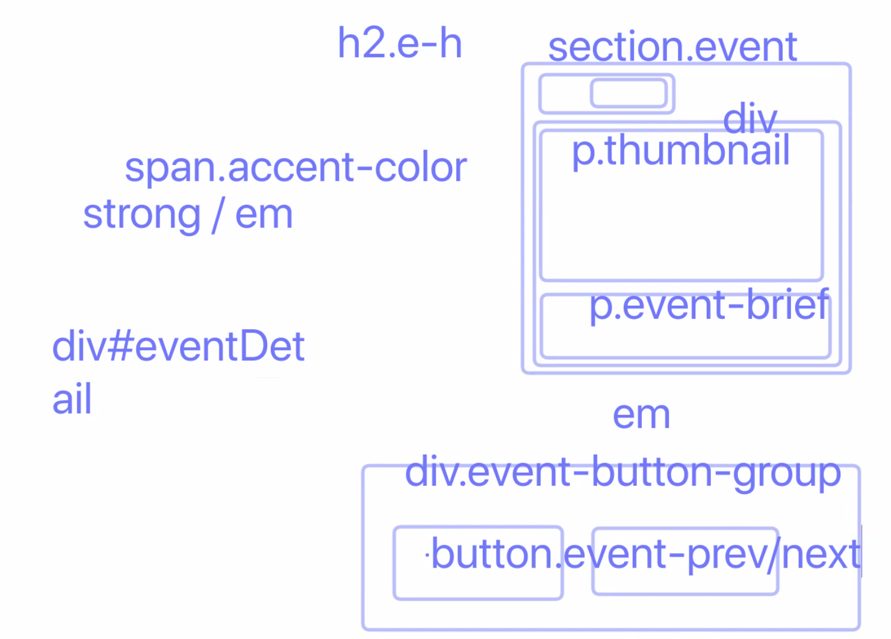

#### HTML

```html
<section class="event">
  <h2 class="event-heading">신규 <span class="accent-color">이벤트</span></h2>
  <div id="eventDetail">
    <p class="event-thumbnail">
      
    </p>
    <p class="event-brief">
      <em> 웹표준 핵심 가이드북 2 출시! </em> 선착순 500명 한정으로증정.
    </p>
  </div>

  <div class="event-button-group">
    <button class="event-button-pre">이전 이벤트 보기</button>
    <button class="event-button-next">다음 이벤트 보기</button>
  </div>
</section>
<section class="related">
  <h2 class="related-heading">관련 <span class="accent-color">사이트</span></h2>
  <ul class="related-list">
    <li><a href="#">패스트 캠퍼스</a></li>
    <li><a href="#">웹접근성 연구소</a></li>
    <li><a href="#">W3C</a></li>
    <li><a href="#">CSS ZenGarden</a></li>
    <li><a href="#">웹접근성 연구소</a></li>
  </ul>
</section>
```

- img 한번에 묶은다음, 배경에서 보이는 정도를 설정해서 해결하면됨, 이는 서버 성능의 문제임...
- splice 이미지! 현업에서 많이씀.!

#### CSS1

```css
.gradient-box {
  border: 1px solid #aaa;
  border-radius: 5px;
  background: #ccc linear-gradient(#ccc, #eee);
  padding: 10px;
}
.event {
  padding-bottom: 10px;
  position: relative;
}
.event::after {
  content: "";
  display: block;
  width: 100%;
  height: 1px;
  background: #aaa;
}
.event-heading {
  margin: 0 0 10px;
  font-weight: 700;
  font-size: 0.9375rem;
}

.accent-color {
  color: rgb(255, 77, 0);
}
.event-brief {
  font-size: 14px;
}
.event-brief em {
  font-style: normal;
}
.event-button-group {
  height: 18px;
  position: absolute;
  top: 0;
  right: 0;
}
.event-button-group button {
  width: 19px;
  /* 높이를 버튼에 주면 안돼.... form은 그래서 까다로와
   height: 18px; */
  height: 0px;
  padding: 18px 0 0 0;
  /* 넘어가는 텍스트는 삭제해보림! */
  overflow: hidden;
  border: 0;
  /* 잘 안되면 개별속성별로 써보기! 대표속성을 사용하면 잘 인식하지 못하는 경우가있음. */
  background-image: url(./images/back_forward.png);
  background-repeat: no-repeat;
}
.event-button-group .event-button-next {
  background-position: -35px 0;
}
.event-thumbnail {
  margin: 10px 0 0 0;
}
.event-thumbnail img {
  border: 1px solid #aaa;
  box-shadow: 5px 5px 0 0 #aaa;
}
.event-brief {
  margin: 10px 0 0 0;
}
.event-brief em {
  margin: 0;
}
```

- button overflow말고 다른방법으로 만들어보기!

> 텍스트 위에 배경을 올려놔서, 만약에 배경이 렌더링 되지 않는다면, 텍스트가 보이게 한다.

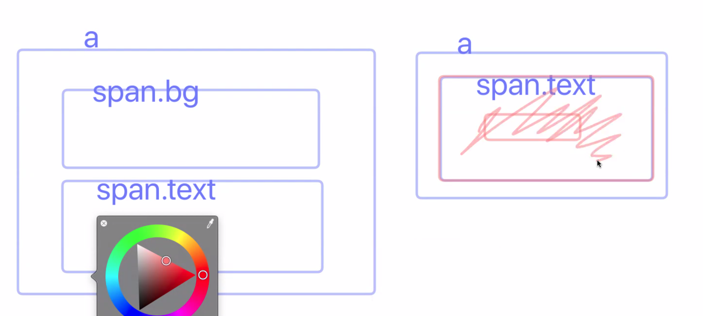

- 사실 aria-label="이전페이지보기"가 제일 좋은방안이긴 하다.. 글씨 없애기 위해서 쌩쑈 안해도 됨.

#### CSS2

```css
.related {
  font-size: 0.875rem;
  border-top: 1px solid #aaa;
}
.related-heading {
  margin: 10px 0;
  font-weight: 700;
  font-size: 0.9375rem;
}
.related-list {
  padding-left: 0;
  margin: 0;
  list-style-type: none;
  background-color: white;
  border: 1px solid #aaa;
  border-radius: 5px;
  height: 27px;
  overflow: hidden;
  /* 효과 넣어주기. */
  transition: all ease 0.4s;
}
.related-list a {
  display: block;
  line-height: 25px;
  /* 첫줄 들여쓰기 - 단락을 시작할 때... */
  text-indent: 1.5em;
}
.related-list a:focus {
  outline-offset: -3px;
}
.related-list:hover {
  /* auto 하면 transition 안들어감...ㅋ 
  height: auto; */
  height: 147px;
  padding: 10px 0;
}
```

- height auto 하면 transition 안들어감!!

  > height를 명확하게 정해놔야함...
