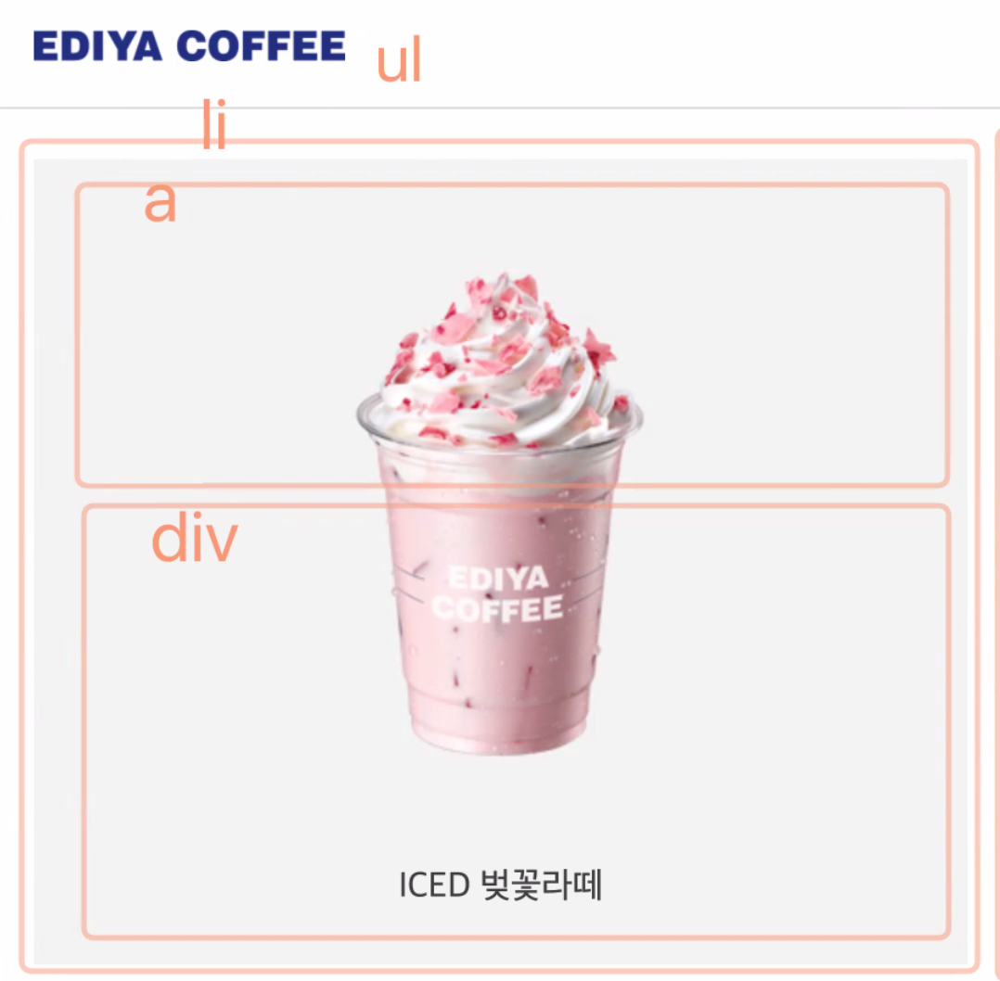

# 이디야

## 유용한 사이트

- [WHATWG](https://html.spec.whatwg.org/)
- [W3 wai-aria best practices](https://www.w3.org/TR/wai-aria-practices-1.1/#dialog_modal)
- [CSS 방법론 - bem smacss oocss](https://wit.nts-corp.com/2015/04/16/35389)
- [backdrop fillter](https://css-tricks.com/almanac/properties/b/backdrop-filter/)

## 기본 HTML 틀 설정

### HTML head

```html
<head>
  <meta charset="UTF-8" />
  <meta http-equiv="X-UA-Compatible" content="IE=edge" />
  <meta name="viewport" content="width=device-width, initial-scale=1.0" />
  <link rel="shortcut icon" href="./images/favicon.ico" />
  <link rel="stylesheet" href="./css/main.css" />
  <title>음료 소개 - 이디야 커피</title>
</head>
```

- `link shortcut icon`으로 타이틀에 이디야 아이콘을 삽입

### HTML body 전체 틀

```html
<div class="container">
  <div class="header-container">
    <div class="header" role="banner">
      <h1 class="brand reset-box">
        <a href="#">
          
        </a>
      </h1>
      <button type="button">
        <span class="ir"></span>
      </button>
      <div class="navigation is-active" role="navigation">
        <h2 class="a11y-hidden">메인 메뉴</h2>
        <ul class="reset-list">
          <li><a href="#">로그인</a></li>
          ...
        </ul>
        <button>
          <span aria-hidden="true">×</span>
        </button>
      </div>
    </div>
  </div>
  <div class="main" role="main">메인 콘텐츠</div>
  <div class="footer a11y-hidden" role="contentinfo"></div>
</div>
```

### HTML 헤더 컨테이너

```html
<div class="header-container">
  <div class="header" role="banner">
    <h1 class="brand reset-box">
      <a href="#">
        <!-- 
        fullsize-max: 이디아 로고 이미지를 자기 원본 크기 이상 커지지 않게함.
        srcset: 브라우저 배율에 맞는 이미지를 선택하게함.
        src: srcset지원되지 않는 브라우저에서 대체이미지  -->
        
      </a>
    </h1>
    <!-- 모바일 환경에서 보여야 하는 메뉴 열기 -->
    <button
      type="button"
      class="button button-open-menu"
      aria-label="메뉴 열기"
      title="메뉴 열기"
    >
      <span class="ir"></span>
    </button>
    <!-- 모바일환경에서는 is-active일 때, 메인 메뉴를 출력함. 
    데스크탑 환경일때는 그냥 상단 네브바에 로고와 나란히 출력한다. -->
    <div class="navigation is-active" role="navigation">
      <h2 class="a11y-hidden">메인 메뉴</h2>
      <ul class="reset-list">
        <li><a href="#">로그인</a></li>
        <li><a href="#">회원가입</a></li>
        <li><a href="#">이디야 디자인</a></li>
        <li class="is-selected"><a href="#">이디야 음료</a></li>
        <li><a href="#">이대야 뉴스</a></li>
        <li><a href="#">매장찾기</a></li>
      </ul>

      <!-- 모바일환경에서 보여야하는 메뉴닫기버튼 -->
      <button
        class="button button-close-menu"
        type="button"
        aria-label="메뉴 닫기"
      >
        <!-- aria-hidden으로 스크린리더가 곱하기를 읽지 않게함 -->
        <span aria-hidden="true">×</span>
      </button>
    </div>
  </div>
</div>
```

## 기본 CSS 설정

### reset CSS

```css
*,
*::before,
*::after {
  box-sizing: border-box;
}
.reset-box {
  margin: 0;
  padding: 0;
}
.reset-list {
  margin: 0;
  padding-left: 0;
  list-style: none;
}
.a11y-hidden {
  position: absolute;
  width: 1px;
  height: 1px;
  margin: -1px;
  clip: rect(0, 0, 0, 0);
  clip-path: polygon(0 0, 0 0, 0 0);
  overflow: hidden;
}
h1,
h2,
h3,
h4 {
  /* font-size: 100%;
    font: inherit; */
  font-size: 1em;
}
a {
  color: inherit;
  text-decoration: none;
}
a:focus {
  outline-offset: -2px;
}

/* 원본 이미지 사이즈 이상 커지지 않게함 */
.fullsize-max {
  max-width: 100%;
  height: auto;
}
/* 부모 크기 이상 커지지 않게함 */
.fullsize {
  width: 100%;
  height: auto;
}

.button {
  cursor: pointer;
  border: 0;
}
```

### main CSS

```css
/* 폰트는 먼저! */
@import url(//spoqa.github.io/spoqa-han-sans/css/SpoqaHanSansNeo.css);
/* normalize css cdn - reset css */
@import url(https://cdnjs.cloudflare.com/ajax/libs/normalize/8.0.1/normalize.css);
/* reset css 연결 */
@import url(./reset.css);

:root {
  --gray: #e0e0e0;
  --tomato: #cd5c5c;
  --coral: #ed8e7c;
  --green: #cdf3a2;
  --violet: #9b72aa;
  --pink: #ffc0cb;
  --yellow: #ffe194;
  --blue: #2e437c;
  --cyan: #4ca1a3;

  /* 변수의 재할당 */
  --primary: var(--blue);
}

.body {
  font-family: "SpoqaHanSansNeo", "sans-serif";
}
```

---

## CSS 스타일링

### 공통 속성

```css
/* 헤더 */
.header-container {
  /* 
  헤더 컨테이너 박스의 하단에 line을 생성.
  헤더와 헤더 컨테이너를 분리하여 line을 브라우저 가로너비에 걸쳐 존재할 수 있게함.
  데스크탑에서는 헤더의 최대 너비를 설정하므로 헤더는 고정되어있지만 해당 선을 쭉 길게 존재함.
  */
  border-bottom: 1px solid var(--gray);
}
.header {
  /* background-color: var(--pink); */
  /* 
  헤더를 flex로 선언하여 자식요소들을 가로로 줄바꿈하여 정렬함.
  aline-items center하면 자식들이 세로방향으로 올라가고 내려가고 하지않고 정렬됨
  */
  display: flex;
  flex-flow: row nowrap;
  align-items: center;
  /* height: 50px; */
}
/* 브랜드 로고 */
.brand {
  /* 라인하이트 문제를 폰트사이즈 1em으로 설정함. */
  font-size: 1em;
  background-color: var(--yellow);
  width: 46.93333333333333%;
  max-width: 200px;
}
.brand a {
  display: inline-block;
  padding: 1.125rem;
}
```

### 모바일 환경

```css
/* 모바일 버전 */
@media screen and (max-width: 767px) {
  /* 헤더 안의 로고와 햄버거 버튼을 가로 양옆에 배치 */
  .header {
    justify-content: space-between;
  }
  .header .button-open-menu {
    /* 버튼 드래그 못하게 막음 */
    user-select: none;
    padding: 0;
    background-color: #fff;
  }
  .header .button-open-menu .ir {
    display: block;
    width: 3.125rem;
    height: 3.125rem;
    background-image: url(./../images/button-navigation.svg);
    background-repeat: no-repeat;
    /* 사이즈에 딱 맞는 버튼 이미지를 가져와서 사용하지 않아도 되지만,
    만약에 버튼크기를 조정해야 하는경우는 아래를 삽입해야함. */
    /* background-position: 50% 50%;
    background-size: cover; */

    transition: all 300ms ease;
  }
  .header .button-open-menu:hover .ir {
    background-color: #f5f5f5;
    box-shadow: 0 0 1px 1px #eee;
  }
  /* 메뉴버튼이 눌린 경우, 메뉴가 화면에 출력되도록
   transform으로 x=0에 위치하게함. */
  .navigation.is-active {
    transform: translateX(0);
  }
  .navigation {
    /* display: none; */
    background-color: hsla(225, 57%, 30%, 0.9);
    /* 메뉴 화면이 화면에 고정되어 스크롤되어도 항상 그 위치에 있도록 fix */
    position: fixed;
    top: 0;
    left: 0;
    width: 100%;
    height: 100vh;
    color: #fff;
    padding-top: 3.5rem;
    /* 버튼 정렬
    display: flex;
    flex-flow: column nowrap; */

    /* 메뉴 버튼이 눌리기 전, 메뉴가 화면에서 보이지 않도록 함.
    하지만 이렇게 하면 스크린 리더는 점근하여 읽게된다... */
    transform: translateX(105vw);
    transition: all 0.4s ease;
  }
  .navigation li {
    border-bottom: 1px solid hsla(225, 57%, 30%, 0.5);
  }
  .navigation a {
    padding: 1rem;
    display: block;
    transition: all 0.4s ease-in-out;
  }
  .navigation a:hover,
  .navigation a:focus {
    background-color: var(--primary);
  }
  .button-close-menu {
    /* 1. flex로 버튼 정렬
    align-self: flex-end;
    order: -1; */
    /* 2. absolute로 버튼 정렬  */
    position: absolute;
    top: 0.625rem;
    right: 0.625rem;
    padding: 0.5rem;
    background-color: transparent;
    color: inherit;
    transition: all 0.4s ease-in-out;
  }
  .button-close-menu:hover,
  .button-close-menu:focus {
    transform: scale(1.5);
  }
}
```

### 데스크탑 환경

```css
/* 데스크 버전 */
@media screen and (min-width: 768px) {
  .header {
    /* 헤더의 최대 가로너비를 설정하여, 뷰포트가 가로로 너무 커지더라도 헤더는 고정되게함. */
    max-width: 75em;
    /* margin으로 왼쪽 오른쪽에 auto를 주게되면, 헤더가 가운데 정렬함. */
    margin-left: auto;
    margin-right: auto;
  }
  .brand {
    /*180/768*/
    margin-right: auto;
  }
  .button-open-menu,
  .button-close-menu {
    display: none;
  }
  .navigation ul {
    /* 메뉴를 가로정렬 */
    display: flex;
    flex-flow: row nowrap;
  }
  .navigation li {
    /* 마진을 왼쪽으로 주어 오른쪽에 마진이 생겨 땡기는 일이 없게함 */
    margin-left: 0.5rem;
  }
  .is-selected {
    font-weight: 700;
  }
  .navigation a {
    color: var(--primary);
    /* 패딩처리 용이하게 블록처리 */
    display: block;
    padding: 0.875rem 0;
  }
}
```

---

## main

### 일반적으로 회사에서는 이렇게 구현


### 우리는 이렇게 구현할 것


- `button`은 `figure`를 포함하지 못함.

- `a`는 `transparent`모델이라 블록/인라인 모드 포함할 수 있음.

  > `button`보다 사용범위가 넓다.
  > `role="button"`을 설정하여, 구현할 수 있음!
  > `figure`를 포함하여 설계

  > 속성은 한번 주면 변하지 않는데, 상태는 변한다.
  > `aria-pressed="false"` 아직 눌러지지 않은 상태!
  > `aria-pressed="true"` 로 js로 바꿔줘야함.

#### 모달은? - [aria-modal MDN](https://developer.mozilla.org/ko/docs/Web/Accessibility/ARIA/Roles/dialog_role)

- `role="dialog"`
- `aria-describedby = "dialog-heading"`

```html
<div
  role="dialog"
  aria-labelledby="dialog1Title"
  aria-describedby="dialog1Desc"
>
  <h2 id="dialog1Title">귀하의 개인정보가 성공적으로 갱신되었습니다.</h2>
  <p id="dialog1Desc">
    <a href="/account">개인정보 관리</a> 페이지에서 언제든지 개인정보를 수정할
    수 있습니다.
  </p>
  <button>닫기</button>
</div>
```

### a를 감싸는 li



<br>

### HTML

- [CSS 방법론 - bem smacss oocss](https://wit.nts-corp.com/2015/04/16/3538)

- `ediya-menu__item--active`

  > `__` : block과 요소를 분리

  > `--` : 상태를 표시

- `hidden`

- `bold span`: span을 써야할 때, bold로 강조할 수 있음

- `is-2`: colunm 관련 속성

### CSS

- webp 포멧
  > 압축률이 높고 화질이 좋은 파일 포멧이 많이 등장하지만 그걸 지원하는 브라우저가 많이 없다면?!
  > 그래도 해당 포멧을 지원하는 브라우저에서는 적은 용량으로 렌더링 할 수 있도록 제공하되, 낮은 브라우저한테도 대안 이미지를 제공하자

#### 메뉴

- 공통부분

```css
/* 메뉴 */
.ediya-menu {
  /* background-color: yellow; */
  /* 
  너비 90.4%
  양옆 공백 1.125rem 
  */

  display: flex;
  /* 줄바꿈 허용, 가로로 */
  flex-flow: row wrap;
  /* gap을 flex에서 사용 */
  gap: 1.125rem;
}
.ediya-menu__item {
  flex: 1 1 20%;
  /* 1. position: relative; */
  position: relative;
  /* 2. 그리드 
  display: grid;*/
  grid-template-columns: 1fr;
  grid-template-rows: auto;
}
.ediya-menu__item a {
  background-color: var(--silver);
  display: block;
  color: var(--black2);
  grid-column-start: 1;
  grid-column-end: 2;
  grid-row-start: 1;
  grid-row-end: 2;
}
.ediya-menu__item figure {
  margin: 0;
  padding-top: 1.25rem;
  display: flex;
  flex-flow: column nowrap;
  justify-content: center;
  align-items: center;
}
.ediya-menu__item img {
  /* 그리드로 쓸 때 transform은 안됨...
  transform: scale(0.86); */
  transition: all 400ms ease;
  /* 사용자 드래그 금지 */
  user-select: none;
  -webkit-user-select: none;
}
.ediya-menu__item figcaption {
  margin-bottom: 2.8125rem;
}
.ediya-menu__item a:hover img {
  transform: scale(1);
}

.ediya-menu__item--detail {
  opacity: 0;
  background-color: rgba(255, 255, 255, 0.5);
  /* 1. position 
  부모 li를 기준으로! */
  position: absolute;
  top: 0;
  left: 0;
  width: 100%;
  height: 100%;

  /* 2. 그리드로 */
  /* grid-column-start: 1;
  grid-column-end: 2;
  grid-row-start: 1;
  grid-row-end: 2; */

  border: 1px solid var(--gray);
  padding: 1.875rem 1.25rem;

  /* 그리드 배치 */
  display: flex;
  flex-flow: column nowrap;

  /* 효과 */
  transition: all 0.4s ease;
}
.ediya-menu__item--detail.is-active {
  opacity: 1;
}
.ediya-menu__item--name {
  color: #202022;
  font-size: 1.125rem;
  /* 현재 글씨 색 currentColor */
  border-bottom: 2px solid currentColor;
  padding-bottom: 1.125rem;
}
.ediya-menu__item--name [lang="en"] {
  /* 속성으로 접근 */
  display: block;
  font-size: 0.875rem;
  color: var(--gray);
}
.ediya-menu__item--detail p {
  line-height: 1.5;
  /* 영양성분 하단에 배치하기 위해 ... */
  flex-grow: 1;
}
/* 영양 성분 파트 */
.ediya-menu__item--multi-column {
  background-color: var(--silver);
  /* 단 나누기 */
  column-count: 2;
  column-rule: 1px solid var(--black2);

  /* 1. 포지션으로 배치 */
  /* position: absolute;
  left: 0;
  width: 100%;
  bottom: 0; */

  /* 2. 음수마진으로 배치 */
  margin: 0 -1.25rem -1.875rem;
}
.ediya-menu__item--multi-column dl {
  margin: 0;
  overflow: hidden;
}
.ediya-menu__item--multi-column dt {
  float: left;
  width: 40%;
  margin-left: 10%;
  margin-top: 0.5rem;
}
.ediya-menu__item--multi-column dd {
  margin-left: 0;
  float: left;
  width: 40%;
  margin-right: 10%;
  margin-top: 0.5rem;
}
.ediya-menu__item--detail .button-close-panel {
  position: absolute;
  top: 0;
  right: 0;
  padding: 0.5rem 1rem;
  font-size: 1.5rem;
  background-color: transparent;
  color: var(--gray);
}
```

- `그리드로 쓸 때 transform은 안됨...`

- `/* 사용자 드래그 금지 */ user-select: none; -webkit-user-select: none;`

- `현재 글씨 색 currentColor`

- `.ediya-menu__item--name [lang="en"]`

- `/* 단 나누기 */ column-count: 2; column-rule: 1px solid var(--black2);`

- ` margin: 0 -1.25rem -1.875rem;`

---

- 모바일버전

```css
@media screen and (max-width: 767px) {
  .header-container {
    position: sticky;
    top: 0;
    z-index: 100;
    background-color: #fff;
  }
  .navigation {
    /* 
    menu를 relative로, 이미지를 transform으로 작성해서
    nav보다 메뉴가 더 위에 떠있는 버그가 발생!
    이는 추후에 해결하자
     */
    z-index: 100;
    /* 겹쳐지는 뒷배경이 흐릿해짐 */
    backdrop-filter: blur(20px);
  }
  /* 메뉴 */
  .ediya-drink {
    padding: 1.125rem;
  }
}
```

- `menu를 relative로, 이미지를 transform으로 작성해서 nav보다 메뉴가 더 위에 떠있는 버그가 발생! 이는 추후에 해결하자`
- `/* 겹쳐지는 뒷배경이 흐릿해짐 */ backdrop-filter: blur(20px);`

---

- 데스크탑 버전

```css
@media screen and (min-width: 768px) {
  .navigation {
    padding-right: 1.125rem;
  }
  /* 메뉴 */
  .ediya-drink {
    padding: 1.875rem 1.125rem;
    max-width: 48rem;
    margin-left: auto;
    margin-right: auto;
  }
}
```

---

#### 애니메이션

```css
/* 애니메이션 */
.brand {
  opacity: 0;
  transform: translateX(-50%);
  animation-name: move;
  animation-duration: 300ms;
  animation-fill-mode: forwards;
  animation-timing-function: ease-in-out;
}
/* 얘는 모바일영역인데.. 가독성으로 걍 여기다 작성했음. 원래는 모바일에 들어가야함 */
.button-open-menu {
  opacity: 0;
  transform: translateX(50%);
  animation-name: move;
  animation-duration: 500ms;
  animation-fill-mode: forwards;
  animation-timing-function: ease-in-out;
  animation-delay: 300ms;
}
/* 모바일 영역임... */
.header-container {
  opacity: 0;
  transform: translateY(50%);
  animation: move 600ms forwards;
}
.ediya-menu__item {
  opacity: 0;
  transform: translateY(50%);
  animation: move;
  animation-fill-mode: forwards;
}
.ediya-menu__item:nth-child(1) {
  animation-duration: 800ms;
}
.ediya-menu__item:nth-child(2) {
  animation-duration: 1200ms;
}
.ediya-menu__item:nth-child(3) {
  animation-duration: 1400ms;
}
.ediya-menu__item:nth-child(4) {
  animation-duration: 1600ms;
}
@keyframes move {
  0% {
  }
  100% {
    opacity: 1;
    transform: translateX(0);
  }
}
```

- animation

  > animation-name

  > animation-duration

  > animation-fill-mode: forwards;

  > animation-timing-function

  > animation-delay

---
