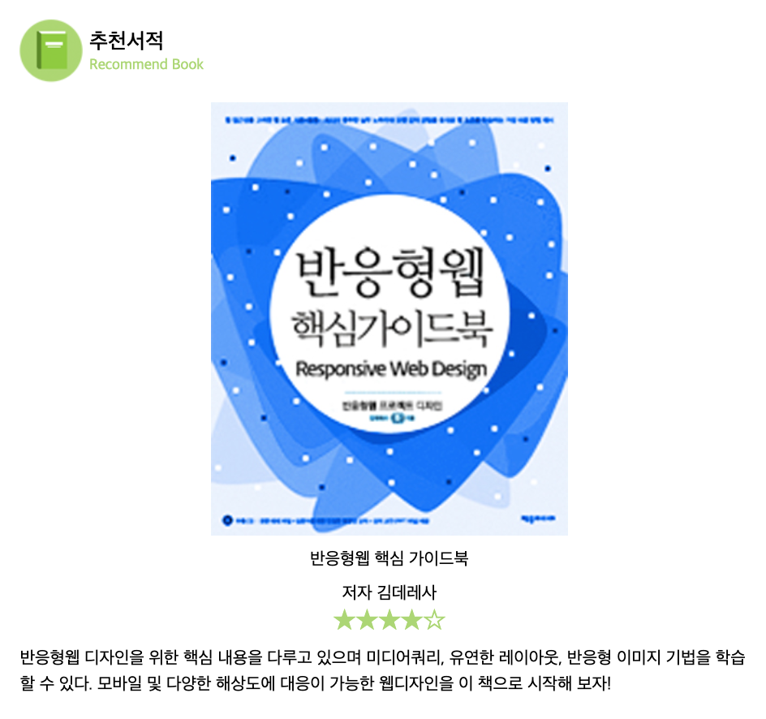
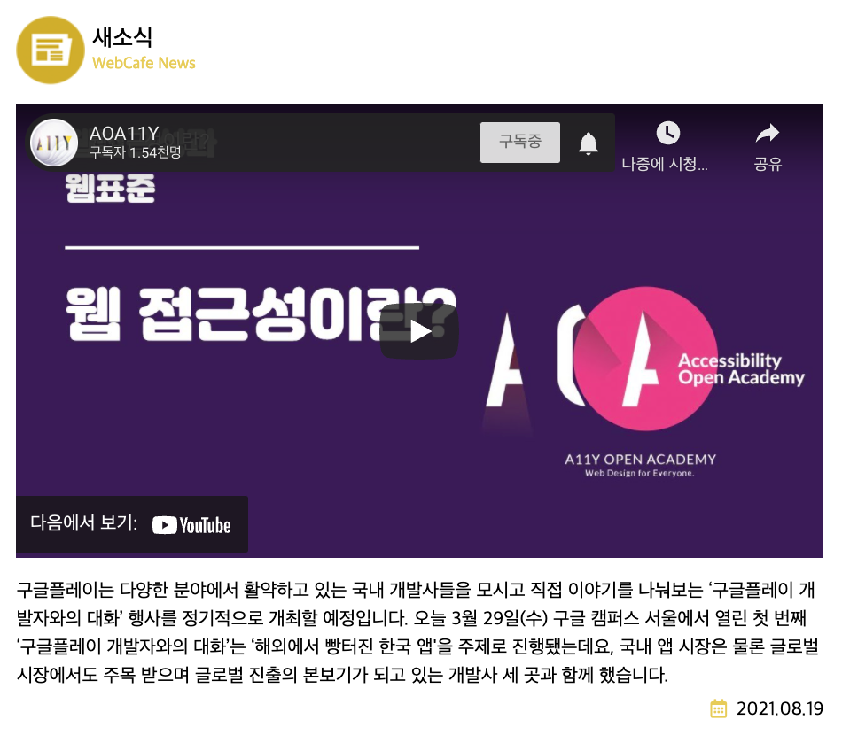
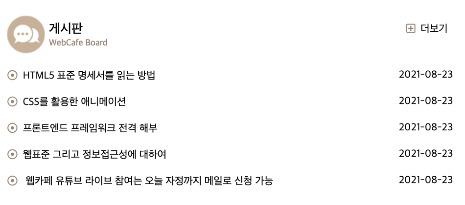
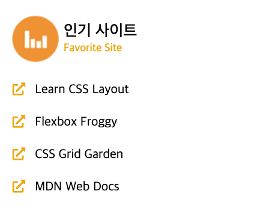
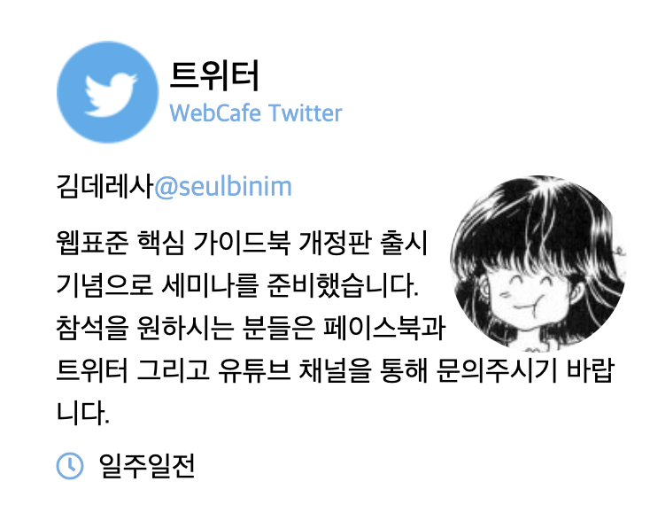

# Main

## 0. HTML - 전체 틀

```html
<main class="appMain homeMain">
  <section class="book"></section>
  <section class="news"></section>
  <section class="board"></section>
  <section class="favorite"></section>
  <article class="twitter"></article>
</main>
```

### SCSS

전체 틀 잡아주기.

- 데스크탑에서 그리드 사용! => [그리드 참고](https://yamoo9.gitbook.io/css-grid/css-grid-term)

```scss
.homeMain {
  // 섹션 공통 여백
  .book,
  .news,
  .board,
  .favorite,
  .twitter {
    margin: rem(24px) 0;
  }
  @include mobile {
    padding: 0 rem(20px);
  }
  @include desktop {
    @include boxSizeMax($paddingX: 20px);
    display: grid;
    grid-template-columns: repeat(12, 1fr);
    grid-template-rows: auto;
    background-color: yellowgreen;
    grid-template-areas:
      "news news news news news news news news news news news news"
      "book book book book favorite favorite favorite twitter twitter twitter twitter twitter"
      "book book book book . board board board board board board board ";

    .book {
      // 시작 행/ 시작 열/ 종료 행/ 종료 열
      // grid-area: 2 / 1 / 4 / 5;
      grid-area: book;
    }

    .news {
      // grid-area: 1/ 1/ 2/ 13;
      grid-area: news;
    }

    .board {
      // grid-area: 3/ 6/ 4/ 13;
      grid-area: board;
    }

    .favorite {
      // grid-area: 2/ 5/ 3/ 9;
      grid-area: favorite;
    }

    .twitter {
      // grid-area: 2/ 8 / 3 /13;
      grid-area: twitter;
    }
  }
}
```

## 1. HTML book



```html
<section class="book">
  <h2 class="book__title sprite spriteBook">
    추천서적<span class="book__enTitle themeGreen">Recommend Book</span>
  </h2>
  <figure class="book__cover">
    
    <figcaption id="book__coverCaption" class="book__coverCaption">
      반응형웹 핵심 가이드북
    </figcaption>
  </figure>
  <dl class="book__info">
    <dt>저자</dt>
    <dd>김데레사</dd>
    <dt class="a11yHidden">평점</dt>
    <dd class="themeGreen ratingStar" aria-label="5점 만점에 4점">
      <span aria-hidden="true">★★★★☆</span>
    </dd>
  </dl>
  <!-- 별점만 별도의 컴포넌트로 바라본다면 다음과 같이 마크업 할 수 있다. -->
  <!-- <div class="ratingStar" aria-label="5점 만점에 4점">
              <span aria-hidden="true">★★★★☆</span>
            </div> -->
  <p class="book__summary">
    반응형웹 디자인을 위한 핵심 내용을 다루고 있으며 미디어쿼리, 유연한
    레이아웃, 반응형 이미지 기법을 학습할 수 있다. 모바일 및 다양한 해상도에
    대응이 가능한 웹디자인을 이 책으로 시작해 보자!
  </p>
</section>
```

### SCSS - 공통

```scss
.homeMain {
  // 섹션 공통 제목 스타일
  [class*="__title"] {
    font-size: rem(20px);
    font-weight: 500;
    @include flexbox(column, center);
    margin-bottom: rem(16px);
  }
  // 섹션 영문 제목 공통 스타일
  [class*="__enTitle"] {
    font-size: rem(14px);
    margin-top: rem(4px);
  }

  // 섹션 본문 공통 스타일
  [class*="__summary"] {
    line-height: 1.5;
  }
  // 아이콘 공통
  .far,
  .fas {
    margin-right: rem(8px);
  }
}
```

#### `[class*="클라스 이름"]`

- [class 다중 선택](https://kmkblog.tistory.com/151)

- 클라스 이름이 `name1`, `name2`, `name3`, `.one_name`... 와 같이 반복되는 경우엔 다음과 같이 다중 선택을 할 수 있다.

- 반복되는 이름이 앞에있거나 뒤에있거나는 상관이 없다!!

```scss
[class*="name"] {
  height: 100px;
}
```

### SCSS - boock

```scss
// 추천서적
.book {
  &__cover {
    // 이미지 컨테이너
    width: 50%;
    @include autoMargin;
    text-align: center;
  }
  &__coverImage {
    @include responsive;
  }
  &__coverCaption {
    margin: rem(16px) 0;
  }
  &__info {
    // 인라인 요소를 가운데에 배치
    text-align: center;
    * {
      display: inline-block;
    }
    .ratingStar {
      display: block;
      color: $green;
      font-size: rem(24px);
      margin: rem(8px) rem(16px);
    }
  }
}
```

- `@include autoMargin;` => `utils/_mixin.scss`

```scss
// Auto Margin을 활용한 박스 가운데 정렬 ------------------------------------------------ /
@mixin autoMargin($marginX: auto) {
  margin-left: $marginX;
  margin-right: $marginX;
}
```

- ` @include responsive;` => `utils/_mixin.scss`

```scss
// 반응형 미디어 ----------------------------------------------------------- /
@mixin responsive($width: max-width) {
  // 기본값 max-width로 속성값이 들어감.
  #{$width}: 100%;
  height: auto;
}
```

#### #{$value} : interpolation

- [interpolation](https://poiemaweb.com/sass-script#6-interpolation-)

인터폴레이션은 변수의 값을 문자열 그대로 삽입함.

`$변수`는 속성값으로만 사용할 수 있지만,

`#{}`를 사용하면 속성값도 가능하고, 셀렉터와 속성이름으로도 사용할 수 있다.

- ex)

```scss
$name: foo;
$attr: border;

// 속성이름, 셀렉터로 사용하기
p.#{$name} {
  // p.foo
  #{$attr}-color: blue; // border-color: blue;
}

// 속성값으로 사용하기
.someclass {
  $font-size: 12px;
  $line-height: 30px;
  // 연산의 대상으로 취급되지 않도록
  font: #{$font-size} / #{$line-height}; // 12px / 30px
}
```

## 2. HTML - news



```html
<section class="news">
  <h2 class="news__title sprite spriteNews">
    새소식
    <span class="news__enTitle themeYellow" leng="en">WebCafe News</span>
  </h2>
  <figure class="news__videoContainer">
    <!-- <video
                class="news__video"
                poster="./assets/media/poster.jpg"
                controls
              >
                <source src="./assets/media/stories.mp4" type="video/mp4" />
                <track
                  src="./assets/media/stories-en.vtt"
                  kind="captions"
                  srclang="en"
                  label="English Caption"
                />
              </video> -->
    <div class="news__iframeContainer">
      <iframe
        width="560"
        height="315"
        src="https://www.youtube.com/embed/fUcIe7-2zxw"
        frameborder="0"
        allowfullscreen
      ></iframe>
    </div>
    <figcaption class="a11yHidden">구글 개발자 이야기</figcaption>
  </figure>
  <p class="news__summary">
    구글플레이는 다양한 분야에서 활약하고 있는 국내 개발사들을 모시고 직접
    이야기를 나눠보는 ‘구글플레이 개발자와의 대화’ 행사를 정기적으로 개최할
    예정입니다. 오늘 3월 29일(수) 구글 캠퍼스 서울에서 열린 첫 번째 ‘구글플레이
    개발자와의 대화’는 ‘해외에서 빵터진 한국 앱'을 주제로 진행됐는데요, 국내 앱
    시장은 물론 글로벌 시장에서도 주목 받으며 글로벌 진출의 본보기가 되고 있는
    개발사 세 곳과 함께 했습니다.
  </p>
  <time class="news__date" datetime="2021-08-19T14:03:23">
    <i class="far fa-calendar-alt themeYellow" aria-hidden="true"></i>2021.08.19
  </time>
</section>
```

### SCSS

```scss
// 새소식
.news {
  &__videoContainer {
    margin-bottom: rem(16px);
  }
  //   &__video {
  //     @include responsive(width);
  //   }

  &__iframeContainer {
    @include resposiveIframe;
  }

  &__date {
    display: block;
    text-align: right;
    margin-top: rem(8px);
  }
}
```

- `news__video`

  `responsive`에 `width`값을 전달. `width: 100%`로 설정된다.

  html에서 `news__video`태그를 주석처리 했기 때문에, 해당 스타일링도 주석처리함.

- `.news__iframeContainer`

  `iframe`은 컨테이너가 필요하다.

  컨테이너를 다음과 같이 스타일링 해주면, 반응형으로 비율을 유지하며 크기가 조정된다.

  ```scss
  // 반응형 iframe ----------------------------------------------------------- /
  @mixin resposiveIframe($width: 16, $height: 9) {
    $ratio: ($height/$width) * 100%;
    // 컨테이너를 기준으로, iframe을 이동시킬 것.
    position: relative;
    // 부모 컨테이너의 너비에 딱 맞춘다.
    // 부모 컨테이너가 크기가 고정되어 있지 않다면, 부모가 변하면 컨테이너도 변한다.
    width: 100%;
    height: 0 !important;
    // *패딩트릭, 부모의 너비를 기준으로 비율을 정해 패딩을 준다.
    padding-top: $ratio;

    iframe {
      // 컨테이너를 기준으로, 왼쪽 상단에 딱맞게 위치시킨다.
      position: absolute;
      top: 0;
      left: 0;
      // 부모의 너비와 높이에 맞춘다.
      width: 100%;
      height: 100%;
    }
  }
  ```

## 3. HTML - board



```html
<section class="board">
  <h2 class="board__title sprite spriteBoard">
    게시판<span class="board__enTitle themeBrown">WebCafe Board</span>
  </h2>
  <ul class="board__list">
    <li class="board__item">
      <a href="#" class="board__link"
        ><i class="far fa-dot-circle themeBrown" aria-hidden="hidden"></i>HTML5
        표준 명세서를 읽는 방법</a
      >
      <time class="board__date" datetime="2021-08-23T11:24:30">2021-08-23</time>
    </li>
    <li class="board__item">
      <a href="#" class="board__link"
        ><i class="far fa-dot-circle themeBrown" aria-hidden="hidden"></i>CSS를
        활용한 애니메이션</a
      >
      <time class="board__date" datetime="2021-08-23T11:24:30">2021-08-23</time>
    </li>
    <li class="board__item">
      <a href="#" class="board__link"
        ><i class="far fa-dot-circle themeBrown" aria-hidden="hidden"></i
        >프론트엔드 프레임워크 전격 해부</a
      >
      <time class="board__date" datetime="2021-08-23T11:24:30">2021-08-23</time>
    </li>
    <li class="board__item">
      <a href="#" class="board__link"
        ><i class="far fa-dot-circle themeBrown" aria-hidden="hidden"></i>웹표준
        그리고 정보접근성에 대하여</a
      >
      <time class="board__date" datetime="2021-08-23T11:24:30">2021-08-23</time>
    </li>
    <li class="board__item">
      <a href="#" class="board__link"
        ><i class="far fa-dot-circle themeBrown" aria-hidden="hidden"></i>
        웹카페 유튜브 라이브 참여는 오늘 자정까지 메일로 신청 가능</a
      >
      <time class="board__date" datetime="2021-08-23T11:24:30">2021-08-23</time>
    </li>
  </ul>
  <a href="/" title="게시판" class="board__more"
    ><i class="far fa-plus-square themeBrown" aria-hidden="hidden"></i>더보기</a
  >
</section>
```

- `time`태그를 사용하여 날짜를 표시

`<time datetime="날짜"></time>`

### SCSS - board

```scss
// 게시판
.board {
  position: relative;
  &__more {
    position: absolute;
    top: rem(4px);
    right: 0;
    padding: rem(8px);
  }
  &__item {
    @include flexbox(row, space-between);
    margin: rem(8px) 0;
  }
  &__link {
    display: block; // 말줄임 처리를 위해 블록으로
    padding: rem(8px) 0;
    @include ellipsis;
    margin-right: rem(8px);
  }
  &__date {
    // 날짜 줄바꿈 금지
    white-space: nowrap;
    padding: rem(8px) 0;
    vertical-align: baseline;
  }
}
```

- `a`태그 말줄임 처리 => `@include ellipsis;`

말줄임 처리 하려면 요소가 `block`이여야한다.

[말줄임 처리 참고자료](https://webruden.tistory.com/655)

```scss
// 텍스트 ellipsis ----------------------------------------------------------- /
@mixin ellipsis {
  text-overflow: ellipsis; // 넘어가는거 말줄임표로 설정
  white-space: nowrap; // 줄바꿈 금지
  overflow: hidden; // 넘어가는거 숨기기
}
```

- `vertical-align`

[vertical align 정리 링크](https://mygumi.tistory.com/368)

`inline`, `table-cell box`에서의 수직 정렬을 지정함.

이 속성은 대부분 이미지와 텍스트를 같은 요소에서 중간으로 배치하기 위해 사용함.

주로 텍스트 요소에 `line-height`를 주고, `img`태그에 `vertical-align:top`을 주고 쓴다. (참고로 이미지태그는 인라인임.)

```html
<div>
  
  <span> Text</span>
</div>
```

```scss
img {
  width: 20px;
  height: 20px;
  // 이미지에게 top을 주어야한다.
  vertical-align: top;
}

span {
  // 텍스트는
  line-height: 20px;
}
```

## 4. HTML - favorite



```html
<section class="favorite">
  <h2 class="favorite__title sprite spriteFavorite">
    인기 사이트<span class="favorite__enTitle themeOrange">Favorite Site</span>
  </h2>
  <ol class="favorite__list">
    <li class="favorite__item">
      <a
        class="favorite__link"
        href="http://ko.learnlayout.com/"
        target="_blank"
        data-tooltip="레이아웃을 배우자"
        rel="noopener noreferrer"
      >
        <i class="fas fa-external-link-alt themeOrange" aria-hidden="true"></i>
        Learn CSS Layout
      </a>
    </li>
    <li class="favorite__item">
      <a
        class="favorite__link"
        href="http://flexboxfroggy.com/#ko"
        target="_blank"
        data-tooltip="게이머처럼 Flex"
        rel="noopener noreferrer"
      >
        <i class="fas fa-external-link-alt themeOrange" aria-hidden="true"></i>
        Flexbox Froggy
      </a>
    </li>
    <li class="favorite__item">
      <a
        class="favorite__link"
        href="http://cssgridgarden.com/#ko"
        target="_blank"
        data-tooltip="농장주 되기 Grid"
        rel="noopener noreferrer"
      >
        <i class="fas fa-external-link-alt themeOrange" aria-hidden="true"></i>
        CSS Grid Garden
      </a>
    </li>
    <li class="favorite__item">
      <a
        class="favorite__link"
        href="https://developer.mozilla.org/ko/"
        target="_blank"
        data-tooltip="최고의 웹교과서 MDN"
        rel="noopener noreferrer"
      >
        <i class="fas fa-external-link-alt themeOrange" aria-hidden="true"></i>
        MDN Web Docs
      </a>
    </li>
  </ol>
</section>
```

### SCSS - favorite

```scss
// 인기사이트
.favorite {
  &__item {
    margin: rem(8px) 0;
  }
  &__link {
    display: block;
    padding: rem(8px) 0;

    // 반응형으로 폰트사이즈
    //   @include mobile {
    //     &::after {
    //       // 글씨 크기 변하면 레이아웃이...위로 좀 올라가있어서..내림
    //       position: relative;
    //       top: rem(4px);
    //       content: attr(data-tooltip);
    //       margin-left: rem(8px);
    //       display: inline-block;
    //       color: $orange;
    //       // 최소 12px, 최대 18px로 글자크기가 유연하게...
    //       font-size: clamp(0.75rem, 4vw, 1.125rem);
    //       @include ellipsis;
    //     }
    //   }
  }
}
```

- 특성 선택자 `attr()`

  html 요소의 `attribute`값을 가져와서 css에서 사용할 수 있게한다.

  ex)

  ```scss
  /* Simple usage */
  attr(data-count);
  attr(title);

  /* With type */
  attr(src url);
  attr(data-count number);
  attr(data-width px);

  /* With fallback */
  attr(data-count number, 0);
  attr(src url, "");
  attr(data-width px, inherit);
  attr(data-something, "default");
  ```

- `clamp()` 글씨 크기도 반응형

  이미지에서도 쓰일 수 있다. => [참고](https://frontdev.tistory.com/entry/clamp-%EC%82%AC%EC%9A%A9%ED%95%98%EA%B8%B0)

  `clamp("최소 크기", n%, "최대 크기")`

  최소 크기 이하만큼 작아지지 않고, 최대 크기 이상 커지지 않는다.

  평소엔 n%의 비율을 유지한다. 꼭 퍼센트가 아니라 상대단위면 된다.

## 5. HTML - twitter



```html
<article class="twitter">
  <h2 class="twitter__title sprite spriteTwitter">
    트위터<span class="twitter__enTitle themeBlue">WebCafe Twitter</span>
  </h2>
  <div class="twitter__container">
    <dl class="twitter__userInfo">
      <dt class="a11yHidden">사용자 이름</dt>
      <dd class="twitter__userName">김데레사</dd>
      <dt class="a11yHidden">사용자 ID</dt>
      <dd class="twitter__userId themeBlue">
        <a
          href="/"
          target="_blank"
          title="트위터 계정으로 이동"
          rel=" noopener noreferrer"
          >@seulbinim</a
        >
      </dd>
    </dl>
    <figure class="twitter__userProfile">
      
    </figure>
    <p class="twitter__summary">
      웹표준 핵심 가이드북 개정판 출시 기념으로 세미나를 준비했습니다. 참석을
      원하시는 분들은 페이스북과 트위터 그리고 유튜브 채널을 통해 문의주시기
      바랍니다.
    </p>
    <time class="twitter__date" datetime="2021-08-18T15:03:25">
      <i class="far fa-clock themeBlue" aria-hidden="true"></i>일주일전
    </time>
  </div>
</article>
```

### SCSS

```scss
// 트위터
.twitter {
  &__userInfo {
    // 아이템이 inline처럼 쌓임
    display: inline-flex;
    margin-bottom: rem(12px);
  }
  &__userProfile {
    // figure요소
    width: rem(100px);
    height: rem(100px);
    border-radius: 50%;
    overflow: hidden;
    background-color: skyblue;

    //----- 이미지 띄우기
    float: right;
    // 브라우저에서 제공은 잘안하지만.. 그래도 이쁘게!
    // https://developer.mozilla.org/en-US/docs/Web/CSS/CSS_Shapes/Overview_of_CSS_Shapes
    shape-outside: circle(50%);
  }
  &__userProfileImage {
    // max-width: 100%;
    // 컨테이너에 맞춰서 줄어들고 커짐. 최대 원본이미지 까지.
    @include responsive;
  }
  &__date {
    display: block;
    margin-top: rem(8rem);
  }
}
```

- `display: inline-flex;`

  인라인 특성의 flex container을 정의한다.

  따라서 container가 인라인처럼 쌓이게 된다.

  `twitter__userInfo`에게 `inline-flex`를 부여하였으므로,
  이후에 오는 컨테이너와 인라인처럼 배치된다. 따라서 `twitter__userProfile`와 인라인처럼 배치되었다.

- 참고로 `figure`은 `block`요소다. => [display 속성 참고 자료](https://webstudynote.tistory.com/84)

- `twitter__userProfile` 는 float해서 inline요소와 어울리게 하였다.

- `shape-outside: circle(50%);`

  이미지 요소의 모양을 원으로 바꿔서 글씨와 잘 어울리게 만들어준다.

  브라우저에서 제공은 잘안하지만.. 그래도 이쁘게!

  [CSS Shapes](https://developer.mozilla.org/en-US/docs/Web/CSS/CSS_Shapes/Overview_of_CSS_Shapes)

- `max-width: 100%;`

  컨테이너에 맞춰서 줄어들고 커짐. 최대 원본이미지 까지.

---

- [@custom-selector](https://preset-env.cssdb.org/features#custom-selectors)]

  postcss의 기능으로, 여러 선택자를 별칭을 설정하여 한번에 사용할 수 있다. 최신 기능이라 stage를 1로 (제일 안정한 버전)으로 하면 사용할 수 없다.

```scss
@custom-selector :--heading h1, h2, h3, h4, h5, h6;

article :--heading + p {
}
```

- [font awesome - accessibility](https://fontawesome.com/v5.15/how-to-use/on-the-web/other-topics/accessibility)

- 프로젝트 할 때, post css 뭐 어떤걸 시도해봤다~ 실패해도 괜찮음.

## \_sprite.scss

```scss
// sprites
@use './color' as var; // 별칭 붙임
// 색상 테마
$colors: (
  "Green": var.$green,
  "Yellow": var.$yellow,
  "Brown": var.$brown,
  "Orange": var.$orange,
  "Blue": var.$blue,
);

@each $color, $color-value in $colors {
  // #{}으로 변수 값을 빼옴.
  .theme#{$color} {
    color: $color-value;
  }
}

// 스프라이트 배경이미지
.sprite {
  min-height: rem(60px);
  padding-left: rem(64px);
  background-image: url(./../assets/images/sprite_main.png);
  background-repeat: no-repeat;

  // 리스트 유형
  $sprites: Book, Board, News, Favorite, Twitter;
  $x: 0;
  $y: 0;

  @each $sprite in $sprites {
    // 인덱스를 index함수로 뽑아내서 i에 저장
    $i: index($sprites, $sprite);
    // #{} 변수를 뽑아줌.
    &#{$sprite} {
      background-position: $x $y;
    }
    // y값 115씩 감소
    $y: $y - 115px;
  }
}
```

- @each 반복문

  list와 map 데이터를 반복할 때 사용한다

  ```scss
  // $values는 리스트, value는 리스트 안의 데이터
  @each $value in $values{
    excution
  }
  ```

- 데이터형: map

  map또한 @each로 반복할 수 있다.

  ```scss
  $values: (
    key1: 10px,
    key2: 20px,
    key3: 30px,
  );

  @each $key, $value in $values {
    li.has#{$key} {
      font-size: $value;
    }
  }
  ```
