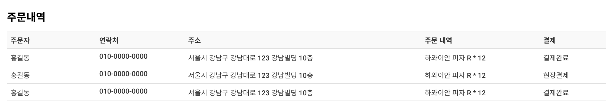
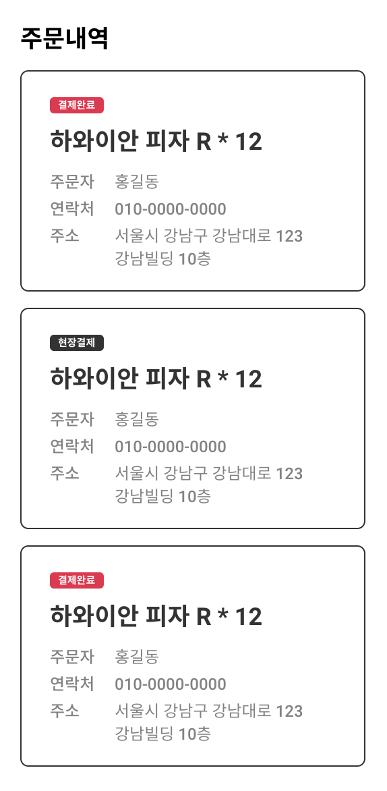

# Table and Card

- [table accessibility example](https://www.w3.org/WAI/tutorials/tables/)

- [table id, headers example](https://www.w3.org/WAI/tutorials/tables/multi-level/#table-with-multiple-column-headers-in-each-column)

  - th : id값을 부여
  - td : headers에 id를 연결해줌.

- [신현석 table](https://hyeonseok.com/blog/729)

## HTML

```html
<div class="order">
  <h1 class="order__title">주문내역</h1>

  <div
    class="order__list"
    role="table"
    aria-label="고객 주문내역"
    aria-describedby="orderListDetail"
  >
    <div id="orderListDetail" class="order__description">
      주문 고객의 성명, 연락처, 주소, 주문내역, 결재 정보
    </div>
    <div class="order__item order__item--head" role="row">
      <span class="order__name" role="columnheader" aria-sort="none"
        >주문자</span
      >
      <span class="order__phone" role="columnheader" aria-sort="none"
        >연락처</span
      >
      <span class="order__address" role="columnheader" aria-sort="none"
        >주소</span
      >
      <span class="order__detail" role="columnheader" aria-sort="none"
        >주문 내역</span
      >
      <span class="order__payment" role="columnheader" aria-sort="none"
        >결제</span
      >
    </div>

    <div class="order__item order__item--body">
      <span class="order__name" data-label="주문자" role="cell">홍길동</span>
      <span class="order__phone" data-label="연락처" role="cell"
        >010-0000-0000</span
      >
      <span class="order__address" data-label="주소" role="cell"
        >서울시 강남구 강남대로 123 강남빌딩 10층</span
      >
      <span class="order__detail" role="cell">하와이안 피자 R * 12</span>
      <span class="order__payment" role="cell"
        ><span class="order__badge order__badge--done">결제완료</span></span
      >
    </div>

    <div class="order__item order__item--body">
      <span class="order__name" data-label="주문자" role="cell">홍길동</span>
      <span class="order__phone" data-label="연락처" role="cell"
        >010-0000-0000</span
      >
      <span class="order__address" data-label="주소" role="cell"
        >서울시 강남구 강남대로 123 강남빌딩 10층</span
      >
      <span class="order__detail" role="cell">하와이안 피자 R * 12</span>
      <span class="order__payment" role="cell"
        ><span class="order__badge">현장결제</span></span
      >
    </div>

    <div class="order__item order__item--body">
      <span class="order__name" data-label="주문자" role="cell">홍길동</span>
      <span class="order__phone" data-label="연락처" role="cell"
        >010-0000-0000</span
      >
      <span class="order__address" data-label="주소" role="cell"
        >서울시 강남구 강남대로 123 강남빌딩 10층</span
      >
      <span class="order__detail" role="cell">하와이안 피자 R * 12</span>
      <span class="order__payment" role="cell"
        ><span class="order__badge order__badge--done">결제완료</span></span
      >
    </div>
  </div>
</div>
```

### role

- `role="table"`

  테이블 컨테이너의 역활을 설정

- `role="row"`

  테이블의 헤더가 '열'로 나열되어 있음.

- `roloe="columnheader"`

  테이블 '행'의 헤더를 설정.

- `role="cell"`

  테이블에서 정보값임을 나타냄.

### aria

- `aria-label="고객 주문 내역"`

  해당 요소가 어떤 목적인지 나타냄

- `aria-describedby="orderListDetail"`

  해당 요소의 자세한 설명이 적혀있는 요소의 id와 연결함.

- `aria-sort="none"`

  해당 테이블이 오름차/내림차로 정렬되어있지 않은 상태임을 나타냄.

  > [참고자료](https://aoa.gitbook.io/skymimo/aoa-2018/2018-aria/table#undefined)

  오름차순 ascending과 내림차순 descending, 그리고 정렬되지 않은 상태 none을 사용할 수 있다.

## SCSS

> 다음과 같이 class명을 먼저 작성하고 개발 시작해도 괜찮을 것 같다.
> 모바일/데스크탑의 경우 해당 클래스 내에서 구분하여 작성하는 방식.

```scss
@use './a11y.scss' as *;
@use './color' as *;
@use './media-query' as *;
@use './unit' as *;
@use './mixin' as *;
@use './base' as *;

// 주문내역
.order {
  // 주문 내역 제목
  &__title {
  }

  // 주문 내역 테이블 및 리스트
  &__list {
    @include desktop {
    }
  }

  // 주문 내역 테이블 요약 정보
  &__description {
  }

  // 테이블 개별 행 또는 카드
  &__item {
    @include mobile {
    }

    @include desktop {
    }

    // 제목 행
    &--head {
      @include desktop {
      }

      @include mobile {
      }
    }

    // 내용 행
    &--body {
      @include desktop {
      }
    }
  }

  // 주문자
  &__name {
    @include desktop {
    }
  }
  // 연락처
  &__phone {
    @include desktop {
    }
  }
  // 주소
  &__address {
    @include desktop {
    }
  }
  // 주문내역
  &__detail {
    @include desktop {
    }
    @include mobile {
    }
  }
  // 결제
  &__payment {
    @include desktop {
    }
    @include mobile {
    }
  }
  // 결제 관련 badge 스타일
  &__badge {
    @include mobile {
    }

    &--done {
      @include mobile {
      }
    }
  }

  // data-label 속성이 있는 요소 (.order__name, .order__phone, .order__address)
  [data-label] {
    @include mobile {
    }
  }
}
```

### 데스크탑



- `order__name`, `order__phone`, `order__address` ... 에게 width값을 %로 주었다.

### 모바일



- flex를 사용하여 order을 바꿔줌

- 단어 단위로 줄 바꿈

  ```scss
  word-break: keep-all;
  ```

- flex에서 item요소가 축소되는 것을 방지

  ```scss
  flex-shrink: 0;
  ```
