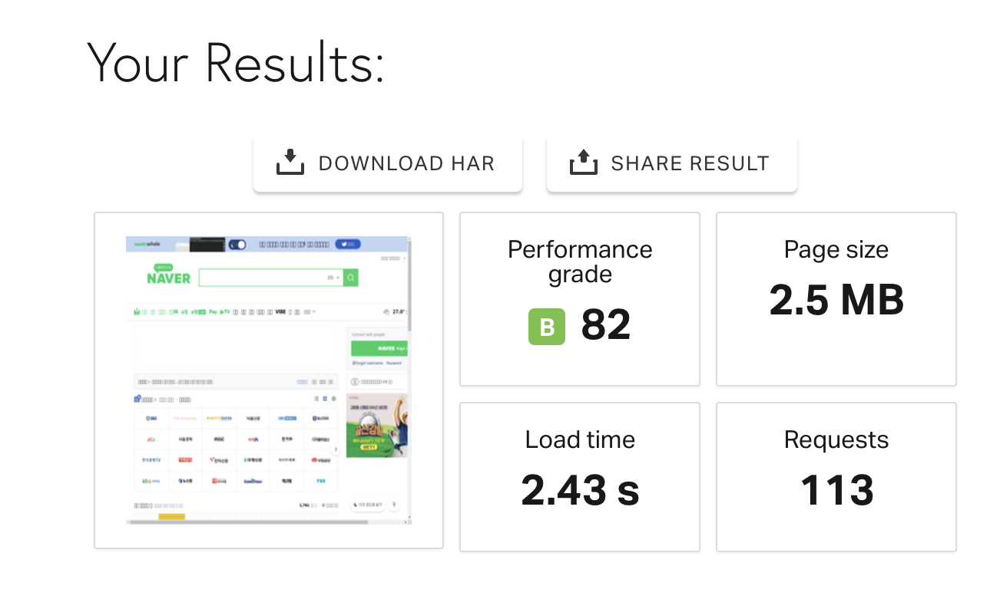
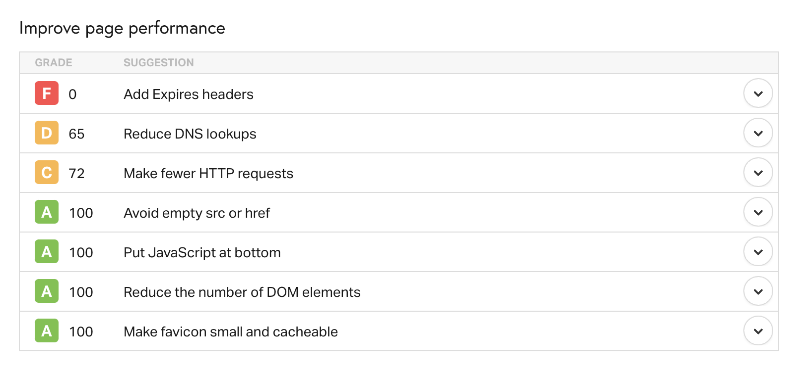
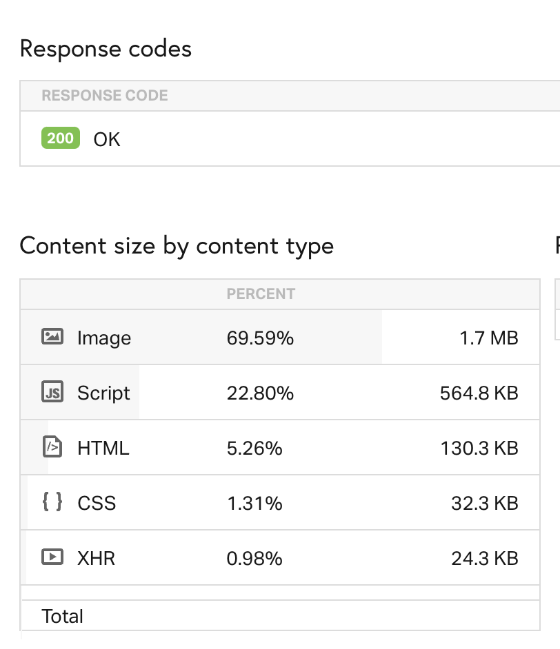

# 이미지 최적화

## 유용한 사이트

- [SEO를 위한 이미지 최적화 10가지](https://www.hedleyonline.com/ko/blog/seo-image-optimization/)

- [이미지 최적화 - Image Optimization](https://code-masterjung.tistory.com/60)

- [Pingdom - 페이지 용량, 다운로드 속도, 코드분석](https://tools.pingdom.com/)

- [Google PageSpeed Insights - 웹페이지의 콘텐츠를 분석하여 페이지 속도를 개선할 방법을 추천해줌](https://developers.google.com/speed/pagespeed/insights/)

- [이미지 용량 최적화](http://comlover.com/blog/image-optimization-for-website)

- [Improving mobile page speed by 200% using SVG and Nano](https://medium.com/@Vectaio/improving-mobile-page-speed-by-200-using-svg-and-nano-a0f67ece95fa)

- [이미지 최적화](https://sw-ryu.tistory.com/80)

### Pingdom을 이용하여 네이버 확인

## 이미지 최적화를 해야하는 이유

웹 페이지에서 대부분의 용량을 차지하는 것은 이미지이다.

이미지 최적화를 한다면

- 웹 페이지 바이트를 절약할 수 있다
- 사이트 성능 또한 향상할 수 있다
- 브라우저가 다운로드해야하는 바이트가 줄어든다
- 클라이언트의 대역폭에 여유가 생긴다
- 콘텐츠를 더 빨리 다운로드하여 화면에 렌더링한다.
- 서버 저장공간이 적게 필요한다. (비용절감)
- 최적의 사용자 경험을 제공할 수 있다
  > 사이트 방문자의 40%가 3초안에 웹페이지가 로딩되지 않으면 떠난다...
- 구글의 SEO 순위를 결정할 때 모바일 응답성을 고려하여, 검색순위에 노출된다.

## 이미지 최적화 방법

### 1. 불필요한 이미지 리소스를 제거

- 이미지 리소스를 줄임.
- 적절한 곳에만 이미지를 배치.

### 2. CSS 활용 Image Sprites

- 여러개의 이미지를 독립적으로 사용하지 않고 단일 이미지로 결합하여 CSS를 적용해 필요에 따라 개별 이미지로 사용
- CSS 효과를 가능한 많이 사용하면 이미지 최적화에 도움이 됨.
  > 이미지 공백을 자르고, css로 여백을 제공하는 방식

### 3. 이미지에서 인코딩 텍스트 대신 웹 글꼴 사용

- 웹 글꼴
  > 개인 컴퓨터에 설치되지 않고 웹 서버에서 로드해야하는 글꼴

### 4. 이미지 포맷 설정

- GIF : 애니메이션
- JPG : 카메라로 찍은 사진
- PNG : 만들어진 이미지

> 예 1) 가로폭 1,000 픽셀 사진 이미지
>
> - JPG : 370KB
> - PNG : 694KB

> 예 2) 가로폭 1,000 픽셀 이미지
>
> - PNG : 421KB
> - JPG : 821KB

### 5. 이미지 폭 조절

- 페이지에서 사용하는 이미지는 가로폭이 1000px를 넘지 않는다.
- 블로그처럼 좌측/우축 메뉴가 존재한다면 800px로도 가능하다.

DSLR 카메라 또는 핸드폰으로 찍은 사진은 가로폭이 3000px을 넘기 때문에, 이비지 사이즈를 줄여주는 것 만으로 큰 효과를 얻음

> 예) 가로폭 3000픽셀 : 2,690KB
> 해당 이미지를 가로폭 1000픽셀로 줄인 후 : 370KB

### 6. Vector vs. Raster Images

#### Vector

- 기하학적 모양으로 구성된 이미지에 적합
- 확대/축소되고 해상도와 독립적
- 불규칙한 모양과 세부사항이 많으면 안됨

* 벡터 이미지 최적화를 위해

- SVG파일을 축소하여 크기를 줄여야함
- SVG파일은 GZIP으로 압축해야함.
- SVG파일은 XML기반 형식

#### Raster Images

- 불규칙한 모양과 세부사항이 많은 이미지에 최적
- 확대/축소에 영향을 받음

* 래스터 이미지 최적화

- 비트 깊이를 줄임
- 델타인코딩을 적용
- 손실 이미지 압축, 무손실 이미지 압축
